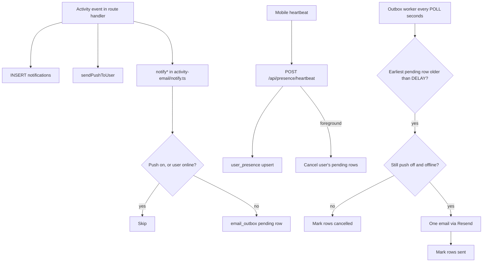

# Activity email fallback and presence heartbeat — SwapHaven API

Activity emails (new offer, counter, accepted, declined, withdrawn, chat message, listing saved) are a **fallback channel**. They go only to users who have push turned off **and** are not in the app. Everyone else learns about activity through FCM push and the in-app feed.

Related:

- Push and deep links: [deeplink-push-notifications.md](./deeplink-push-notifications.md)
- Mobile side of the heartbeat: `barter-stack/mobile/docs/PRESENCE_HEARTBEAT.md`
- Mobile lifecycle hooks: `barter-stack/mobile/docs/APP_LIFECYCLE_MANAGER.md`

OTP, password-reset, and content-report mail in `src/lib/mailer.ts` are **not** part of this. They still send immediately.

---

## 1. Rules

| User state | Activity email |
|---|---|
| Push enabled | Never. The event is not even queued. |
| Push disabled, online (app in foreground) | Not sent for activity that happens while online. Pending rows are cancelled when the user opens the app. |
| Push disabled, offline | Queued. One email goes out `ACTIVITY_EMAIL_DELAY_MINUTES` after the **first** unsent activity, containing only activity since the previous email. |

In-app `notifications` rows and FCM push are unchanged by this feature.

---

## 2. Architecture



### Why there are no repeats

Row status is the cursor. A send includes only that user's `pending` rows and then marks them `sent`. A later activity creates a new `pending` row, which starts a new window from its own `created_at`. Rows already `sent` or `cancelled` are never included again.

### Window

- `due = created_at of the earliest pending row + ACTIVITY_EMAIL_DELAY_MINUTES`.
- The window is **fixed**, not sliding: a chat burst cannot keep postponing the email.
- A foreground heartbeat cancels pending rows. So if rows are still pending when they fall due, the user has stayed away for the whole window.

---

## 3. Presence heartbeat

### Endpoint

```
POST /api/presence/heartbeat
Authorization: Bearer <access_token>

{ "state": "foreground" | "background", "pushEnabled": true | false }
```

**Responses:** `204` recorded, `400` validation error, `401` missing or invalid token.

Handler: `src/routes/presence.ts`, mounted at `/api/presence` in `src/app.ts`.

1. Upserts `user_presence` via `upsertPresence` (`src/lib/activity-email/gates.ts`).
2. On `foreground`, calls `cancelPendingOutboxForUser`.

Writes are throttled: if state and `pushEnabled` are unchanged and the last write is under 30 seconds old, the upsert is skipped. The cancel still runs.

### When the app sends it

The client sends a heartbeat on **resume**, **pause/detach**, and **right after the push toggle** in Settings. There is **no periodic heartbeat** while the app is open. See the mobile doc for details.

### How "online" is decided

`isUserOnline(userId)`:

- `user_presence.is_foreground` is `true`, **and**
- `last_seen_at` is newer than `now() - ACTIVITY_EMAIL_ONLINE_TTL_SECONDS`.

Because the client does not poll, a user stays "online" from the resume heartbeat until the background heartbeat. The TTL (default 6 hours) only matters when the app is force-killed or crashes and never sends `background`. After the TTL, that user counts as offline again.

### How "push enabled" is decided

`isPushEnabledForUser(userId)`:

| `user_presence.push_enabled` | Result |
|---|---|
| `true` | Push on |
| `false` | Push off |
| `null` or no row (never reported, older app builds) | Push on if the user has any `device_tokens` row, otherwise off |

The client computes `pushEnabled` as: in-app preference on **and** OS permission granted **and** an FCM token is available. The server cannot work this out itself: turning push off in the app deletes the token only on the device, and turning it off in OS Settings leaves the token valid.

Push status is one flag per user. With several devices, the most recent heartbeat wins.

---

## 4. Enqueue

Every `notify*` function in `src/lib/activity-email/notify.ts` keeps its signature and call sites (`offers.ts`, `cash-offers.ts`, `conversations.ts`, `saved.ts`, `listings.ts`). Each one loads its template fields and calls `enqueueActivityEmail` (`src/lib/activity-email/enqueue.ts`) instead of sending.

`enqueueActivityEmail` returns:

| Result | Meaning |
|---|---|
| `skipped` | Kill switch off, push enabled, or user online |
| `enqueued` | New pending row |
| `coalesced` | Chat message merged into an existing pending row |

**Chat coalescing:** `notifyChatMessage` passes `coalesceKey = new_message:<conversationId>`. If a pending row with that key exists, its payload is replaced with the latest message, `payload.messageCount` increments, and the summary becomes `"<name> messaged you about <title> (+N more)"`. One thread yields one line in the email.

Event types: `new_swap_offer`, `new_cash_offer`, `swap_counter`, `cash_counter`, `offer_accepted`, `offer_declined`, `offer_withdrawn`, `new_message`, `listing_saved`.

---

## 5. Outbox worker

`src/lib/activity-email/outbox-worker.ts`. Started from `src/index.ts` after the server starts listening, stopped on SIGTERM/SIGINT. It does nothing when `NODE_ENV=test` or `ACTIVITY_EMAIL_ENABLED=false`.

Each tick (every `ACTIVITY_EMAIL_POLL_SECONDS`; a tick is skipped if the previous one is still running):

1. Finds up to 50 users whose earliest pending row is older than the delay.
2. For each user, re-checks the gates. If push is now on or the user is online, all pending rows become `cancelled`.
3. Opens a transaction and locks that user's pending rows with `FOR UPDATE SKIP LOCKED`, so two API instances never send the same rows.
4. Renders the email:
   - one row: the existing single-event template (`renderFromOutboxRow` in `render-from-payload.ts`);
   - several rows: `renderActivityDigest` in `templates.ts` ("You have N updates on Barter"), one line per summary, one **Open inbox** button.
5. Sends via `sendActivityEmail` (`send.ts`) and marks the rows `sent`.

If the user has no decryptable email, rows are `cancelled`. If Resend returns an error, `sendActivityEmail` throws, the transaction rolls back, and the rows stay `pending` for the next tick. If `RESEND_API_KEY` or `EMAIL_FROM` is unset, the send is skipped with a log line and the rows are still marked `sent`.

Tests call `processActivityEmailOutbox()` directly.

---

## 6. Data model

Migration: `drizzle/0036_activity_email_outbox.sql`. Schema: `src/db/schema/activity_email.ts` (synced to barter-ai with `npm run schema:sync-barter-ai`).

### `user_presence`

Kept separate from `users` so frequent writes don't touch the users row.

| Column | Type | Notes |
|---|---|---|
| `user_id` | uuid PK, FK `users` cascade | |
| `last_seen_at` | timestamp | Time of last written heartbeat |
| `is_foreground` | boolean | `true` after resume, `false` after pause |
| `push_enabled` | boolean, nullable | `null` = never reported |
| `push_reported_at` | timestamp, nullable | |
| `updated_at` | timestamp | Used for the 30-second write throttle |

### `email_outbox`

| Column | Type | Notes |
|---|---|---|
| `id` | uuid PK | |
| `user_id` | uuid FK `users` cascade | Recipient |
| `event_type` | text | One of the event types above |
| `coalesce_key` | text, nullable | Chat only |
| `payload` | jsonb | Template arguments |
| `summary` | text | One-line digest entry |
| `status` | enum `email_outbox_status` | `pending` / `sent` / `cancelled` |
| `created_at` | timestamp | Window start |
| `sent_at` | timestamp, nullable | |

Indexes: `(status, created_at)`, `(user_id, status)`, `(user_id, coalesce_key, status)`.

---

## 7. Configuration

Defined in `src/config/env.ts`, documented in `.env.example`.

| Variable | Default | Purpose |
|---|---|---|
| `ACTIVITY_EMAIL_ENABLED` | `true` | Kill switch. `false` disables enqueue and the worker. |
| `ACTIVITY_EMAIL_DELAY_MINUTES` | `30` | Minutes after the first unsent activity before sending |
| `ACTIVITY_EMAIL_ONLINE_TTL_SECONDS` | `21600` (6 h) | Force-kill safety net for a stuck `is_foreground = true` |
| `ACTIVITY_EMAIL_POLL_SECONDS` | `60` | Worker interval |

Resend still needs `RESEND_API_KEY` and `EMAIL_FROM`.

---

## 8. Why Postgres and not Redis or a queue

- Uses the existing Postgres, so no new service or cost. Infra has no Redis or workers today.
- A 30-minute delay needs minute-level precision, not a job scheduler.
- Heartbeats are two small writes per app session (resume and pause).
- The outbox survives restarts and is safe across instances with `SKIP LOCKED`.
- If load grows, move only the "is online" check to Redis first; move to BullMQ/SQS only when there are many job types.

---

## 9. Key files

| File | Role |
|---|---|
| `src/routes/presence.ts` | `POST /api/presence/heartbeat` |
| `src/lib/activity-email/gates.ts` | `isPushEnabledForUser`, `isUserOnline`, `shouldEnqueueActivityEmail`, `upsertPresence`, `cancelPendingOutboxForUser` |
| `src/lib/activity-email/enqueue.ts` | `enqueueActivityEmail`, chat coalescing |
| `src/lib/activity-email/notify.ts` | Per-event `notify*` helpers (enqueue only) |
| `src/lib/activity-email/outbox-worker.ts` | Poller, locking, send, mark rows |
| `src/lib/activity-email/render-from-payload.ts` | Outbox row to rendered email |
| `src/lib/activity-email/templates.ts` | Single-event templates and `renderActivityDigest` |
| `src/lib/activity-email/send.ts` | Resend send; throws on Resend error |
| `src/db/schema/activity_email.ts` | `user_presence`, `email_outbox` |
| `tests/activity-email-outbox.test.ts` | Scenario tests |

---

## 10. Testing

```bash
docker compose up postgres -d
npm test -- tests/activity-email-outbox.test.ts tests/activity-email-templates.test.ts
```

Covered: heartbeat cancels pending rows; push enabled skips; online skips; legacy `device_tokens` fallback; send only after the delay; second email contains only new activity; chat coalescing; push turned on before send cancels.

Manual check against a running API:

```bash
# Report offline with push off
curl -X POST "$API/api/presence/heartbeat" -H "Authorization: Bearer $TOKEN" \
  -H 'Content-Type: application/json' -d '{"state":"background","pushEnabled":false}'
# Trigger activity from another account, then lower ACTIVITY_EMAIL_DELAY_MINUTES (e.g. 1) to see the email quickly.
```
