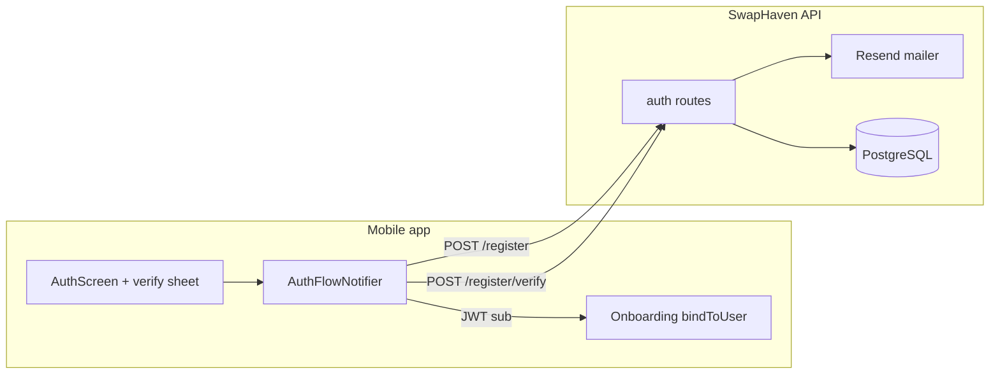
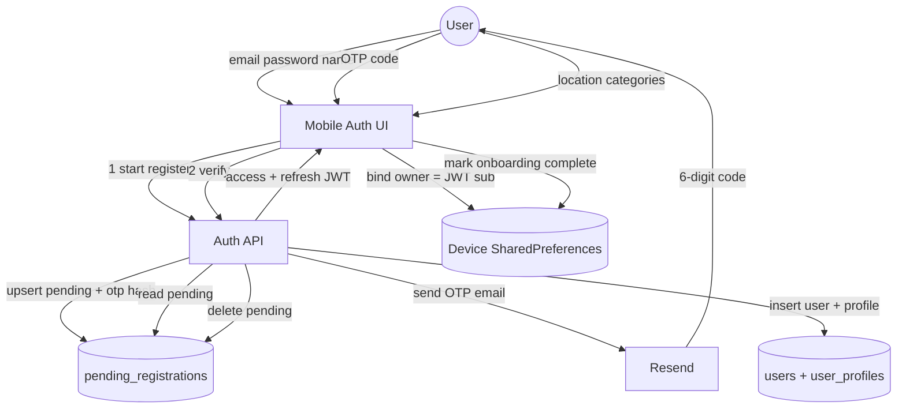
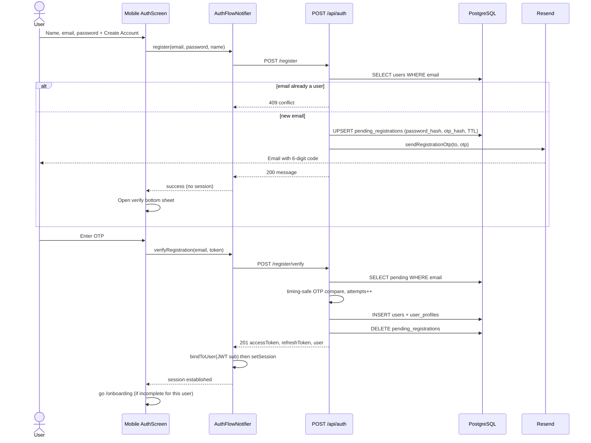
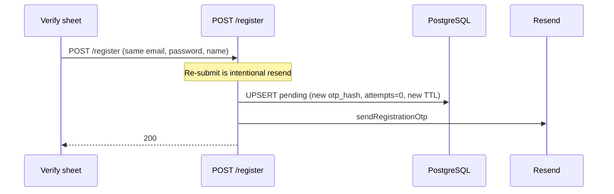

# Create account — email OTP registration

**Validated against code (2026-07-22)** on branch `create-account`.

Email/password signup is a **two-step** flow: credentials are stored as a *pending* registration and a 6-digit OTP is emailed; the `users` row is created only after OTP verify. Mobile then binds **per-user onboarding** on the device (location / categories) so shared devices do not leak preferences between accounts.

Companion mobile notes: see barter-stack repo `mobile/docs/CREATE_ACCOUNT_AND_ONBOARDING.md` (sibling checkout).

---

## Product overview

| Step | What happens |
|------|----------------|
| 1. Start | User submits name, email, password → API upserts `pending_registrations` + emails OTP |
| 2. Verify | User submits email + 6-digit code → API creates `users` + `user_profiles`, issues JWTs |
| 3. Onboard | Mobile binds onboarding to JWT `sub`; new/different users see location/category onboarding |

Social login (`POST /api/auth/social`) is unchanged (immediate find-or-create). See [SOCIAL_LOGIN.md](./SOCIAL_LOGIN.md).

---

## Architecture (context)



---

## Data flow diagram (DFD — level 1)



**External entities:** User, Resend (email).  
**Stores:** `pending_registrations`, `users` / `user_profiles`, device onboarding prefs.  
**Processes:** start registration, verify OTP, bind onboarding, complete onboarding.

---

## Sequence — register + verify (happy path)



---

## Sequence — resend OTP



---

## Sequence — login vs register (same device, per-user onboarding)

```mermaid
sequenceDiagram
  participant App as Mobile
  participant Store as OnboardingStore
  participant Router as GoRouter

  Note over App,Router: User A already completed onboarding on this device

  App->>App: login(A) → JWT sub=A
  App->>Store: bindToUser(A)
  Store-->>App: sameUser (keep complete + prefs)
  App->>Router: redirect
  Router-->>App: /swipe (onboardingDone)

  App->>App: logout (tokens cleared; onboarding NOT wiped)

  App->>App: login(B) → JWT sub=B
  App->>Store: bindToUser(B)
  Store-->>App: switchedUser (clear prefs, complete=false)
  App->>Router: redirect
  Router-->>App: /onboarding
```

Logout does **not** clear onboarding storage — that preserves User A’s skip-on-relogin behavior.

---

## Database

### Table: `pending_registrations`

Migration: `drizzle/0017_pending_registrations.sql`

| Column | Type | Notes |
|--------|------|--------|
| `email` | text PK | Lowercased |
| `password_hash` | text | bcrypt (cost 12), same as `users` |
| `name` | text | Display name (1–80), copied to `users.name` / profile |
| `otp_hash` | text | SHA-256 hex of 6-digit OTP (plaintext never stored) |
| `otp_expires` | timestamp | 10 minutes from issue |
| `otp_attempts` | integer | Failed verify attempts; max **5** then row deleted |
| `created_at` / `updated_at` | timestamp | |

No FK to `users` — row is deleted on successful verify, mailer failure after start, lockout, or when social signup creates the same email.

### Related: `users` (unchanged shape)

Created only on successful verify (or social). Password-reset OTP columns remain separate (`password_reset_*`).

### ER (auth-relevant)

```mermaid
erDiagram
  pending_registrations {
    text email PK
    text password_hash
    text name
    text otp_hash
    timestamp otp_expires
    int otp_attempts
  }
  users {
    uuid id PK
    text email UK
    text password_hash
    text name
  }
  user_profiles {
    uuid id PK_FK
    text display_name
  }
  users ||--|| user_profiles : "1:1"
  pending_registrations }o..o| users : "promoted on verify"
```

### Device storage (mobile only — not in Postgres)

| Key | Purpose |
|-----|---------|
| `barter_onboarding_complete` | bool |
| `barter_onboarding_user_id` | owner user id (JWT `sub`) |
| `barter_onboarding_user_prefs_json` | location, radius, categories |
| `barter_location_synced_to_server` | one-time location backfill flag |

---

## API

Base: `/api/auth` (rate-limited via `authLimiter` except in `development`).

### `POST /api/auth/register` — start signup

**Auth:** none  

**Body:**

```json
{
  "email": "alice@example.com",
  "password": "password123",
  "name": "Alice"
}
```

| Field | Rules |
|-------|--------|
| `email` | valid email; stored lowercased |
| `password` | min 8 chars |
| `name` | trim, 1–80 chars |

**Success `200`:**

```json
{
  "message": "We sent a verification code to your email."
}
```

Does **not** return tokens. Does **not** insert into `users`.

**Errors:**

| Status | `error` | When |
|--------|---------|------|
| 400 | `validation` | Zod failure |
| 409 | `conflict` | Email already in `users` |
| 503 | `service_unavailable` | Resend/mailer failed; pending row cleared |

**Side effects:** Upsert pending row; email OTP via Resend; non-production logs OTP to server console.

---

### `POST /api/auth/register/verify` — complete signup

**Auth:** none  

**Body:**

```json
{
  "email": "alice@example.com",
  "token": "123456"
}
```

| Field | Notes |
|-------|--------|
| `token` | 6-digit OTP (field name matches password-reset for mobile consistency) |

**Success `201`:**

```json
{
  "accessToken": "eyJ...",
  "refreshToken": "eyJ...",
  "user": {
    "id": "uuid",
    "email": "alice@example.com",
    "name": "Alice"
  }
}
```

**Errors:**

| Status | `error` | When |
|--------|---------|------|
| 400 | `validation` | Zod failure |
| 400 | `bad_request` | Missing/expired pending, wrong OTP, or locked out |
| 409 | `conflict` | User already exists (e.g. social won a race) |

**OTP rules:** 10-minute TTL; max 5 failed attempts then pending deleted; constant-time hash compare.

---

### Curl examples

```bash
# 1) Start
curl -s -X POST http://localhost:3001/api/auth/register \
  -H 'Content-Type: application/json' \
  -d '{"email":"alice@example.com","password":"password123","name":"Alice"}'

# 2) Verify (use code from email or non-prod server log)
curl -s -X POST http://localhost:3001/api/auth/register/verify \
  -H 'Content-Type: application/json' \
  -d '{"email":"alice@example.com","token":"123456"}'
```

---

## Configuration

| Env var | Required for email | Notes |
|---------|-------------------|--------|
| `RESEND_API_KEY` | Yes to send | Without it, register returns 503 for new emails |
| `EMAIL_FROM` | Yes to send | Resend From address |
| `JWT_ACCESS_SECRET` / `JWT_REFRESH_SECRET` | Always | Token issuance on verify |
| `AUTH_RATE_LIMIT_MAX` | Optional | Auth route rate limit |

Mail templates: `sendRegistrationOtp` in `src/lib/mailer.ts` (subject: “Your Barter verification code”).

---

## Security notes

- Pending passwords are bcrypt-hashed; OTPs are SHA-256 hashed (never stored plaintext).
- OTP compare uses `crypto.timingSafeEqual`.
- Re-register same email before verify refreshes OTP (resend) without creating a user.
- Existing `users` email always returns 409 on start (no silent overwrite).
- Social create for the same email deletes any pending row for that address.

---

## Mobile mapping

| Layer | Path |
|-------|------|
| UI | `lib/features/auth/presentation/auth_screen.dart` (`_VerifyRegistrationSheet`) |
| Flow | `lib/features/auth/di/auth_providers.dart` (`register` → OTP; `verifyRegistration` → `_establishSession`) |
| Endpoints | `ApiEndpoints.authRegister`, `authRegisterVerify` |
| Onboarding bind | `OnboardingStore.bindToUser` + `AccessTokenClaims.subject` |

After verify, mobile navigates to `/onboarding` when the bound user has not completed onboarding on this device.

---

## Seed CLI

`npm run seed:user` now: `POST /register` → prompt/`SEED_OTP` → `POST /register/verify`.  
See [SEED_USER.md](./SEED_USER.md). Local non-prod: OTP also appears in API logs.

---

## Tests

| Suite | Coverage |
|-------|----------|
| `tests/auth.test.ts` | Start register (no user), verify success, bad OTP, lockout, mailer 503 |
| `tests/helpers/fixtures.ts` | `registerUser()` plants known OTP then verifies (all integration tests) |

```bash
npm test -- tests/auth.test.ts
```

---

## OpenAPI

Paths documented in `src/openapi/spec.ts`:

- `POST /api/auth/register`
- `POST /api/auth/register/verify`

Swagger UI: `/api-docs` when the server is running.
