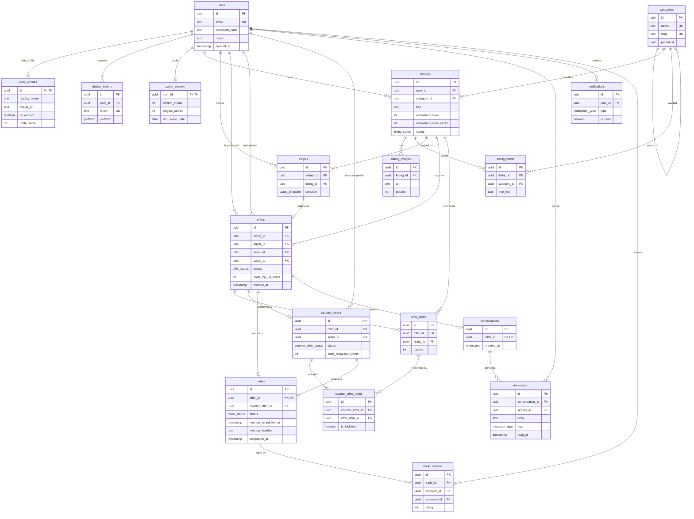

# SwapHaven API — Database Schema

PostgreSQL schema managed with **Drizzle ORM**. Source of truth lives in
`src/db/schema/*.ts`; migrations are generated into `drizzle/` and applied with
`npm run db:migrate` (see [LOCAL_DEVELOPMENT.md](./LOCAL_DEVELOPMENT.md)).

This document describes every table, its columns, the relationships between
them, and how the raw columns are **mapped to the wire DTOs** consumed by the
mobile app (Unified Inbox: Offers + Chats tabs).

---

## 1. Entity-relationship diagram



> Notes on the diagram
> - `categories.parent_id`, and `notifications.related_*_id` are **logical**
>   references (plain `uuid` columns, no DB-level foreign key constraint).
> - `||--o|` = one-to-(zero-or-one); `||--o{` = one-to-many.
> - `trades.offer_id` and `conversations.offer_id` are **unique** (`FK,UK`), so a
>   given offer maps to at most one trade and one conversation.

---

## 2. Enums

| Enum | Values |
|------|--------|
| `platform` | `ios`, `android`, `web` |
| `condition` | `new`, `like_new`, `great`, `good`, `fair` |
| `listing_status` | `active`, `traded`, `paused`, `deleted` |
| `swipe_direction` | `left`, `right` |
| `offer_status` | `pending`, `accepted`, `denied`, `countered`, `expired`, `withdrawn` |
| `counter_offer_status` | `pending`, `accepted`, `denied`, `expired` |
| `trade_status` | `pending_meetup`, `completed`, `disputed`, `cancelled` |
| `message_type` | `text`, `image`, `system` |
| `notification_type` | `offer_received`, `offer_accepted`, `offer_denied`, `offer_withdrawn`, `counter_received`, `counter_accepted`, `counter_denied`, `trade_confirmed`, `trade_completed`, `message`, `review_received`, `swipe_match`, `streak_milestone` |

---

## 3. Tables

Legend: **PK** primary key · **FK** foreign key · **UK** unique · `NN` not-null.

### 3.1 Identity & profile

#### `users` — credentials and account root
| Column | Type | Constraints | Notes |
|--------|------|-------------|-------|
| `id` | uuid | PK, default random | |
| `email` | text | NN, UK | login identifier |
| `password_hash` | text | NN | bcrypt hash — **never serialized to clients** |
| `name` | text | NN | legal/fallback name |
| `password_reset_token_hash` | text | | set during reset flow |
| `password_reset_expires` | timestamp | | reset OTP TTL (10 minutes) |
| `password_reset_attempts` | integer | not null, default 0 | failed OTP redeem attempts (max 5) |
| `created_at` / `updated_at` | timestamp | NN, default now | |

#### `user_profiles` — public-facing profile (1:1 with `users`)
| Column | Type | Constraints | Notes |
|--------|------|-------------|-------|
| `id` | uuid | PK, FK→`users.id` (cascade) | shares the user's id |
| `display_name` | text | NN | shown in app |
| `bio` | text | | |
| `avatar_url` | text | | |
| `location_city` | text | | |
| `location_lat` / `location_lng` | decimal(9,6) | | |
| `trade_score` | int | NN, default 0 | |
| `total_trades` | int | NN, default 0 | |
| `rating_sum` / `rating_count` | int | NN, default 0 | average = sum/count |
| `is_verified` | boolean | NN, default false | blue check |
| `created_at` / `updated_at` | timestamp | NN, default now | |

#### `device_tokens` — push notification targets
| Column | Type | Constraints |
|--------|------|-------------|
| `id` | uuid | PK |
| `user_id` | uuid | NN, FK→`users.id` (cascade) |
| `token` | text | NN, UK |
| `platform` | `platform` enum | NN |
| `created_at` | timestamp | NN, default now |

#### `swipe_streaks` — gamification counters (1:1 with `users`)
| Column | Type | Constraints |
|--------|------|-------------|
| `user_id` | uuid | PK, FK→`users.id` (cascade) |
| `current_streak` / `longest_streak` | int | NN, default 0 |
| `last_swipe_date` | date | |
| `bonus_swipes_remaining` | int | NN, default 0 |

### 3.2 Catalog

#### `categories` — taxonomy (self-referencing tree)
| Column | Type | Constraints | Notes |
|--------|------|-------------|-------|
| `id` | uuid | PK | |
| `name` | text | NN, UK | |
| `slug` | text | NN, UK | |
| `icon` | text | | |
| `parent_id` | uuid | | logical self-reference (no FK constraint) |

#### `listings` — items available to trade
| Column | Type | Constraints | Notes |
|--------|------|-------------|-------|
| `id` | uuid | PK | |
| `user_id` | uuid | NN, FK→`users.id` (cascade) | owner |
| `category_id` | uuid | FK→`categories.id` | structured category |
| `title` | text | NN | |
| `description` | text | NN, default `""` | |
| `category` | text | NN, default `general` | free-text/legacy category |
| `condition` | `condition` enum | NN | |
| `estimated_value` | int | NN, default 0 | **dollars** (legacy) |
| `estimated_value_cents` | int | nullable | **cents** (preferred); see mapping §4 |
| `accept_cash_top_ups` | boolean | NN, default false | |
| `wanted_category_ids` | jsonb (string[]) | NN, default `[]` | |
| `wanted_categories` | jsonb (string[]) | NN, default `[]` | |
| `details` | jsonb `{ageRange, brand}` | NN, default `{…}` | |
| `review_snapshot` | jsonb | NN, default `{}` | |
| `is_swipe_only` | boolean | NN, default false | |
| `status` | `listing_status` enum | NN, default `active` | |
| `location_*` | text/decimal | various defaults | city/lat/lng/address/state/country/postal |
| `created_at` / `updated_at` | timestamp | NN, default now | |

#### `listing_images`
| Column | Type | Constraints | Notes |
|--------|------|-------------|-------|
| `id` | uuid | PK | |
| `listing_id` | uuid | NN, FK→`listings.id` (cascade) | |
| `url` | text | NN | |
| `position` | int | NN, default 0 | gallery order |
| `created_at` | timestamp | NN, default now | |

#### `listing_wants` — what the owner wants in return
| Column | Type | Constraints |
|--------|------|-------------|
| `id` | uuid | PK |
| `listing_id` | uuid | NN, FK→`listings.id` (cascade) |
| `category_id` | uuid | FK→`categories.id` |
| `free_text` | text | |

### 3.3 Discovery

#### `swipes` — left/right decisions
| Column | Type | Constraints | Notes |
|--------|------|-------------|-------|
| `id` | uuid | PK | |
| `swiper_id` | uuid | NN, FK→`users.id` (cascade) | |
| `listing_id` | uuid | NN, FK→`listings.id` (cascade) | |
| `direction` | `swipe_direction` enum | NN | |
| `created_at` | timestamp | NN, default now | |
| — | — | UK(`swiper_id`,`listing_id`) | one swipe per user/listing |

### 3.4 Offers & counters

#### `offers` — a buyer proposing items for a listing
| Column | Type | Constraints | Notes |
|--------|------|-------------|-------|
| `id` | uuid | PK | |
| `listing_id` | uuid | NN, FK→`listings.id` | the wanted item (seller's) |
| `buyer_id` | uuid | NN, FK→`users.id` | proposer |
| `seller_id` | uuid | NN, FK→`users.id` | listing owner |
| `swipe_id` | uuid | FK→`swipes.id` | originating swipe, if any |
| `status` | `offer_status` enum | NN, default `pending` | |
| `buyer_note` | text | | |
| `cash_top_up_cents` | int | NN, default 0 | signed; see mapping §4 |
| `expires_at` | timestamp | | |
| `created_at` / `updated_at` | timestamp | NN, default now | |

#### `offer_items` — listings the buyer is putting up
| Column | Type | Constraints |
|--------|------|-------------|
| `id` | uuid | PK |
| `offer_id` | uuid | NN, FK→`offers.id` (cascade) |
| `listing_id` | uuid | NN, FK→`listings.id` |
| `position` | int | NN, default 0 |

#### `counter_offers` — seller's counter to an offer
| Column | Type | Constraints |
|--------|------|-------------|
| `id` | uuid | PK |
| `offer_id` | uuid | NN, FK→`offers.id` (cascade) |
| `seller_id` | uuid | NN, FK→`users.id` |
| `status` | `counter_offer_status` enum | NN, default `pending` |
| `seller_note` | text | |
| `cash_requested_cents` | int | NN, default 0 |
| `expires_at` | timestamp | |
| `created_at` / `updated_at` | timestamp | NN, default now |

#### `counter_offer_items` — which offer items the counter keeps
| Column | Type | Constraints |
|--------|------|-------------|
| `id` | uuid | PK |
| `counter_offer_id` | uuid | NN, FK→`counter_offers.id` (cascade) |
| `offer_item_id` | uuid | NN, FK→`offer_items.id` |
| `is_included` | boolean | NN, default true |

### 3.5 Trades & reviews

#### `trades` — an accepted offer becoming a real-world swap
| Column | Type | Constraints | Notes |
|--------|------|-------------|-------|
| `id` | uuid | PK | |
| `offer_id` | uuid | NN, **UK**, FK→`offers.id` | 1:1 with the offer |
| `counter_offer_id` | uuid | FK→`counter_offers.id` | set if settled via counter |
| `status` | `trade_status` enum | NN, default `pending_meetup` | |
| `meetup_scheduled_at` | timestamp | | **added for Chats tab** (meetup chip) |
| `meetup_location` | text | | **added for Chats tab** |
| `completed_at` | timestamp | | |
| `created_at` / `updated_at` | timestamp | NN, default now | |

#### `trade_reviews`
| Column | Type | Constraints |
|--------|------|-------------|
| `id` | uuid | PK |
| `trade_id` | uuid | NN, FK→`trades.id` (cascade) |
| `reviewer_id` | uuid | NN, FK→`users.id` |
| `reviewee_id` | uuid | NN, FK→`users.id` |
| `rating` | int | NN |
| `comment` | text | |
| `created_at` | timestamp | NN, default now |

### 3.6 Conversations & messages

#### `conversations` — a chat thread, created when a trade starts (1:1 with `offers`)
| Column | Type | Constraints | Notes |
|--------|------|-------------|-------|
| `id` | uuid | PK | |
| `offer_id` | uuid | NN, **UK**, FK→`offers.id` (cascade) | all chat context derives from the offer |
| `created_at` | timestamp | NN, default now | |

#### `messages`
| Column | Type | Constraints | Notes |
|--------|------|-------------|-------|
| `id` | uuid | PK | |
| `conversation_id` | uuid | NN, FK→`conversations.id` (cascade) | |
| `sender_id` | uuid | NN, FK→`users.id` | |
| `body` | text | NN | |
| `type` | `message_type` enum | NN, default `text` | |
| `read_at` | timestamp | | drives `unreadCount`; see mapping §4 |
| `created_at` | timestamp | NN, default now | serialized as `sentAt` |

### 3.7 Notifications

#### `notifications`
| Column | Type | Constraints | Notes |
|--------|------|-------------|-------|
| `id` | uuid | PK | |
| `user_id` | uuid | NN, FK→`users.id` (cascade) | recipient |
| `type` | `notification_type` enum | NN | |
| `title` / `body` | text | NN | |
| `related_offer_id` | uuid | | logical reference |
| `related_trade_id` | uuid | | logical reference |
| `related_conversation_id` | uuid | | logical reference |
| `is_read` | boolean | NN, default false | |
| `created_at` | timestamp | NN, default now | |

---

## 4. Field mapping (DB → API DTOs)

The mobile client never sees raw rows. `src/lib/inbox-serializers.ts` flattens
Drizzle relations into the documented inbox DTOs and strips sensitive columns.
The notation below is `source column/relation → DTO field`.

### 4.1 User summary (`buyer`, `seller`, `otherUser`)
Built from a `users` row joined to its `user_profiles` row via
`serializeUserSummary`.

| DTO field | Source | Rule |
|-----------|--------|------|
| `id` | `users.id` | |
| `displayName` | `user_profiles.display_name` → fallback `users.name` → `""` | |
| `avatarUrl` | `user_profiles.avatar_url` | `null` if no profile |
| `isVerified` | `user_profiles.is_verified` | `false` if no profile |

> `password_hash`, `email`, reset tokens and all other `users` columns are
> **never** included.

### 4.2 Listing summary (`listing`, item listings)
`serializeListingSummary`.

| DTO field | Source | Rule |
|-----------|--------|------|
| `id` | `listings.id` | |
| `title` | `listings.title` | |
| `estimatedValueCents` | `listings.estimated_value_cents` → else `listings.estimated_value × 100` → else `0` | dollars↔cents normalization (`resolveValueCents`) |
| `images[]` | `listing_images` (relation) | mapped to `{ url }` only |
| `user` | nested user summary | only present for offer-listing context |

### 4.3 `OfferPage` item — Offers tab
`GET /api/offers/received` and `/api/offers/sent`, via `serializeOfferListItem`.

| DTO field | Source |
|-----------|--------|
| `id` | `offers.id` |
| `status` | `offers.status` |
| `buyerId` | `offers.buyer_id` |
| `sellerId` | `offers.seller_id` |
| `listingId` | `offers.listing_id` |
| `cashTopUpCents` | `offers.cash_top_up_cents` |
| `createdAt` | `offers.created_at` |
| `listing` | `offers.listing` relation → listing summary |
| `buyer` | `offers.buyer` relation → user summary |
| `seller` | `offers.seller` relation → user summary |
| `offeredItems[]` | `offers.items` relation (`offer_items`) → `{ id, listing }` |

Client-derived (not stored):
- **`direction`** = `sent` when `buyer.id === currentUser.id`, else `received`.
- **Action needed** = seller: `direction === received && status === pending`; buyer: `direction === sent && status === countered`.
- **Cash delta** = `cashTopUpCents / 100`: positive = buyer pays extra; negative
  = buyer's items are worth more.

### 4.4 `Conversation` item — Chats tab
`GET /api/conversations`, via `serializeConversationListItem(conversation, currentUserId, unreadCount)`.

| DTO field | Source | Rule |
|-----------|--------|------|
| `id` | `conversations.id` | |
| `offer.id` | `offers.id` | via `conversations.offer` |
| `offer.status` | `offers.status` | |
| `offer.listing` | `offers.listing` | listing summary |
| `offer.offeredItems[]` | `offers.items` | listing summaries |
| `trade` | `offers.trade` relation | `null` if no trade yet |
| `trade.meetupScheduledAt` | `trades.meetup_scheduled_at` | drives the **"Meetup Set"** chip when non-null |
| `trade.meetupLocation` | `trades.meetup_location` | |
| `otherUser` | `offers.seller` if `offer.buyerId === currentUserId` else `offers.buyer` | the *other* participant |
| `lastMessage` | most recent `messages` row (limit 1, desc `created_at`) | `null` if no messages |
| `lastMessage.body` | `messages.body` | |
| `lastMessage.sentAt` | `messages.created_at` | renamed |
| `lastMessage.senderId` | `messages.sender_id` | |
| `unreadCount` | aggregate: count of `messages` where `conversation_id = c.id AND sender_id ≠ currentUser AND read_at IS NULL` | computed per page |
| `updatedAt` | `lastMessage.created_at` → fallback `conversations.created_at` | |

Client-derived status label (Chats tab):
| Condition | Label |
|-----------|-------|
| `offer.status === pending` | "Offer Sent" |
| `offer.status === countered` | "Negotiating" |
| `trade.status === pending_meetup` | "Trade Active" / "Meetup Set" |
| `trade.status === completed` | "Completed" |

`PATCH /api/conversations/{id}/read` sets `messages.read_at = now()` for all
inbound, unread rows in that conversation (clears the row's badge).

### 4.5 `InboxSummary` — nav badge counts
`GET /api/inbox/summary`.

| DTO field | Source |
|-----------|--------|
| `actionNeededOffers` | count where `(seller_id = currentUser AND status = pending) OR (buyer_id = currentUser AND status = countered)` |
| `unreadMessages` | sum of unread inbound `messages` across the user's conversations |
| `total` | `actionNeededOffers + unreadMessages` |

---

## 5. Migrations

Schema changes follow the generate → review → apply flow:

```bash
npm run db:generate   # drizzle-kit generate → drizzle/<name>.sql + snapshot
npm run db:migrate    # apply pending migrations to the local DB
```

The meetup fields (`trades.meetup_scheduled_at`, `trades.meetup_location`) were
added in `drizzle/0002_dizzy_wendigo.sql`. Use `db:migrate` (not `db:push`) so
only the reviewed SQL runs. See [LOCAL_DEVELOPMENT.md](./LOCAL_DEVELOPMENT.md).
