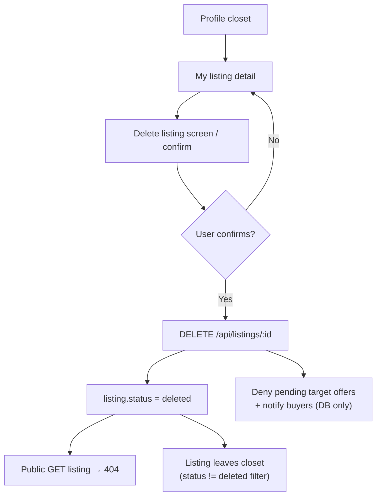
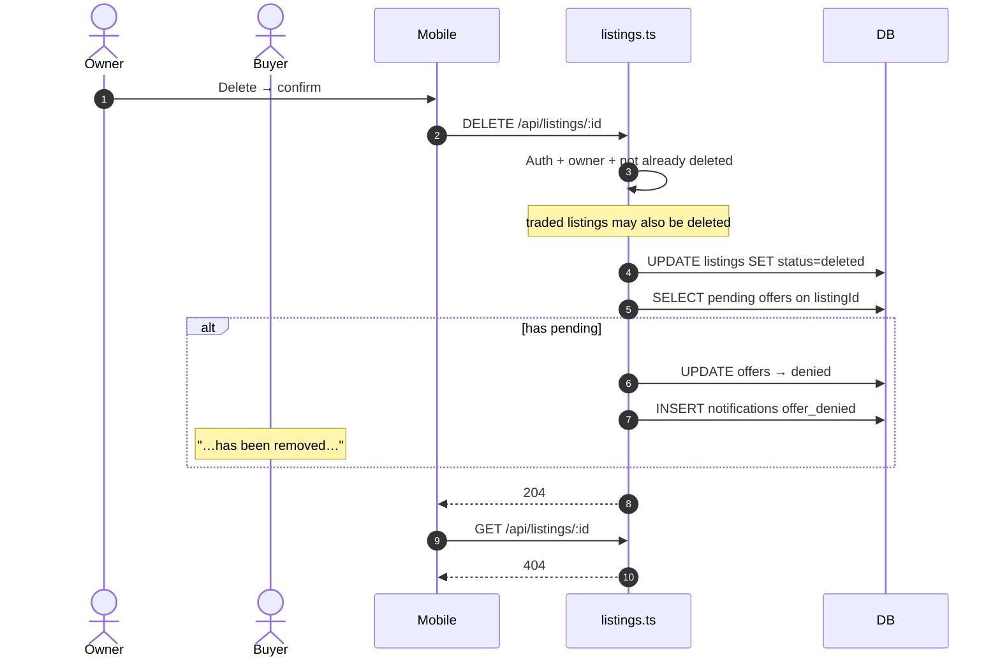

# Delete listing flow

Thorough reference for **soft-deleting** a listing (`DELETE /api/listings/:listingId`), including mobile confirmation UI, API contract, offer side effects, and open-offer UX when a listing (or a bundle item) becomes `deleted`.

**Related docs:** [LISTING_STATUS_AND_OWNER_FLOWS.md](./LISTING_STATUS_AND_OWNER_FLOWS.md) (status diagram + all sequences) · [MARK_AS_SOLD_FLOW.md](./MARK_AS_SOLD_FLOW.md) · [EDIT_LISTING_FLOW.md](./EDIT_LISTING_FLOW.md) · [LISTING_MANAGEMENT_FEATURE.md](./LISTING_MANAGEMENT_FEATURE.md)

---

## 1. Goal

Let the listing owner remove an item from the marketplace without hard-deleting the row. The listing is set to `status = deleted`, disappears from public GET / discovery, and **pending** offers that targeted it are denied.

**Status path:** `active` --Path_Delete--> `deleted`, or `traded` --Path_Delete_AfterSold--> `deleted` (DELETE only returns `409` when already `deleted`).

---

## 2. Flow diagram

## 2b. Sequence diagram

### Mobile entry points

| Step | Location |
|------|----------|
| Owner listing detail | `mobile/lib/features/profile/presentation/my_listing_detail/` |
| Delete confirmation UI | `mobile/lib/features/profile/presentation/delete_listing/` |
| Repository | `ProfileRepository.deleteListing` |
| HTTP | `BarterApiService` → `DELETE /api/listings/{id}` |

Product copy may suggest Mark as Sold instead of delete (trade history / profile stats), but delete remains a first-class owner action.

---

## 3. API contract

### `DELETE /api/listings/{listingId}`

**Auth:** required. **Owner only.**

**Body:** none.

**Success:** `204 No Content`.

**Errors**

| Status | When |
|--------|------|
| `401` | No auth |
| `403` | Not the listing owner |
| `404` | Listing not found |
| `409` | Listing already `deleted` |

---

## 4. Server behavior (ordered)

1. Load listing; enforce ownership.
2. If already `deleted` → `409`.
3. Update listing: `status = deleted`, `updatedAt = now`.
4. Call `cancelPendingOffersAndNotify(listingId, title, "listing_deleted")`:
   - Same filter as mark-sold: **`offers.listingId === listingId`** and **`status === "pending"`** only.
   - Sets those offers to `denied`.
   - Inserts in-app `offer_denied` notifications (DB only — **no FCM push**; see [deeplink-push-notifications.md](./deeplink-push-notifications.md)).
   - Body: `"<title>" has been removed. Your offer has been declined.`
5. Return `204`.

Implementation: `src/routes/listings.ts` (`DELETE /:listingId`).

**Note:** Soft delete does **not** cascade-delete offer/trade history rows. Related FKs remain; public listing GET returns not found for deleted listings.

---

## 5. Offer side effects — what clears vs what stays

| Offer situation | Cleared on delete? | Result |
|-----------------|-------------------|--------|
| Offer **targets** this listing, status `pending` | Yes | `denied` + buyer notified |
| Offer **targets** this listing, status `countered` | **No** | Offer stays open |
| This listing is a **side item** in a multi-item round | **No** | Offer stays; item shows as deleted in UI |

### Open-offer UX (mobile inbox)

When an offer stays open but includes a listing with `status = deleted`:

- Trade Offer / View Counter / Counter: item is **struck through**, red **DELETED** label.
- Trade-value sums exclude that item’s cents.
- Counter does not select/submit deleted items.
- Accept blocked until the pending round only contains `active` listings (`409` on server).

---

## 6. Public visibility

| Surface | Behavior after delete |
|---------|------------------------|
| `GET /api/listings/:id` | `404` |
| Search / swipe / nearby | Excluded |
| Owner closet (`GET /api/users/:id/listings`) | Deleted listings are not returned as active |

---

## 7. Mark sold vs delete

| | Mark as Sold | Delete |
|--|--------------|--------|
| Endpoint | `POST …/sold` | `DELETE …/:id` |
| New status | `traded` | `deleted` |
| Metadata | `soldMethod`, optional partner | None |
| Trade count | +1 if `traded_on_barter` | Never |
| Pending target offers | Denied + notify | Denied + notify |
| Countered / side-item offers | Stay open (UI strike) | Stay open (UI strike) |
| From `traded` | 409 | Allowed → `deleted` |

Prefer Mark as Sold when the item actually left via a trade or sale so profile trade stats and history stay accurate.

---

## 8. Test coverage

| Area | File / suite |
|------|----------------|
| Soft delete, 403/409, pending offer cancel, side-item gap | `tests/listing-owner-actions.test.ts` |
| Accept 409 when round item deleted | `tests/offers.test.ts` |
| Mobile `unavailableLabel` / totals | `mobile/test/features/inbox/inbox_entities_test.dart` |

---

## 9. Manual QA checklist

1. Owner deletes active listing → `204`; public GET → `404`.
2. Delete again → `409`.
3. Non-owner → `403`.
4. Buyer with **pending** offer on that listing → offer `denied` + notification.
5. Buyer with **countered** offer → offer remains; UI shows **DELETED**; Accept disabled.
6. Multi-item offer where a side listing is deleted → offer remains; that item struck; Counter excludes it.
7. Closet no longer shows the listing as active.
