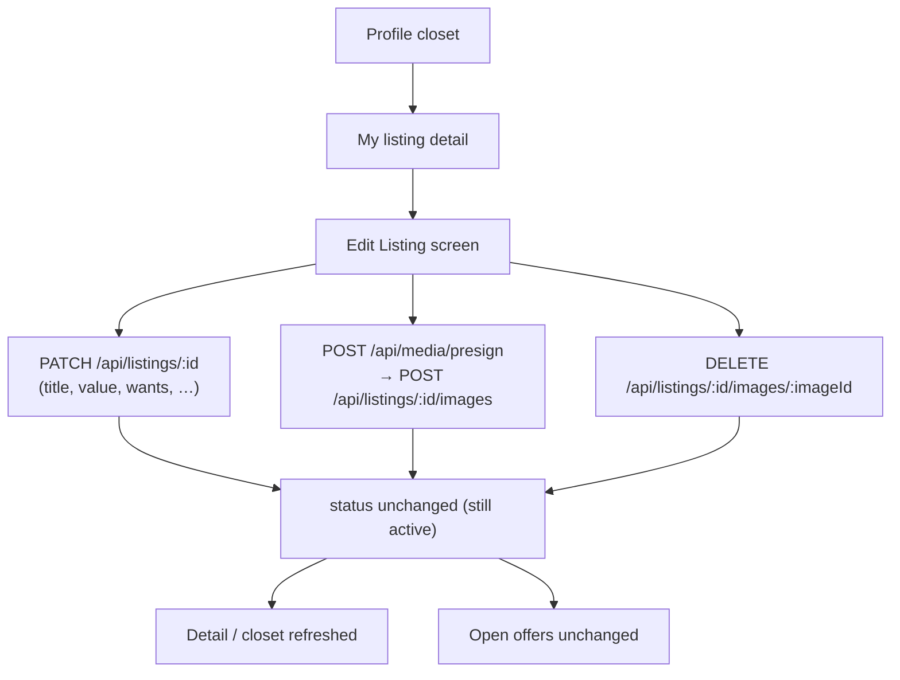
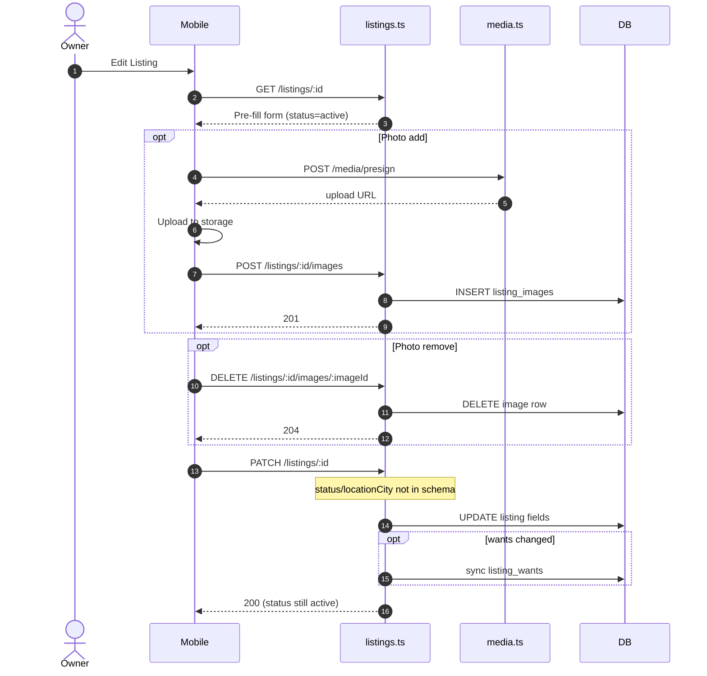

# Edit listing flow

Thorough reference for **editing** an owned listing (`PATCH /api/listings/:listingId`) and related photo mutations, including mobile Edit Listing UI, allowed fields, and what edit does **not** change (status / location / offers).

**Related docs:** [LISTING_STATUS_AND_OWNER_FLOWS.md](./LISTING_STATUS_AND_OWNER_FLOWS.md) (status diagram + all sequences) · [MARK_AS_SOLD_FLOW.md](./MARK_AS_SOLD_FLOW.md) · [DELETE_LISTING_FLOW.md](./DELETE_LISTING_FLOW.md) · [LISTING_MANAGEMENT_FEATURE.md](./LISTING_MANAGEMENT_FEATURE.md)

---

## 1. Goal

Let the listing owner update marketplace-facing fields (title, description, value, condition, category, trade wants) and manage photos, **without** closing the listing. Closing remains explicit via Mark as Sold or Delete.

**Status path:** `active` --Path_Edit--> `active` (status **unchanged**). PATCH cannot set `traded` / `deleted` / `paused`.

---

## 2. Flow diagram



## 2b. Sequence diagram



### Mobile entry points

| Step | Location |
|------|----------|
| Edit Listing UI | `mobile/lib/features/profile/presentation/edit_listing/edit_listing_screen.dart` |
| Use cases / repository | Profile feature `application/` + `ProfileRepository` |
| Field PATCH | `BarterApiService` → `PATCH /api/listings/{id}` |
| Images | Presign upload, then `POST` / `DELETE` listing image routes |

---

## 3. API contracts

### `PATCH /api/listings/{listingId}`

**Auth:** required. **Owner only.**

All body fields are **optional** (partial update). Zod schema: `updateListingSchema` in `src/routes/listings.ts`.

| Field | Type | Notes |
|-------|------|--------|
| `title` | string | Display title |
| `description` | string | Body copy |
| `category` | string | Free-text category name (may be synced with `categoryId`) |
| `categoryId` | UUID | Must exist in `categories`; resolves display name if needed |
| `condition` | enum | `new` / `like_new` / `great` / `good` / `fair` |
| `estimatedValue` | number ≥ 0 | Dollars (coerced); stored rounded |
| `estimatedValueCents` | positive int | Preferred precise value |
| `wantedCategoryIds` | UUID[] | Open-to-trade category IDs; syncs `listing_wants` |
| `wantedCategories` | string[] | Display labels for wants |

**Explicitly not part of edit**

| Field | How to change instead |
|-------|------------------------|
| `status` | `POST /sold` or `DELETE` — not in `updateListingSchema` |
| `locationCity` / geo | Set at **create** time only — not in PATCH schema |
| Photos | Image routes below |

Sending `status` or `locationCity` in PATCH has no effect (Zod strips unknown keys / fields not in schema). Tests assert status stays `active`.

**Success `200`**

```json
{
  "listing": { "...barter listing..." },
  "id": "<uuid>",
  "title": "...",
  "status": "active"
}
```

**Errors**

| Status | When |
|--------|------|
| `400` | Validation failure / unknown `categoryId` |
| `401` | No auth |
| `403` | Not owner |
| `404` | Listing not found |

### Photos

| Method | Path | Role |
|--------|------|------|
| `POST` | `/api/media/presign` | Get upload URL (S3) |
| `POST` | `/api/listings/:id/images` | Attach public HTTPS image URL |
| `DELETE` | `/api/listings/:id/images/:imageId` | Remove image row |

Image attach requires a public `https` URL (typically from the media presign flow). Non-owners get `403`.

---

## 4. Server behavior (PATCH)

1. Load listing; enforce ownership.
2. Validate partial body.
3. If `categoryId` provided, resolve category row (400 if missing).
4. Apply only provided scalar fields; bump `updatedAt`.
5. If wants changed (`wantedCategoryIds` and/or `wantedCategories`), call `syncListingWants` to replace `listing_wants` rows.
6. Return serialized listing (barter shape) plus `id` / `title` / `status`.

**Does not** touch offers, notifications, or trade counts.

---

## 5. Relationship to offers

| Action | Effect on open offers |
|--------|------------------------|
| Edit title / price / photos / wants | **None** — offers and rounds keep pointing at the same listing IDs |
| Edit while offers are pending/countered | Negotiation continues; buyers see updated listing data on next fetch |
| Change value | Inbox trade-value sums use the listing’s current `estimatedValueCents` from offer serializers |

To close negotiations, use [Mark as Sold](./MARK_AS_SOLD_FLOW.md) or [Delete](./DELETE_LISTING_FLOW.md).

---

## 6. Status lifecycle reminder

```text
active ──PATCH (edit)──► active
active ──POST /sold───► traded
active ──DELETE───────► deleted
```

PATCH never transitions status.

---

## 7. Test coverage

| Area | File / suite |
|------|----------------|
| Title/description/wants update, ignore status/location, 403 | `tests/listings.test.ts` + `tests/listing-owner-actions.test.ts` |
| Image add/remove | `tests/listings.test.ts` |
| Mobile edit screens | Profile feature widget / repository tests under `mobile/test/features/profile/` |

---

## 8. Manual QA checklist

1. Owner edits title and description → values persist; status still `active`.
2. Owner updates `wantedCategoryIds` → GET listing shows matching wants.
3. Owner updates `estimatedValueCents` → offer detail trade value reflects new cents after refresh.
4. Attempt to PATCH `status: "deleted"` → listing remains `active`.
5. Non-owner PATCH → `403`.
6. Add photo via presign + POST images → appears on detail.
7. Delete photo → removed from gallery.
8. Open offers on the listing remain `pending`/`countered` after edit.
