# Follow Feature

End-to-end reference for **Follow**: graph, alerts, discovery priority, performance limits, deploy compatibility, and mobile UX across `swaphaven-api`, `barter-ai`, and `barter-stack/mobile`.

Follow is a **one-way** relationship: the **follower** watches the **followee** (seller). It is not mutual friendship and not a block.

**PR:** [barterinfo/swaphaven-backend#41](https://github.com/barterinfo/swaphaven-backend/pull/41)

---

## 1. Product overview

| Goal | What the user gets |
|------|--------------------|
| Stay close to sellers they trust | Follow from a public profile |
| Hear about new inventory | Push + in-app notification when that seller lists (and related activity) |
| See their items sooner | Swipe deck + recommendations boost followed sellers; Search has a dedicated “From people you follow” row |
| Control noise | Mute one person, or turn off follow alerts globally, without unfollowing |

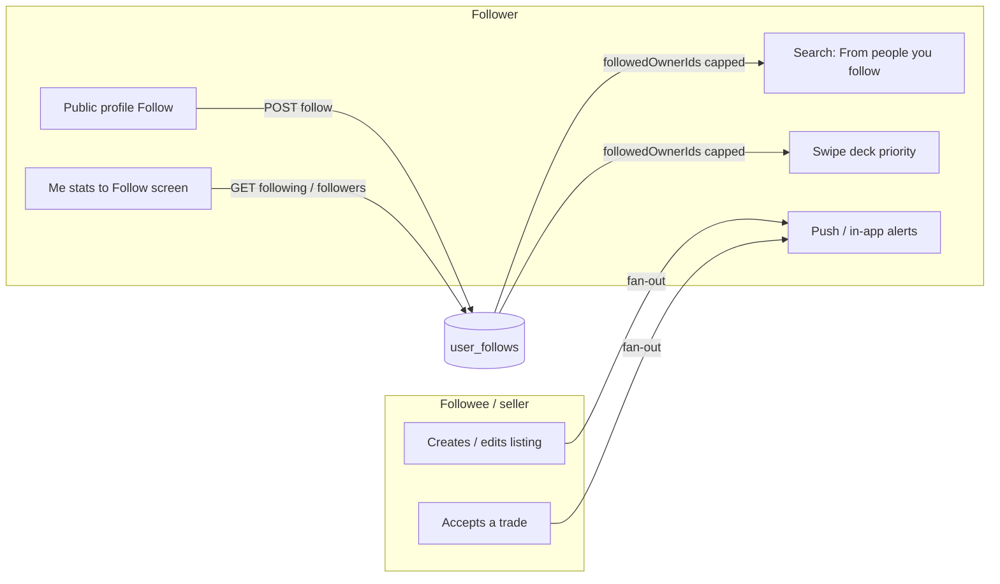

### What Follow is **not**

| Concept | Notes |
|---------|--------|
| Mutual friends | Following A does not make A follow you |
| Public followers list on others | Own Followers list only (`GET /api/users/me/followers`). Public profiles show **counts**, not the list |
| A replacement for block | Block deletes follow edges both ways and hides discovery |
| Guaranteed top of every deck | Boost is additive with 14-day decay; stronger taste matches can still rank higher |
| Unlimited ranking boost list | Deck/search injection uses at most **200** most recently followed sellers |

---

## 2. System architecture

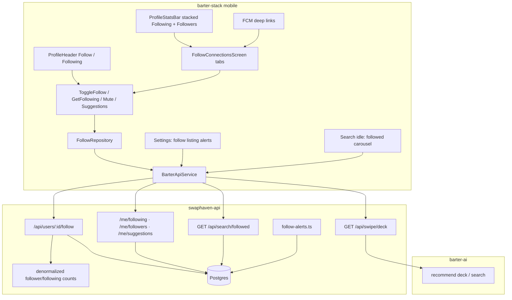

| Layer | Responsibility |
|-------|----------------|
| **Mobile** | Follow UI, mute menu, settings switch, deep links, search carousel |
| **swaphaven-api** | Graph CRUD, denormalized counts, suggestions, paced alert fan-out, SQL-paginated `/search/followed`, deck soft-pin fallback |
| **barter-ai** | Candidate injection + score boost when ranking the deck / recommendations |
| **Postgres** | `user_follows`, profile counts + alert flags, notification types, perf indexes (`0035`) |

---

## 3. Data model

### 3.1 `user_follows`

Migrations: `drizzle/0032_user_follows.sql`, `0034_follow_activity.sql` (mute).

| Column | Type | Notes |
|--------|------|--------|
| `id` | uuid PK | |
| `follower_id` | uuid → users | Who follows |
| `followee_id` | uuid → users | Who is followed |
| `alerts_muted` | boolean, default false | Keep follow + ranking; skip activity pushes |
| `created_at` | timestamptz | Newest-first list order |

Constraints:

- Unique `(follower_id, followee_id)`
- Indexes on `(follower_id, created_at)` and `(followee_id, created_at)`
- Cascade delete when either user is deleted

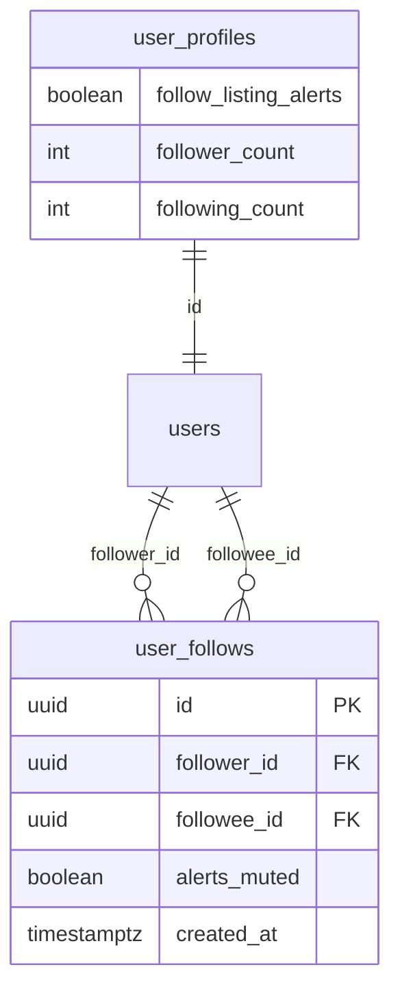

### 3.2 Profile flags and counts

| Field | Table | Default | Meaning |
|-------|-------|---------|---------|
| `follow_listing_alerts` | `user_profiles` | `true` | Master switch for listing / price / relist / trade-accepted alerts |
| `follower_count` | `user_profiles` | `0` | **Denormalized** — updated on follow / unfollow / block edge delete |
| `following_count` | `user_profiles` | `0` | **Denormalized** — same |
| `isFollowing` | Response only | `false` for guest / self | Whether the authenticated viewer follows this user |

Counts are maintained in `adjustFollowCounts` (`src/lib/user-follows.ts`). Profile GETs read the columns; they do **not** run live `COUNT(*)` on `user_follows`.

### 3.3 Notification types

Migrations: `0033_followed_listing_notification.sql`, `0034_follow_activity.sql`.

| `notification_type` | When | Push `data.type` | Deep link |
|---------------------|------|------------------|-----------|
| `followed_listing` | New listing create | `followed_listing` | Listing detail |
| `followed_listing_price` | Active listing price change | `followed_listing_price` | Listing detail |
| `followed_listing_relisted` | `paused` → `active` | `followed_listing_relisted` | Listing detail |
| `followed_trade_accepted` | Followed seller accepts an offer | `followed_trade_accepted` | Listing detail |
| `new_follower` | Someone follows you | `new_follower` | That user’s profile |

Extra columns on `notifications` for burst collapse:

| Column | Notes |
|--------|--------|
| `related_listing_id` | Listing for activity alerts |
| `actor_user_id` | Seller (or follower for `new_follower`) |
| `burst_count` | How many events this row represents after collapse |

### 3.4 Performance indexes (`0035_follow_perf.sql`)

| Index | Purpose |
|-------|---------|
| `notifications_user_type_actor_created_at_idx` | Burst-collapse lookup |
| `device_tokens_user_id_idx` | Push fan-out token load |
| `listings_status_user_id_created_at_idx` | Followed feeds / injection |

---

## 4. User flows

### 4.1 Follow someone

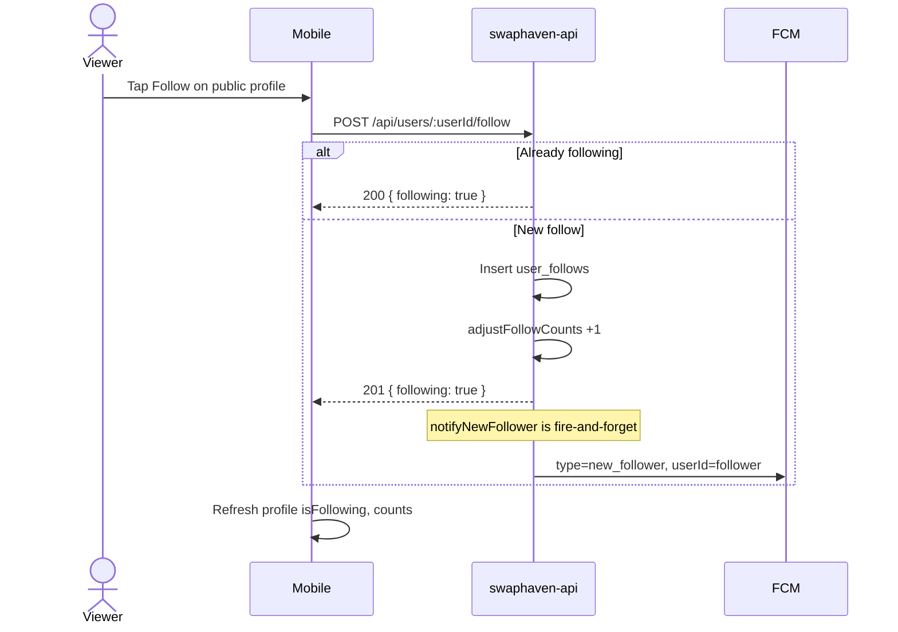

**Guards**

- Auth required
- Cannot follow yourself → `400`
- Block either way → `403`
- Target missing → `404`
- Idempotent: second POST → `200`, no second `new_follower` alert, counts unchanged

### 4.2 Unfollow

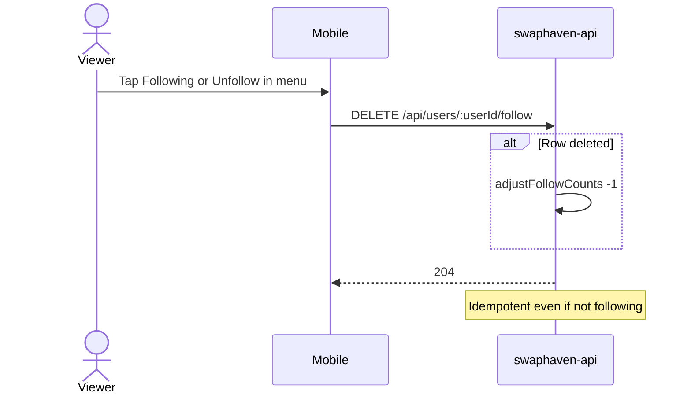

### 4.3 Mute one person (keep follow)

```mermaid
sequenceDiagram
  actor U as Follower
  participant App as Follow screen
  participant API as swaphaven-api

  U->>App: Mute listing alerts
  App->>API: PATCH /api/users/:userId/follow { alertsMuted: true }
  API-->>App: 200 { alertsMuted: true }
  Note over API: Ranking boost remains; activity fan-out skips this follower
```

### 4.4 Global alerts switch

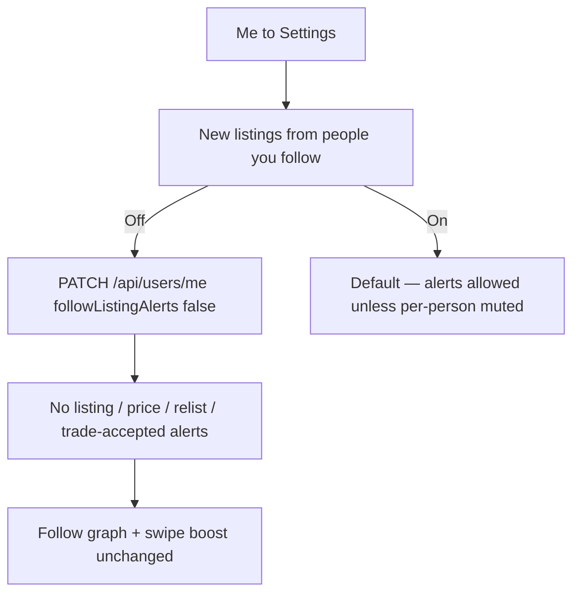

`new_follower` pushes are **not** gated by this switch.

### 4.5 Seller lists an item → follower alert

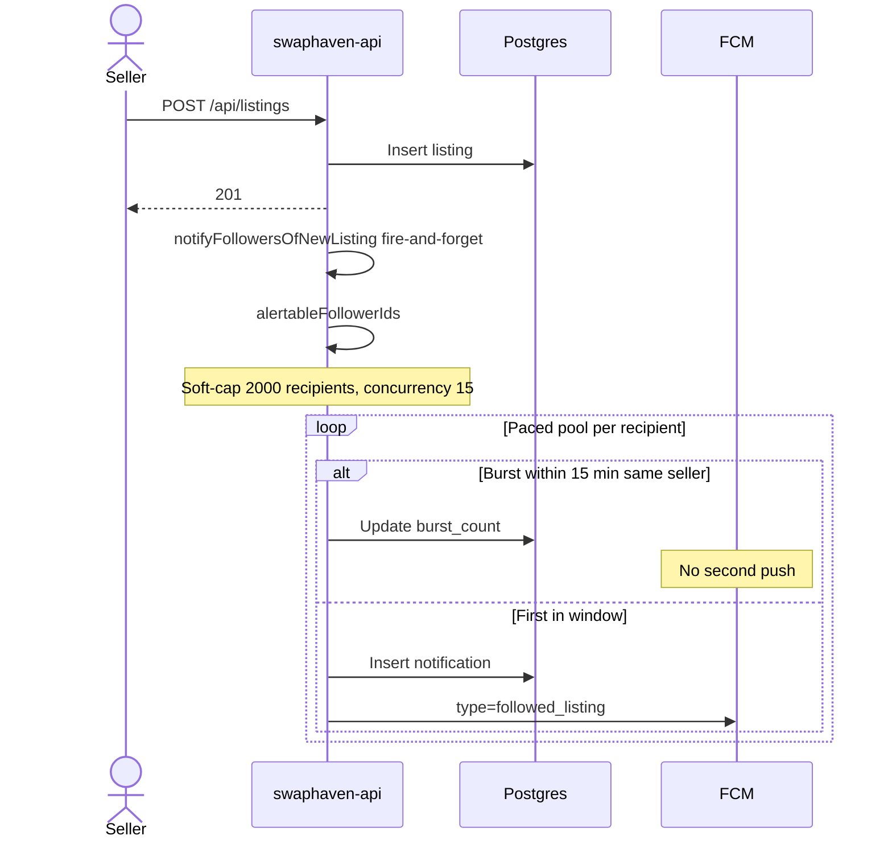

Burst copy:

| Count | Title | Body |
|-------|-------|------|
| 1 | New listing | `{Name} listed {Title}` |
| N | New listings | `{Name} listed N items` |

### 4.6 Other activity alerts

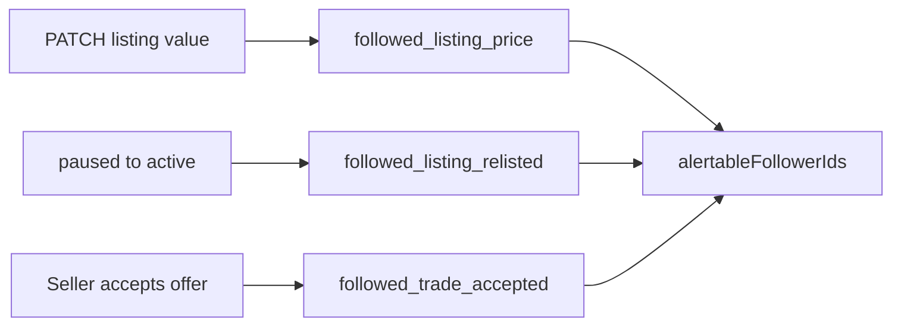

| Event | Collapse | Notes |
|-------|----------|--------|
| New listing | Per **seller**, 15 min | One push; body becomes “listed N items” |
| Price / relist | Per **listing**, 15 min | |
| Trade accepted | **None** | Every eligible follower gets insert + push |

Owners pause / list again via listing `status: paused` \| `active`.

### 4.7 Browse Follow screen (Me)

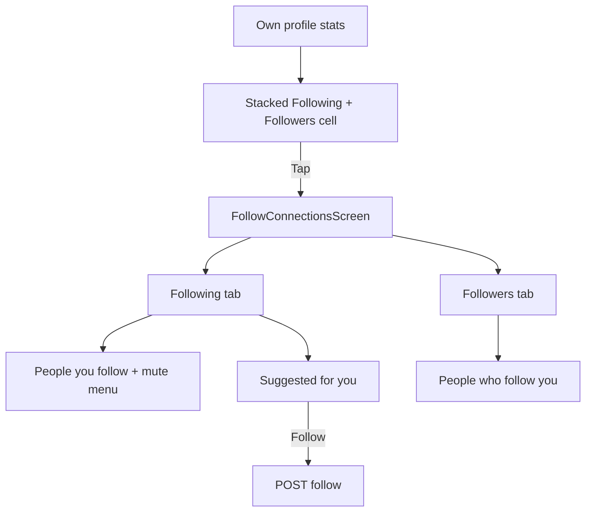

Public profiles show **Followers** count (not a tappable list of other people’s followers).

---

## 5. HTTP API

All follow mutations require auth.

| Method | Path | Purpose |
|--------|------|---------|
| `POST` | `/api/users/:userId/follow` | Follow (idempotent) |
| `DELETE` | `/api/users/:userId/follow` | Unfollow (idempotent `204`) |
| `PATCH` | `/api/users/:userId/follow` | `{ alertsMuted: boolean }` |
| `GET` | `/api/users/me/following` | Paginated following (+ `alertsMuted`) |
| `GET` | `/api/users/me/followers` | Paginated own followers |
| `GET` | `/api/users/me/suggestions` | Up to 10 sellers in interest categories; SQL excludes followed/blocked |
| `PATCH` | `/api/users/me` | Includes `followListingAlerts` |
| `GET` | `/api/users/me` | Includes denormalized `followerCount`, `followingCount` |
| `GET` | `/api/users/:userId` | `followerCount`, `followingCount`, `isFollowing` |
| `GET` | `/api/search/followed` | Newest active listings from followees (SQL page, not taste-ranked) |

### Follow response (POST)

```json
{
  "id": "…",
  "followeeId": "…",
  "following": true
}
```

### Mute response (PATCH)

```json
{
  "followeeId": "…",
  "following": true,
  "alertsMuted": true
}
```

### Following list item

```json
{
  "userId": "…",
  "displayName": "…",
  "avatarUrl": null,
  "followedAt": "2026-09-29T02:00:00.000Z",
  "alertsMuted": false
}
```

---

## 6. Discovery and ranking

### 6.1 Followee ID load (API)

`followedOwnerIds(viewerId)` in `src/lib/user-follows.ts`:

- Ordered by `created_at DESC`
- Default cap: **`DISCOVERY_FOLLOWEE_CAP = 200`**
- Used by swipe deck, search recommended injection, and soft-pin fallback

The Follow **lists** and `/search/followed` join still use the full graph (not limited to 200).

### 6.2 barter-ai

| Mechanism | Detail |
|-----------|--------|
| Candidate injection | Up to **40** recent active listings from followed owners (`FOLLOWED_SLOT`) |
| Score boost | Additive up to **0.3**, × recency decay over ~**14 days** (`followBoostScore`) |
| Reason string | Prefer follow reason when boost dominates |

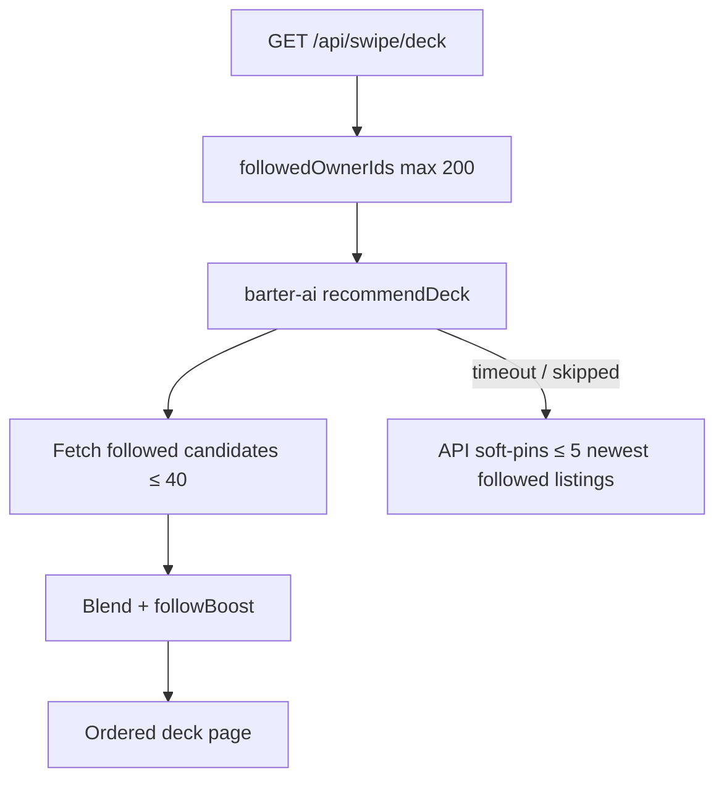

### 6.3 Search

| Endpoint / surface | Behavior |
|--------------------|----------|
| `GET /api/search/recommended` | Injects followed listings (capped followee set) into the ML pool |
| `GET /api/search/followed` | Join `user_follows → listings`, SQL `LIMIT`/`OFFSET` + `COUNT` — **does not** materialize all IDs in Node |
| Mobile search idle | Carousel **FROM PEOPLE YOU FOLLOW** above recommendations |

---

## 7. Alert fan-out (performance)

Implementation: `src/lib/follow-alerts.ts`.

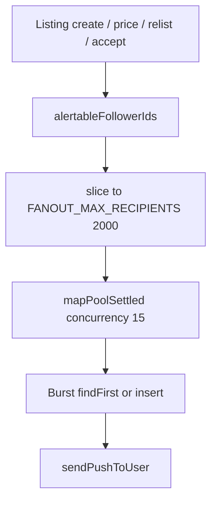

| Constant | Value | Meaning |
|----------|-------|---------|
| `BURST_WINDOW_MS` | 15 minutes | Collapse window |
| `FANOUT_CONCURRENCY` | 15 | Max parallel recipient workers |
| `FANOUT_MAX_RECIPIENTS` | 2000 | Soft-cap per event (beyond this, no alert for that event) |

**Eligibility query path**

1. Followers of seller with `alerts_muted = false` (SQL filter)
2. Blocks involving seller **restricted to those follower IDs**
3. Profiles with `follow_listing_alerts = true`

**Call sites**

| Trigger | Pattern |
|---------|---------|
| Listing create / price / relist | `void notify…().catch` — does not block HTTP |
| Offer accept (seller) | Same + activity email from main (`notifyOfferAccepted`) |
| POST follow | `void notifyNewFollower(…).catch` — response not blocked by FCM |

At **viral** scale (10k+ followers), prefer a queue/outbox later; current design is safe for early–mid growth.

---

## 8. Push and deep links (mobile)

| `data.type` | Opens |
|-------------|--------|
| `followed_listing` / `_price` / `_relisted` / `_trade_accepted` | Listing detail (`listingId`) |
| `new_follower` | Follower’s profile (`userId`) |

Payload fields: `title`, `body`, plus `listingId` or `userId`. FCM is data-oriented with APNs alert for title/body; Android relies on app handling.

**Old app builds** that do not know these types: tap deep-link is a no-op (parser returns null). iOS may still show the system alert. Not a crash — see §14.

---

## 9. Mobile surfaces map

| Screen / widget | Role |
|-----------------|------|
| `ProfileHeader` | Follow / Following on public profiles |
| `ProfileStatsBar` | Own profile: stacked Following + Followers → Follow screen |
| `FollowConnectionsScreen` | Tabs: Following \| Followers; suggestions under Following |
| Following row overflow menu | Mute / unmute, Unfollow |
| Settings | “New listings from people you follow” |
| Search idle | Followed listings carousel |
| My listing detail | Pause / List again (relist alerts) |

Feature layout (clean architecture):

```
mobile/lib/features/follow/
  domain/          FollowedUser, SuggestedPerson, FollowRepository
  application/     ToggleFollow, GetFollowing, GetFollowers, Mute, Suggestions, Alerts switch
  data/            Remote data source + models
  presentation/    FollowConnectionsScreen, tiles
  di/              followingListProvider, followersListProvider, …
```

---

## 10. Block interaction

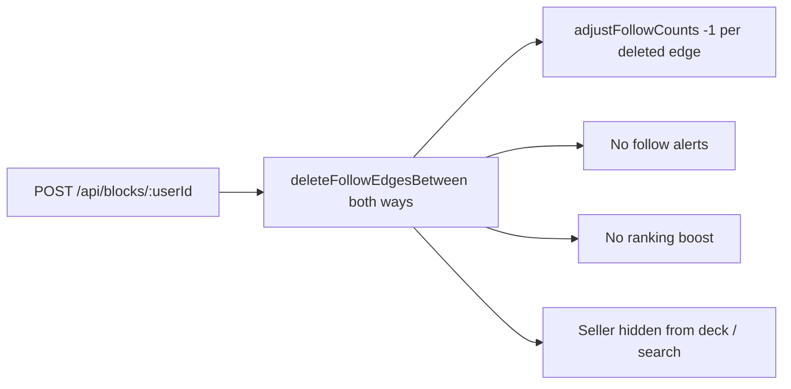

Follow while blocked → `403`. Unblock does **not** restore the follow.

---

## 11. Alert eligibility matrix

| Condition | Listing activity alerts | New follower alert |
|-----------|-------------------------|-------------------|
| Not following seller | No | — |
| `alerts_muted` on edge | No | — |
| `follow_listing_alerts = false` | No | Still yes (for followee) |
| Block either way | No | No |
| Beyond 2000th recipient in fan-out | No for that event | N/A |
| Self | N/A | N/A |

---

## 12. Performance impact summary

| Path | Behavior | Scale note |
|------|----------|------------|
| Profile GET | Read denormalized counts | Cheap always |
| Followed search | SQL page | Cost ≈ page size |
| Deck / recommended | ≤ 200 followees | Older follows still listed; less ML boost |
| Fan-out | Paced + soft-capped | Viral sellers may need a queue later |
| Empty follow graph | Near-zero extra work | Typical at launch |

| Scale | Risk |
|-------|------|
| Early (tens–hundreds of follows) | Negligible |
| Growth (~1k–2k followers on a seller) | Controlled; soft-cap may drop alerts past 2000 |
| Viral (10k+) | Plan queue/outbox |

---

## 13. Migrations and verify

| Migration | Purpose |
|-----------|---------|
| `0032_user_follows.sql` | Graph table |
| `0033_followed_listing_notification.sql` | `followed_listing` + `related_listing_id` |
| `0034_follow_activity.sql` | Mute, master switch, burst columns, extra notification enums |
| `0035_follow_perf.sql` | Denormalized counts, burst/token/listings indexes |

```bash
cd swaphaven-api
docker compose up -d postgres
npm run db:migrate
npx vitest run tests/follows.test.ts tests/followed-listing-notify.test.ts tests/follow-activity.test.ts
npm run typecheck
```

After schema changes, sync barter-ai read-only schema (`npm run schema:sync-barter-ai`).

Mobile (when Follow UI is on the branch):

```bash
cd barter-stack/mobile
flutter analyze lib/features/follow
flutter test test/core/notifications/notification_deep_link_test.dart
```

---

## 14. Deploy and old Flutter builds

Follow is **additive**. Old clients keep working on the new API.

| Situation | Impact |
|-----------|--------|
| Old app + new API | Auth, swipe, offers, chat unchanged |
| Extra JSON fields (`followerCount`, `isFollowing`, …) | Ignored by typical `fromJson` |
| New Follow endpoints | Old app never calls them |
| New push types to old app | May show system alert; deep link often no-op — not a crash |
| Empty follow graphs | No ranking/alert behavior change |

**Deploy order:** run migrations + API (+ barter-ai with `followedOwnerIds`) **before or with** the store build that exposes Follow. App-first without API → Follow UI gets 404s.

---

## 15. Edge cases

| Case | Behavior |
|------|----------|
| Follow self | `400` |
| Double follow | `200`, no duplicate edge / no second new-follower push / no double count |
| Unfollow when not following | `204`, counts unchanged |
| Mute when not following | `404` |
| Seller lists many items quickly | One push; in-app row updates `burst_count` |
| Followee has no FCM token | In-app notification still written; push skipped |
| Interest categories empty | Suggestions returns `[]` |
| barter-ai down | Soft-pin up to 5 followed listings on swipe deck |
| Guest | Can view public profiles; Follow requires sign-in |
| Block after follow | Edges deleted; denormalized counts decremented |

---

## 16. Key source files

| Area | Path |
|------|------|
| Graph helpers + caps + counts | `src/lib/user-follows.ts` |
| Alert fan-out | `src/lib/follow-alerts.ts` |
| User routes | `src/routes/users.ts` |
| Followed search | `src/search/collections.ts` → `searchFollowedPage` |
| Swipe soft-pin | `src/routes/swipe.ts` |
| Schema | `src/db/schema/user_follows.ts`, `users.ts`, `notifications.ts`, `listings.ts` |
| Tests | `tests/follows.test.ts`, `followed-listing-notify.test.ts`, `follow-activity.test.ts` |

---

## 17. Related docs

- [REPORT_AND_BLOCK.md](./REPORT_AND_BLOCK.md) — block removes follow edges  
- [SEARCH_RECOMMENDATIONS.md](./SEARCH_RECOMMENDATIONS.md) — recommended ranking  
- [SWIPE_FEATURE.md](./SWIPE_FEATURE.md) — deck pipeline  
- [deeplink-push-notifications.md](./deeplink-push-notifications.md) — FCM matrix  
- Mobile: `mobile/docs/PUSH_PAYLOAD_SPEC.md`, `deeplink-push-notifications.md`
