# Follow Feature

End-to-end reference for **Follow**: graph, alerts, discovery priority, and mobile UX across `swaphaven-api`, `barter-ai`, and `barter-stack/mobile`.

Follow is a **one-way** relationship: the **follower** watches the **followee** (seller). It is not mutual friendship and not a block.

---

## 1. Product overview

| Goal | What the user gets |
|------|--------------------|
| Stay close to sellers they trust | Follow from a public profile |
| Hear about new inventory | Push + in-app notification when that seller lists (and related activity) |
| See their items sooner | Swipe deck + recommendations boost followed sellers; Search has a dedicated “From people you follow” row |
| Control noise | Mute one person, or turn off follow alerts globally, without unfollowing |

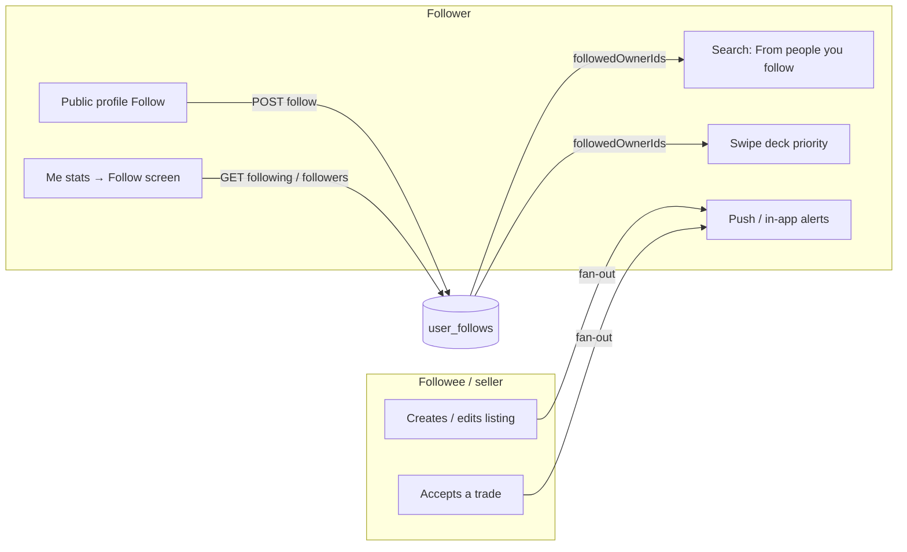

### What Follow is **not**

| Concept | Notes |
|---------|--------|
| Mutual friends | Following A does not make A follow you |
| Public followers list on others | Own Followers list only (`GET /api/users/me/followers`). Public profiles show **counts**, not the list |
| A replacement for block | Block deletes follow edges both ways and hides discovery |
| Guaranteed top of every deck | Boost is additive with 14-day decay; stronger taste matches can still rank higher |

---

## 2. System architecture

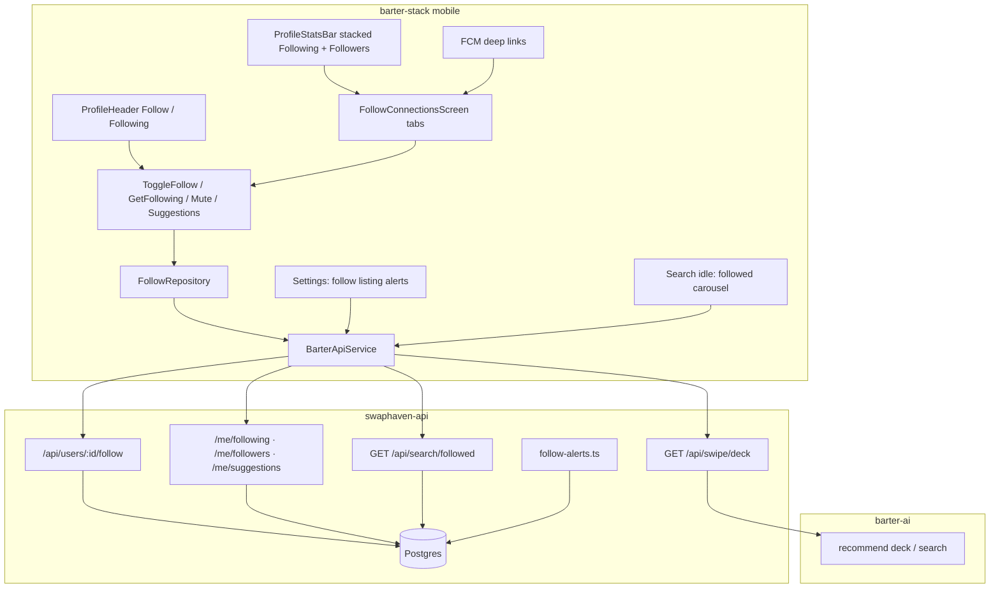

| Layer | Responsibility |
|-------|----------------|
| **Mobile** | Follow UI, mute menu, settings switch, deep links, search carousel |
| **swaphaven-api** | Graph CRUD, suggestions, alert fan-out, search/followed, deck soft-pin fallback |
| **barter-ai** | Candidate injection + score boost when ranking the deck / recommendations |
| **Postgres** | `user_follows`, notification types, `user_profiles.follow_listing_alerts` |

---

## 3. Data model

### 3.1 `user_follows`

Migration: `drizzle/0032_user_follows.sql` (+ `0034_follow_activity.sql` for mute).

| Column | Type | Notes |
|--------|------|--------|
| `id` | uuid PK | |
| `follower_id` | uuid → users | Who follows |
| `followee_id` | uuid → users | Who is followed |
| `alerts_muted` | boolean, default false | Keep follow + ranking; skip activity pushes |
| `created_at` | timestamptz | Newest-first list order |

Constraints:

- Unique `(follower_id, followee_id)`
- Indexes on `(follower_id, created_at)` and `(followee_id, created_at)`
- Cascade delete when either user is deleted

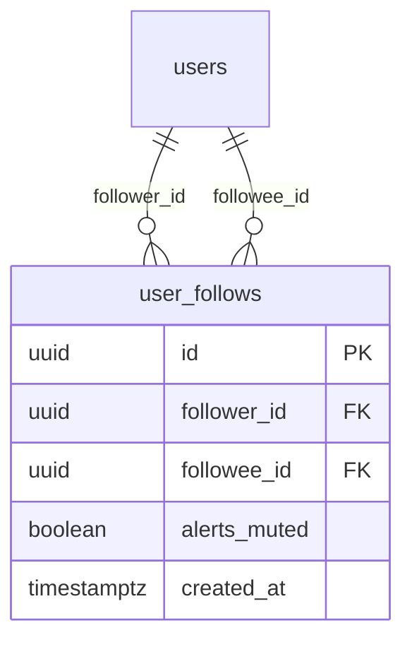

### 3.2 Profile flags

| Field | Table | Default | Meaning |
|-------|-------|---------|---------|
| `follow_listing_alerts` | `user_profiles` | `true` | Master switch for listing / price / relist / trade-accepted alerts from people you follow |
| `followerCount` / `followingCount` | Computed on profile responses | — | Not stored denormalized |
| `isFollowing` | Public profile when viewer is authenticated | `false` for guest / self | Whether the viewer follows this user |

### 3.3 Notification types

Migration: `drizzle/0033_followed_listing_notification.sql`, `0034_follow_activity.sql`.

| `notification_type` | When | Push `data.type` | Deep link |
|---------------------|------|------------------|-----------|
| `followed_listing` | New listing create | `followed_listing` | Listing detail |
| `followed_listing_price` | Active listing price change | `followed_listing_price` | Listing detail |
| `followed_listing_relisted` | `paused` → `active` | `followed_listing_relisted` | Listing detail |
| `followed_trade_accepted` | Followed seller accepts an offer | `followed_trade_accepted` | Listing detail |
| `new_follower` | Someone follows you | `new_follower` | That user’s profile |

Extra columns on `notifications` for burst collapse:

| Column | Notes |
|--------|--------|
| `related_listing_id` | Listing for activity alerts |
| `actor_user_id` | Seller (or follower for `new_follower`) |
| `burst_count` | How many events this row represents after collapse |

---

## 4. User flows

### 4.1 Follow someone

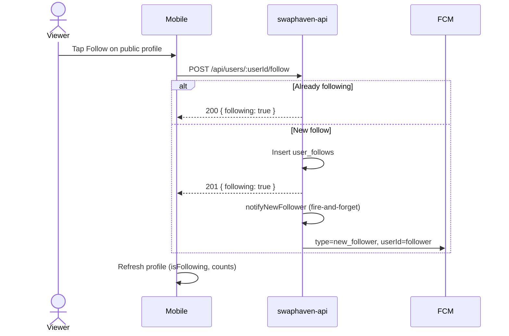

**Guards**

- Auth required
- Cannot follow yourself → `400`
- Block either way → `403`
- Target missing → `404`
- Idempotent: second POST → `200`, no second `new_follower` alert

### 4.2 Unfollow

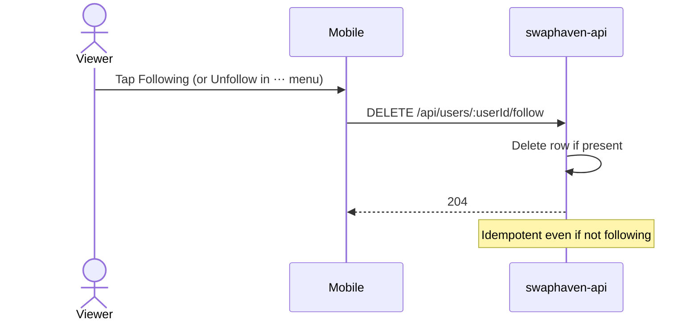

### 4.3 Mute one person (keep follow)

```mermaid
sequenceDiagram
  actor U as Follower
  participant App as Follow screen
  participant API as swaphaven-api

  U->>App: ⋯ → Mute listing alerts
  App->>API: PATCH /api/users/:userId/follow { alertsMuted: true }
  API-->>App: 200 { alertsMuted: true }
  Note over API: Ranking boost remains; activity fan-out skips this follower
```

Row shows subtitle **Listing alerts muted**. Menu item becomes **Turn alerts on**.

### 4.4 Global alerts switch

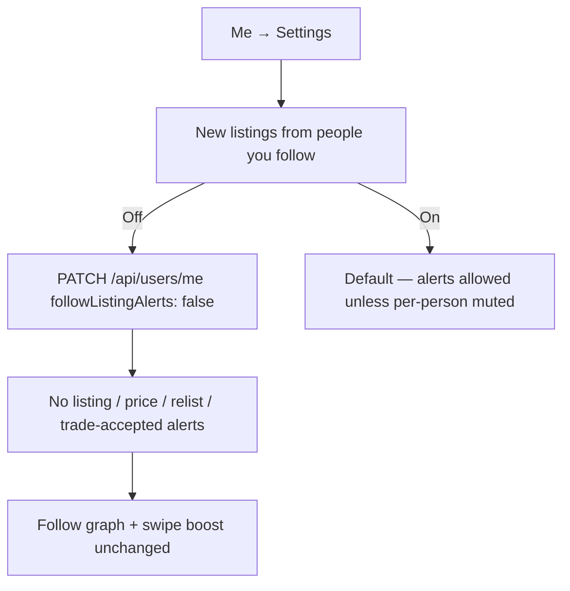

`new_follower` pushes are **not** gated by this switch (someone followed *you*).

### 4.5 Seller lists an item → follower alert

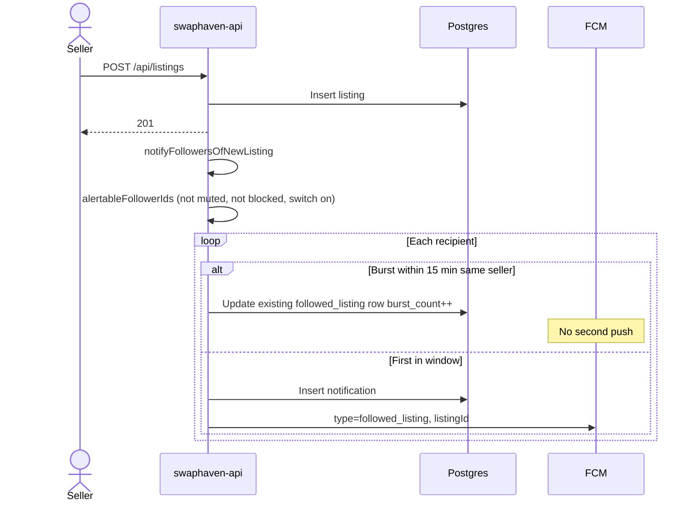

Burst copy:

| Count | Title | Body |
|-------|-------|------|
| 1 | New listing | `{Name} listed {Title}` |
| N | New listings | `{Name} listed N items` |

### 4.6 Other activity alerts

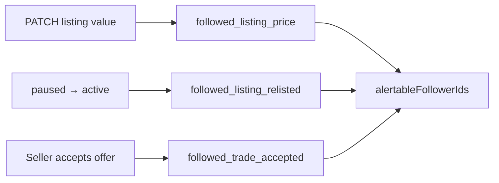

Price and relist collapse per **listing** in the 15-minute window. Trade-accepted does not collapse.

Mobile owners can pause / list again from **My listing detail** (`status: paused` \| `active`).

### 4.7 Browse Follow screen (Me)

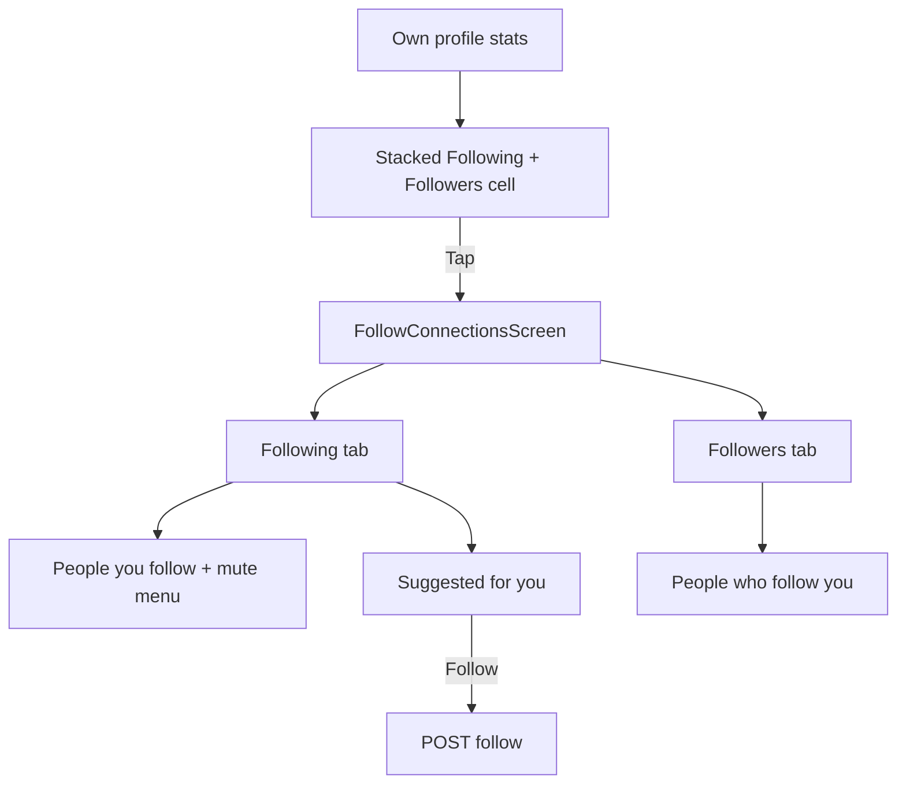

Public profiles keep **Followers** count (not tappable list) and **Responds**; they do not open your private Followers list.

---

## 5. HTTP API

All follow mutations require auth.

| Method | Path | Purpose |
|--------|------|---------|
| `POST` | `/api/users/:userId/follow` | Follow (idempotent) |
| `DELETE` | `/api/users/:userId/follow` | Unfollow (idempotent `204`) |
| `PATCH` | `/api/users/:userId/follow` | `{ alertsMuted: boolean }` |
| `GET` | `/api/users/me/following` | Paginated following (+ `alertsMuted`) |
| `GET` | `/api/users/me/followers` | Paginated own followers |
| `GET` | `/api/users/me/suggestions` | Up to 10 sellers in interest categories, not followed, not blocked |
| `PATCH` | `/api/users/me` | Includes `followListingAlerts` |
| `GET` | `/api/users/:userId` | `followerCount`, `followingCount`, `isFollowing` |
| `GET` | `/api/search/followed` | Newest active listings from followees (not taste-ranked) |

### Follow response (POST / PATCH)

```json
{
  "id": "…",
  "followeeId": "…",
  "following": true,
  "alertsMuted": false
}
```

### Following list item

```json
{
  "userId": "…",
  "displayName": "…",
  "avatarUrl": null,
  "followedAt": "2026-09-29T02:00:00.000Z",
  "alertsMuted": false
}
```

---

## 6. Discovery and ranking

### 6.1 barter-ai

| Mechanism | Detail |
|-----------|--------|
| Candidate injection | Up to **40** recent active listings from followed owners reserved in the scored pool (`FOLLOWED_SLOT`) |
| Score boost | Additive up to **0.3**, × recency decay over ~**14 days** (`followBoostScore`) |
| Reason string | Prefer follow reason when boost dominates (e.g. “From someone you follow”) |

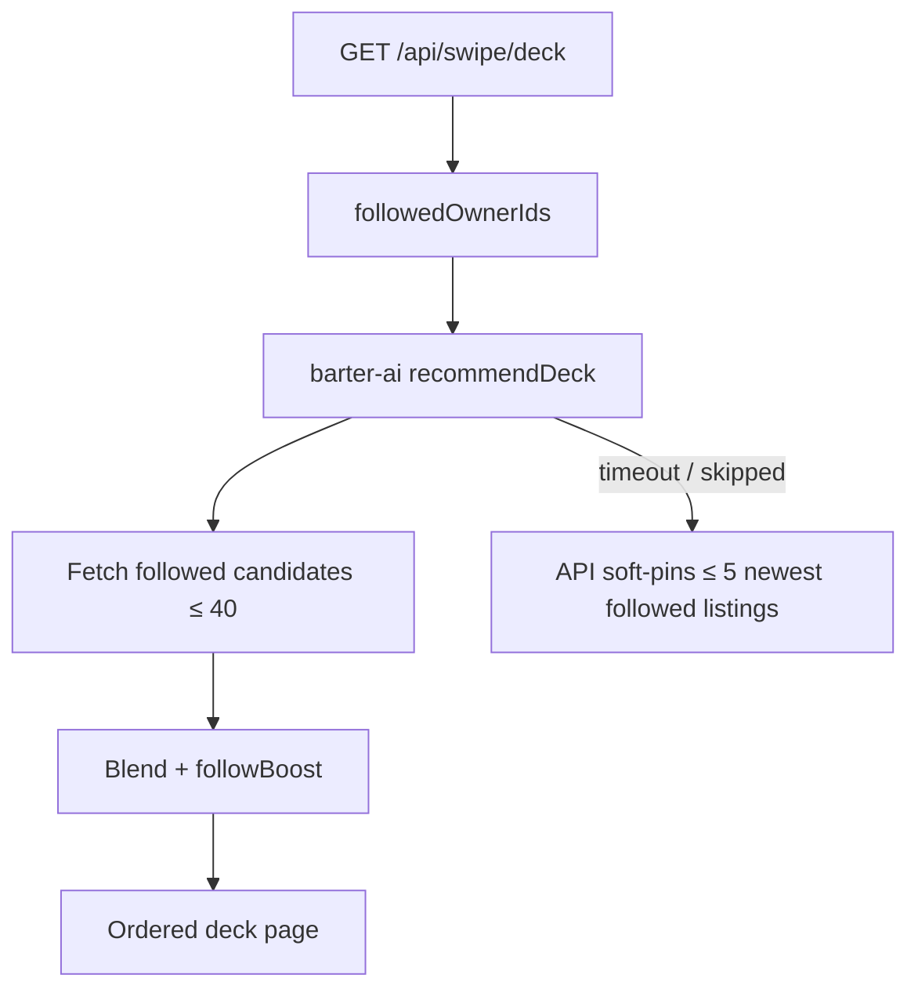

### 6.2 Search

| Endpoint / surface | Behavior |
|--------------------|----------|
| `GET /api/search/recommended` | Injects followed listings into the ML pool (same boost) |
| `GET /api/search/followed` | Separate newest-first feed — visible even when taste outranks follows |
| Mobile search idle | Carousel **FROM PEOPLE YOU FOLLOW** above recommendations |

---

## 7. Push and deep links (mobile)

| `data.type` | Opens |
|-------------|--------|
| `followed_listing` / `_price` / `_relisted` / `_trade_accepted` | `/listings/:listingId` |
| `new_follower` | `/users/:userId` (the follower) |

Payload fields: `title`, `body`, plus `listingId` or `userId`. Data-only FCM (no top-level `notification` block) for custom cards.

---

## 8. Mobile surfaces map

| Screen / widget | Role |
|-----------------|------|
| `ProfileHeader` | Follow / Following on public profiles |
| `ProfileStatsBar` | Own profile: one stacked cell (Following above, Followers below) → Follow screen |
| `FollowConnectionsScreen` | Tabs: Following \| Followers; suggestions under Following |
| Following row `⋯` | Mute / unmute alerts, Unfollow |
| Settings | “New listings from people you follow” |
| Search idle | Followed listings carousel |
| My listing detail | Pause / List again (drives relist alerts) |

Feature layout (clean architecture):

```
mobile/lib/features/follow/
  domain/          FollowedUser, SuggestedPerson, FollowRepository
  application/     ToggleFollow, GetFollowing, GetFollowers, Mute, Suggestions, Alerts switch
  data/            Remote data source + models
  presentation/    FollowConnectionsScreen, tiles
  di/              followingListProvider, followersListProvider, …
```

---

## 9. Block interaction

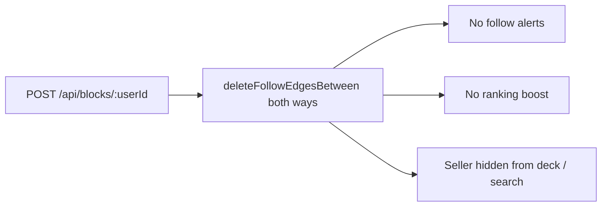

Follow while blocked → `403`. Unblock does **not** restore the follow; the user must follow again.

---

## 10. Alert eligibility matrix

| Condition | Listing activity alerts | New follower alert |
|-----------|-------------------------|-------------------|
| Not following seller | No | — |
| `alerts_muted` on edge | No | — |
| `follow_listing_alerts = false` | No | Still yes (for followee) |
| Block either way | No | No |
| Self | N/A | N/A |

---

## 11. Migrations and verify

| Migration | Purpose |
|-----------|---------|
| `0032_user_follows.sql` | Graph table |
| `0033_followed_listing_notification.sql` | `followed_listing` + `related_listing_id` |
| `0034_follow_activity.sql` | Mute, master switch, burst columns, extra notification enums |

Local API:

```bash
cd swaphaven-api
docker compose up -d postgres
npm run db:migrate
npx vitest run tests/follows.test.ts tests/followed-listing-notify.test.ts tests/follow-activity.test.ts
npm run typecheck
```

After schema changes, sync barter-ai read-only schema (`npm run schema:sync-barter-ai`).

Mobile:

```bash
cd barter-stack/mobile
flutter analyze lib/features/follow
flutter test test/core/notifications/notification_deep_link_test.dart
```

---

## 12. Edge cases

| Case | Behavior |
|------|----------|
| Follow self | `400` |
| Double follow | `200`, no duplicate edge / no second new-follower push |
| Unfollow when not following | `204` |
| Mute when not following | `404` |
| Seller lists many items quickly | One push; in-app row updates `burst_count` |
| Followee has no FCM token | In-app notification still written; push skipped |
| Interest categories empty | Suggestions returns `[]` |
| barter-ai down | Soft-pin up to 5 followed listings on swipe deck |
| Guest | Can view public profiles; Follow requires sign-in |

---

## 13. Related docs

- [REPORT_AND_BLOCK.md](./REPORT_AND_BLOCK.md) — block removes follow edges  
- [SEARCH_RECOMMENDATIONS.md](./SEARCH_RECOMMENDATIONS.md) — recommended ranking  
- [SWIPE_FEATURE.md](./SWIPE_FEATURE.md) — deck pipeline  
- Mobile: `mobile/docs/PUSH_PAYLOAD_SPEC.md`, `deeplink-push-notifications.md`
