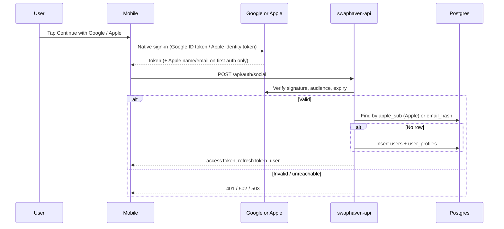
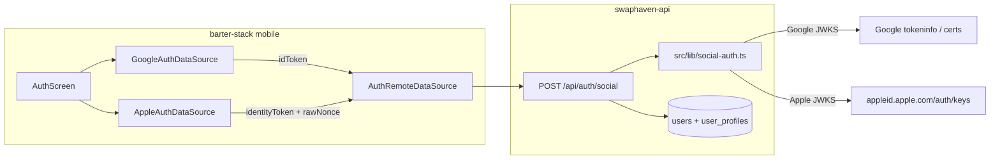

# Google and Apple login

**Validated against code (2026-08-28)** on `swaphaven-api` `main` and barter-stack mobile (`applesignin`).

Sign in (or sign up) with Google or Apple is a **one-shot token exchange**: the app obtains a provider identity token on-device, then `POST /api/auth/social` verifies it server-side and issues the same JWT pair as email/password login.

Facebook is also accepted on the same endpoint; this document is Google and Apple only. API field list for all three providers: [SOCIAL_LOGIN.md](./SOCIAL_LOGIN.md). Email/password OTP signup: [CREATE_ACCOUNT_OTP.md](./CREATE_ACCOUNT_OTP.md).

---

## Product overview

| | Google | Apple |
|--|--------|-------|
| User taps | **Continue with Google** | **Continue with Apple** |
| App obtains | Google ID token (JWT) | Apple identity token (JWT) + raw nonce |
| App sends | `{ provider: "google", idToken }` | `{ provider: "apple", idToken, nonce, fullName?, email? }` |
| API verifies | `google-auth-library` `verifyIdToken` | Apple JWKS + nonce SHA-256 + `aud`/`iss` |
| Account key | Verified email | Apple `sub` (`users.apple_sub`), then verified email |
| New user | Find-or-create immediately (no OTP) | Same |
| Existing email/password user | Linked by email; password unchanged | Linked by email; `apple_sub` stored |

Social signup **skips** the email OTP. A random unguessable `password_hash` is stored so password login stays disabled until the user sets one via forgot-password.

---

## Architecture





**Code map**

| Layer | Path |
|-------|------|
| HTTP | `src/routes/auth.ts` — `POST /social` |
| Verify | `src/lib/social-auth.ts` — `verifySocialToken` |
| Schema | `src/db/schema/users.ts` — `appleSub` |
| Migration | `drizzle/0028_user_apple_sub.sql` |
| OpenAPI | `src/openapi/spec.ts` — `/api/auth/social` |
| Mobile Google | `mobile/lib/features/auth/data/datasources/google_auth_data_source.dart` |
| Mobile Apple | `mobile/lib/features/auth/data/datasources/apple_auth_data_source.dart` |
| Mobile exchange | `mobile/lib/features/auth/data/datasources/auth_remote_data_source.dart` |

---

## Shared HTTP contract

```http
POST /api/auth/social
Content-Type: application/json
```

Unauthenticated. Rate-limited with the other auth routes (`AUTH_RATE_LIMIT_MAX`).

### Success `200 OK`

Same shape as `POST /api/auth/login`. `user.email` is the **masked** address (email privacy), not the raw mailbox.

```json
{
  "accessToken": "eyJ...",
  "refreshToken": "eyJ...",
  "user": {
    "id": "uuid",
    "email": "a***e@gmail.com",
    "name": "Ada Lovelace"
  }
}
```

Use `accessToken` as `Authorization: Bearer <token>`. Rotate with `POST /api/auth/refresh`.

### Errors

| Status | `error` | When |
|--------|---------|------|
| 400 | `validation` | Unknown `provider`, missing `idToken`, or Apple missing `nonce` |
| 401 | `unauthorized` | Bad/expired token, audience mismatch, unverified email, Apple nonce mismatch, first Apple sign-in with no email in the JWT |
| 403 | `forbidden` | Account `suspended_at` is set |
| 502 | `bad_gateway` | Google certs or Apple JWKS unreachable — client should retry |
| 503 | `unavailable` | Google: no client IDs configured. Apple: no audiences (`IOS_BUNDLE_ID` unset **and** no `APPLE_CLIENT_IDS`) |

---

## Account creation and linking

Verified identity is never taken from the client’s optional `email` field. Google and Apple email come from the **token**. Apple `fullName` is used only as a display name when creating a row (Apple does not put the name in the JWT).

Lookup order in `findOrCreateSocialUser`:

1. **Apple `sub`** — `users.apple_sub` unique. Later Apple sessions often omit email; this is the stable key.
2. **Email hash** — `users.email_hash` from the verified JWT email (normalized, HMAC’d with `EMAIL_HASH_PEPPER`).
3. **Insert** — new `users` + `user_profiles`. Random bcrypt `password_hash`. Drop any `pending_registrations` row for that email.
4. **Link** — if an email/password (or Google) row exists and Apple is signing in for the first time, set `apple_sub` on that row. Existing password is not overwritten.

Concurrent double-taps: unique `email_hash` or `apple_sub` (`23505`) → re-read the winner’s row and issue tokens.

Display name is trimmed and capped at 80 characters (same as `/register`).

**Hide My Email:** Apple may issue `…@privaterelay.appleid.com`. That is a real mailbox; store it like any other verified email.

**First Apple auth without email:** if the JWT has no email **and** no `apple_sub` row exists → `401` with a message to revoke the app under iOS Settings → Apple ID → Sign in with Apple, then try again. Name/email are only delivered on that first authorization.

---

## Google

### What the mobile app sends

```json
{ "provider": "google", "idToken": "<google-id-token>" }
```

Flutter `google_sign_in` is initialized with `serverClientId` from `SERVER_CLIENT_ID` in the flavour env files (`mobile/lib/config/env/*.env`). The ID token’s `aud` claim is that **Web** OAuth client ID.

Native iOS also has `GIDClientID` / a reversed-client-id URL scheme in `Info.plist` for the iOS OAuth client. The **server** must accept whichever `aud` the token actually carries:

| Env on API | Typical `aud` in the ID token |
|------------|-------------------------------|
| `GOOGLE_CLIENT_ID` | Web client (matches mobile `SERVER_CLIENT_ID`) — **this is the usual case** |
| `GOOGLE_IOS_CLIENT_ID` | iOS client, if the app is not using `serverClientId` |
| `GOOGLE_ANDROID_CLIENT_ID` | Android client, same situation |

At least one of the three must be set or Google returns `503`.

### Server verification

1. `OAuth2Client.verifyIdToken({ idToken, audience: all configured client IDs })`.
2. Payload must include `email` and `email_verified === true`.
3. Transport / Google 5xx → `502`. Signature, expiry, wrong `aud` → `401`.

The API never talks to Google as an OAuth client (no redirect URI, no client secret for this path). It only **verifies** tokens the app already obtained.

### Console setup (Google Cloud)

1. [Google Cloud Console](https://console.cloud.google.com) → project used by the mobile app → **APIs & Services** → **Credentials**.
2. Create (or reuse) OAuth clients:
   - **Web application** — this ID is `SERVER_CLIENT_ID` on mobile and `GOOGLE_CLIENT_ID` on the API.
   - **iOS** — bundle id `com.barter.app.barterMobile` (UAT: `com.barter.app.barterMobile.uat`). Reversed client id goes in `CFBundleURLSchemes`.
   - **Android** — package `com.barter.app.barter_mobile` plus SHA-1 of the signing cert.
3. OAuth consent screen: add the `email` (and profile) scopes the app requests (`scopeHint: ['email']`).
4. Copy the **Web** client ID into Railway / `.env` as `GOOGLE_CLIENT_ID`. Add iOS/Android client IDs only if tokens are addressed to those clients.

Local / Railway:

```env
GOOGLE_CLIENT_ID=<web-client-id>.apps.googleusercontent.com
# GOOGLE_IOS_CLIENT_ID=<ios-client-id>.apps.googleusercontent.com
# GOOGLE_ANDROID_CLIENT_ID=<android-client-id>.apps.googleusercontent.com
```

### Google troubleshooting

| Symptom | Cause |
|---------|--------|
| `503` `Google sign-in is not configured` | No `GOOGLE_*_CLIENT_ID` on the API |
| `401` `Invalid Google token` | Expired token (~1h), or `aud` is not in the configured list |
| App: Google Sign-In fails before the API | Missing `SERVER_CLIENT_ID` in the flavour `.env`; `serverClientId` is null |
| `401` unverified email | Google account without a verified email (rare for consumer accounts) |

---

## Apple

### What the mobile app sends

The app generates a 32-character raw nonce, sends **SHA-256(hex)** of it to Apple, and sends the **raw** nonce to the API:

```json
{
  "provider": "apple",
  "idToken": "<identity-token JWT>",
  "nonce": "<raw-nonce>",
  "fullName": "Ada Lovelace",
  "email": "ada@privaterelay.appleid.com"
}
```

`fullName` / `email` are omitted on later sign-ins (`?` in Dart). The API **ignores client `email`** for identity.

iOS entitlement: `com.apple.developer.applesignin` in `Runner.entitlements` / `Runner-Release.entitlements`.

### Server verification

1. Decode JWT header `kid`; load [Apple JWKS](https://appleid.apple.com/auth/keys) (cached 1h, refetch on unknown `kid`).
2. `jwt.verify` with `RS256`, `iss = https://appleid.apple.com`, `aud` ∈ apple audiences, 60s clock skew.
3. Timing-safe compare: `SHA-256(raw nonce)` vs JWT `nonce` claim.
4. `sub` required (stable Apple user id).
5. If `email` is present, `email_verified` must be `true` or `"true"` (Apple uses a string).

**Audiences** (`appleAudiences()`):

- `IOS_BUNDLE_ID` (default `com.barter.app.barterMobile`)
- `${IOS_BUNDLE_ID}.uat` when the prod bundle does not already end in `.uat`
- Extra comma-separated ids in `APPLE_CLIENT_IDS` (Android Services ID, web Services ID)

Native iOS identity tokens use the **bundle id** as `aud`, not a Google-style client id.

### Apple Developer setup

1. [Apple Developer](https://developer.apple.com) → **Certificates, Identifiers & Profiles** → **Identifiers**.
2. App ID `com.barter.app.barterMobile` (and UAT `com.barter.app.barterMobile.uat`): enable **Sign in with Apple**.
3. Xcode: Signing & Capabilities → **Sign in with Apple** (writes the entitlement).
4. App Store Connect: the capability must be on the app record used for TestFlight / release.
5. **Android** (if you ship Sign in with Apple there): create a **Services ID**, configure the return URL / domain, and add that Services ID to `APPLE_CLIENT_IDS` so `aud` matches.

No Apple client secret is required for **native** iOS token verification. A Services ID + secret is only needed if you add a web or Android web-based Apple flow later.

Local / Railway:

```env
IOS_BUNDLE_ID=com.barter.app.barterMobile
# Extra audiences (Android / web Services ID):
# APPLE_CLIENT_IDS=com.barter.app.service
```

`IOS_BUNDLE_ID` already defaults in `src/config/env.ts`. Production still needs migration `0028_user_apple_sub.sql` (Railway `migrate:prod` on start).

### Apple troubleshooting

| Symptom | Cause |
|---------|--------|
| `400` validation on `nonce` | Client omitted `nonce` |
| `401` `Invalid Apple token nonce` | Raw nonce does not hash to the JWT claim (app must send the **unhashed** nonce) |
| `401` `Invalid Apple token` | Expired JWT (~10 min), wrong bundle `aud`, or JWKS `kid` miss |
| `401` email missing | First-time user, Apple JWT has no email, no `apple_sub` row — revoke and re-authorize |
| `502` `Could not reach Apple` | JWKS fetch timeout / network |
| Name always empty after first login | Expected — Apple only sends name once; we persist it on create |

---

## Environment reference

| Variable | Required | Used by |
|----------|----------|---------|
| `GOOGLE_CLIENT_ID` | Yes for Google (or a mobile Google client id) | Token `aud` |
| `GOOGLE_IOS_CLIENT_ID` | If iOS tokens use the iOS client as `aud` | Token `aud` |
| `GOOGLE_ANDROID_CLIENT_ID` | If Android tokens use the Android client as `aud` | Token `aud` |
| `IOS_BUNDLE_ID` | Default `com.barter.app.barterMobile` | Apple token `aud` |
| `APPLE_CLIENT_IDS` | No | Extra Apple `aud` values, comma-separated |
| `EMAIL_HASH_PEPPER` | Yes (all auth) | Email lookup for linking |
| `EMAIL_ENCRYPTION_KEY` | Yes (all auth) | Store sealed email on create |

See `.env.example` and [DEPLOYMENT.md](./DEPLOYMENT.md).

---

## Testing

```bash
npx vitest run tests/auth.test.ts tests/social-auth.test.ts
```

| File | What is mocked | What is real |
|------|----------------|--------------|
| `tests/auth.test.ts` | `verifySocialToken` | Postgres find-or-create, Apple `apple_sub`, linking, validation |
| `tests/social-auth.test.ts` | Google `OAuth2Client`, `fetch` (Facebook + Apple JWKS) | JWT sign/verify with a generated RSA key for Apple |

Manual smoke (real device token):

```bash
# Google
curl -s -X POST http://localhost:3001/api/auth/social \
  -H 'Content-Type: application/json' \
  -d '{"provider":"google","idToken":"<google-id-token>"}' | jq

# Apple
curl -s -X POST http://localhost:3001/api/auth/social \
  -H 'Content-Type: application/json' \
  -d '{"provider":"apple","idToken":"<identity-token>","nonce":"<raw-nonce>"}' | jq

export TOKEN="<accessToken>"
curl -s http://localhost:3001/api/auth/me -H "Authorization: Bearer $TOKEN" | jq
```

---

## Security notes

- Tokens are verified **on the server**. Never trust a client-supplied email or Apple `sub`.
- Apple nonce stops replay of a captured identity token with a different nonce.
- JWKS is fetched over HTTPS; keys are cached and refreshed on rotation.
- Social `password_hash` is random; it is not a login path until reset-password.
- Suspended users are rejected on social login the same as password login (`403`).
- Auth rate limit applies to `/social` like `/login`.

---

## Related

- [SOCIAL_LOGIN.md](./SOCIAL_LOGIN.md) — compact API + Facebook
- [CREATE_ACCOUNT_OTP.md](./CREATE_ACCOUNT_OTP.md) — email/password OTP (social skips this)
- [API_GUIDE.md](./API_GUIDE.md) — curl cheatsheet
- [DEPLOYMENT.md](./DEPLOYMENT.md) — Railway env
