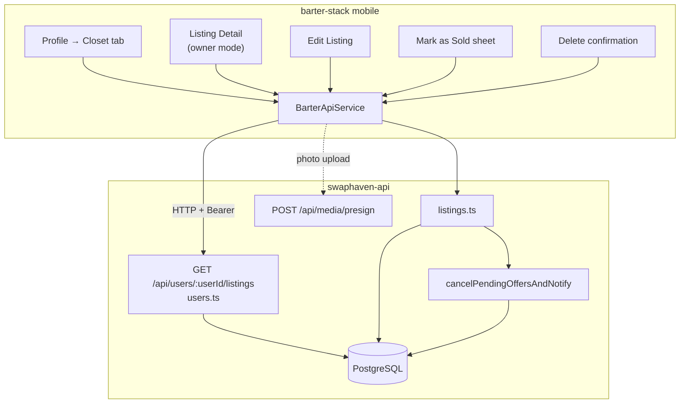
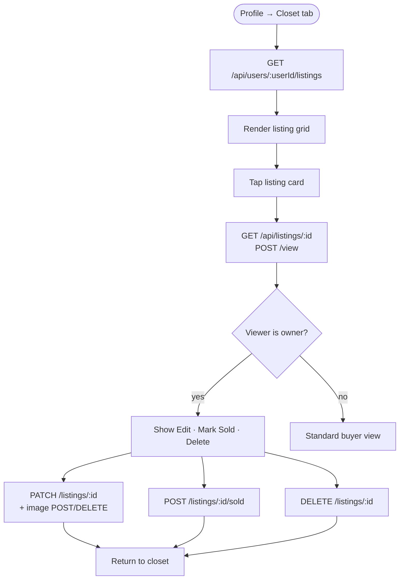
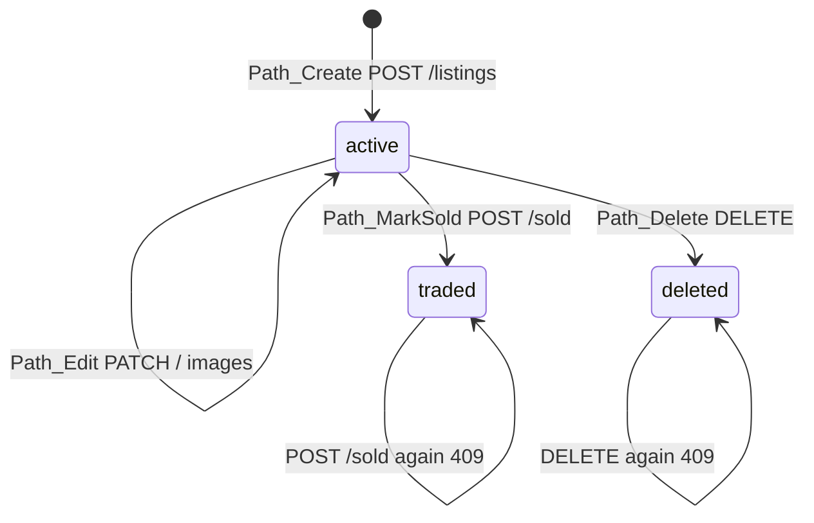
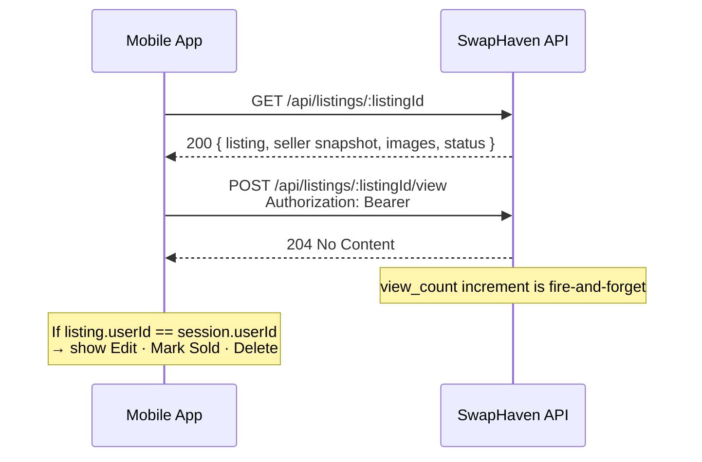
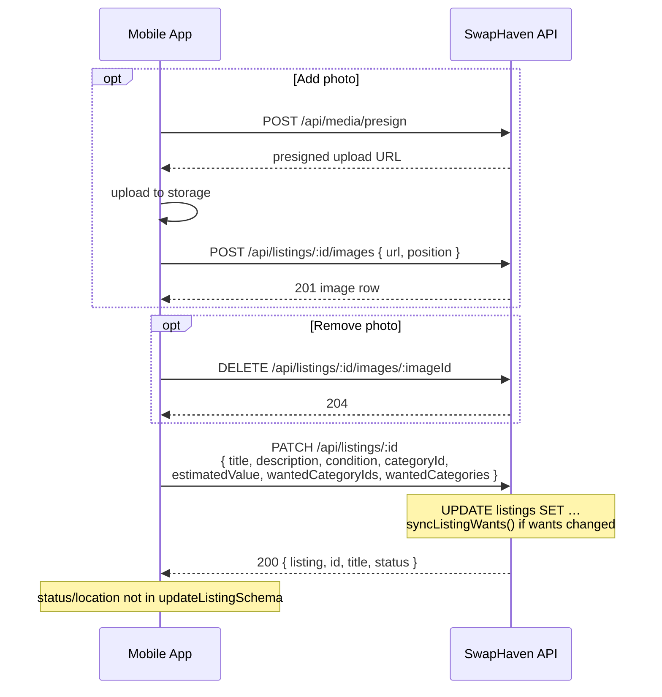
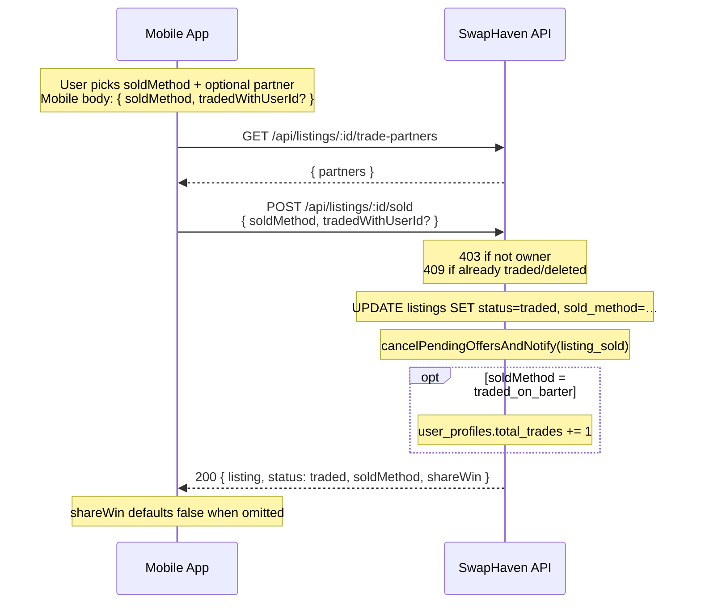
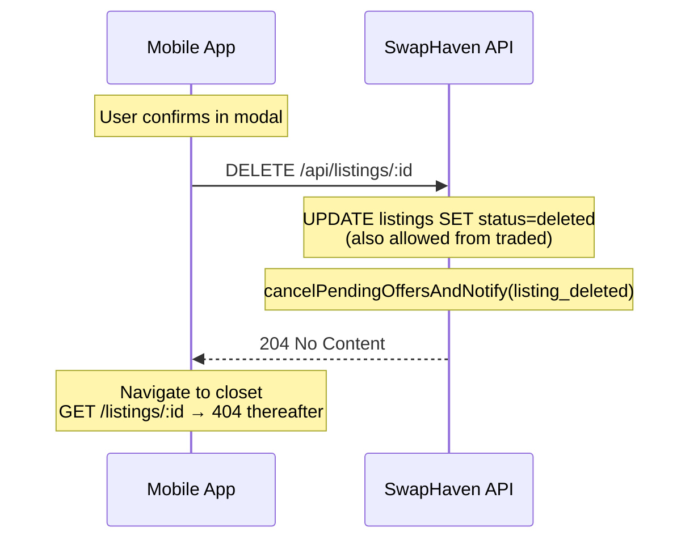
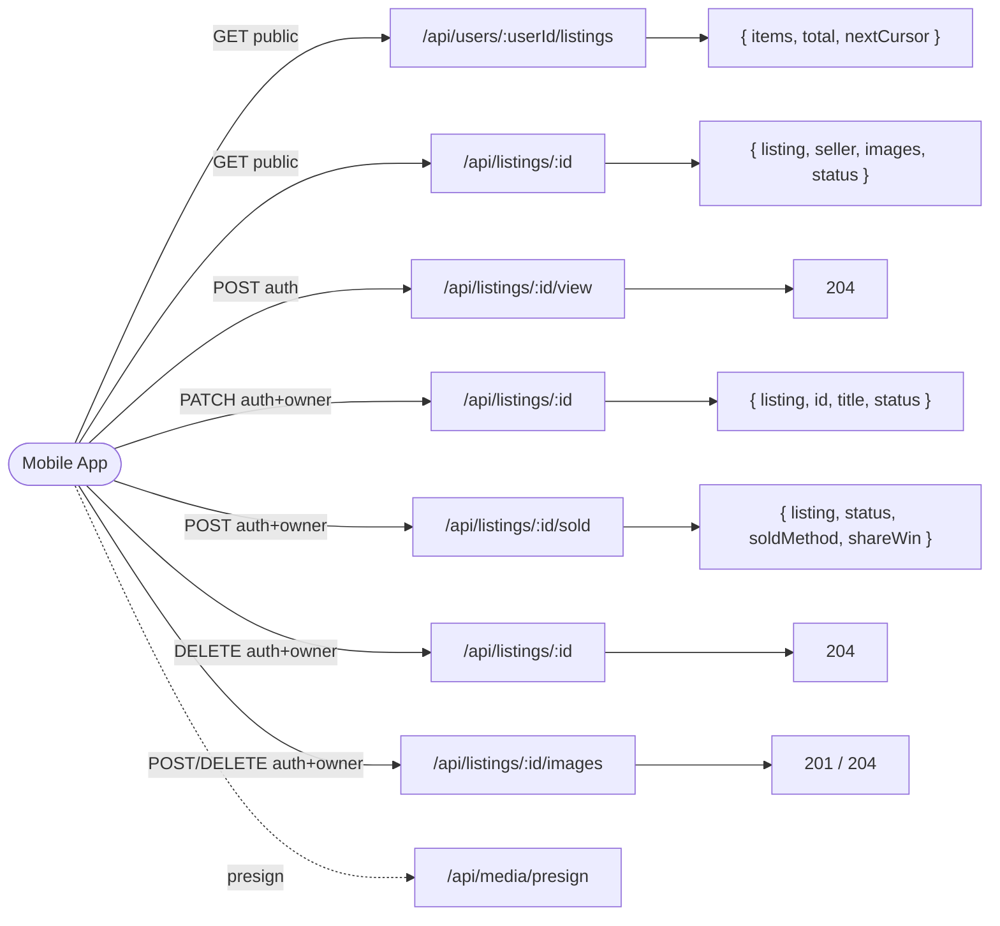
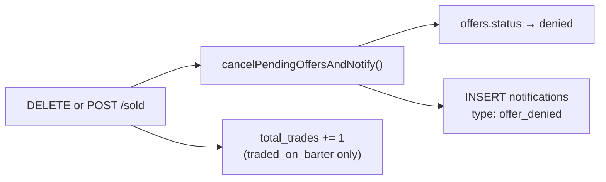

# Listing management — profile closet owner actions

Technical reference for the **profile closet → listing detail → edit / mark sold / delete** flow across **swaphaven-api** (implemented) and **barter-stack mobile** (UI screens). A seller opens their own listing from the closet and can update listing fields, close it out as sold, or soft-delete it.

**Dedicated flow docs (preferred for deep dives):**

- [LISTING_STATUS_AND_OWNER_FLOWS.md](./LISTING_STATUS_AND_OWNER_FLOWS.md) — **status diagram, transition paths, all sequence diagrams**
- [MARK_AS_SOLD_FLOW.md](./MARK_AS_SOLD_FLOW.md)
- [DELETE_LISTING_FLOW.md](./DELETE_LISTING_FLOW.md)
- [EDIT_LISTING_FLOW.md](./EDIT_LISTING_FLOW.md)

**Companion:** interactive diagrams in [`listing-management-feature.html`](./listing-management-feature.html) (SVG sequence, flow, ER, and API maps).

---

## Table of contents

1. [Goals and scope](#1-goals-and-scope)
2. [System architecture](#2-system-architecture)
3. [User flows](#3-user-flows)
4. [Listing status lifecycle](#4-listing-status-lifecycle)
5. [Sequence diagrams](#5-sequence-diagrams)
6. [API contracts](#6-api-contracts)
7. [Backend module map](#7-backend-module-map)
8. [Database model](#8-database-model)
9. [Side effects and notifications](#9-side-effects-and-notifications)
10. [Authorization and errors](#10-authorization-and-errors)
11. [Testing and verification](#11-testing-and-verification)
12. [Operational notes](#12-operational-notes)

---

## 1. Goals and scope

### In scope

| Goal | Implementation |
|------|----------------|
| View own listings in profile closet | `GET /api/users/:userId/listings` |
| Open listing detail with seller snapshot | `GET /api/listings/:listingId` |
| Owner-only action bar (Edit · Mark Sold · Delete) | Client compares `listing.userId` to session |
| Edit title, value, condition, category, description, trade wants | `PATCH /api/listings/:listingId` |
| Add / remove photos on edit | `POST` / `DELETE …/images` (+ presigned upload) |
| Mark listing as sold (traded / cash / given away) | `POST /api/listings/:listingId/sold` |
| Soft-delete listing | `DELETE /api/listings/:listingId` |
| Deny pending offers when sold or deleted | `cancelPendingOffersAndNotify()` |
| Notify buyers of declined offers | `notifications.type = offer_denied` |
| Increment seller trade count on barter sale | `user_profiles.total_trades += 1` when `soldMethod = traded_on_barter` |

### Out of scope (this feature)

| Item | Notes |
|------|--------|
| Changing listing `status` via PATCH | Use `POST /sold` or `DELETE` |
| Editing location on update | Location fields set at **create** time only |
| `acceptCashTopUps`, `isSwipeOnly` on edit screen | Not in PATCH contract |
| “Who did you trade with?” in Mark Sold UI | **Implemented** — mobile loads trade-partners and may send `tradedWithUserId` |
| Mobile `shareWin` toggle | API accepts/echoes `shareWin`; **current mobile does not send it** |
| Hard delete / purge rows | Soft-delete only (`status = deleted`) |
| Paused listing toggle | Enum exists; not part of owner-actions UI |

### Design principles

- **Status changes are explicit endpoints** — PATCH is edit-only; closing a listing is a deliberate action.
- **Owner gate on every mutation** — `listing.userId === req.user.sub` after `requireAuth`.
- **Soft delete preserves history** — deleted listings return 404 on public GET but remain in DB.
- **Offer hygiene** — pending offers are denied atomically when a listing leaves the active pool.

---

## 2. System architecture



### Screen → API mapping

| Screen | Primary endpoint | Auth |
|--------|------------------|------|
| Profile closet grid | `GET /api/users/:userId/listings` | Public |
| Listing detail | `GET /api/listings/:listingId` | Public |
| View count ping | `POST /api/listings/:listingId/view` | Auth |
| Edit listing | `PATCH /api/listings/:listingId` | Auth + owner |
| Add / remove photo | `POST` / `DELETE …/images` | Auth + owner |
| Mark as sold | `POST /api/listings/:listingId/sold` | Auth + owner |
| Delete listing | `DELETE /api/listings/:listingId` | Auth + owner |

Mounted in `src/app.ts`:

```text
app.use("/api/users",    usersRouter);
app.use("/api/listings", listingsRouter);
app.use("/api/media",    mediaRouter);
```

---

## 3. User flows

### 3.1 High-level journey



### 3.2 Edit listing flow

1. Owner taps **Edit** on listing detail.
2. Form pre-filled from `GET /api/listings/:id` (title, description, condition, category, estimated value, wanted categories).
3. Optional photo changes:
   - `POST /api/media/presign` → upload to storage → `POST /api/listings/:id/images`
   - `DELETE /api/listings/:id/images/:imageId` to remove
4. Save → `PATCH /api/listings/:id` with changed fields.
5. Server syncs `listing_wants` rows when `wantedCategoryIds` / `wantedCategories` change.
6. Navigate back; closet reflects changes on next load.

### 3.3 Mark as sold flow

1. Owner taps **Mark Sold** → Mark as Sold screen.
2. User selects one of:
   - **Traded on Barter** → `soldMethod: traded_on_barter`
   - **Sold for cash** → `soldMethod: sold_for_cash`
   - **Given away** → `soldMethod: given_away`
3. Optional partner picker (`GET …/trade-partners`) → may send `tradedWithUserId`.
4. Confirm → `POST /api/listings/:id/sold` with `{ soldMethod, tradedWithUserId? }` (mobile does **not** currently send `shareWin`; API defaults it to `false`).
5. Listing `status` becomes `traded`; removed from active search/swipe; may still appear in closet until filtered client-side.

### 3.4 Delete flow

1. Owner taps **Delete** → confirmation dialog.
2. Confirm → `DELETE /api/listings/:id` → `204`.
3. Listing `status` becomes `deleted`; `GET /api/listings/:id` returns `404`.
4. Repeat delete → `409 conflict`.

---

## 4. Listing status lifecycle

Enum `listing_status`: `active` | `traded` | `paused` | `deleted`.

> **Canonical diagrams and transition matrix:** see [LISTING_STATUS_AND_OWNER_FLOWS.md](./LISTING_STATUS_AND_OWNER_FLOWS.md) (status boxes + labeled Path_Create / Path_Edit / Path_MarkSold / Path_Delete edges, plus sequences).



`paused` exists in the enum only — **no public API** sets it today.
### Visibility rules

| Status | Closet query | `GET /listings/:id` | Swipe / search feeds |
|--------|--------------|---------------------|----------------------|
| `active` | Included | 200 | Included (if other filters pass) |
| `traded` | Included* | 200 | Excluded (`status = active` feeds) |
| `paused` | Included* | 200 | Excluded from active feeds |
| `deleted` | Excluded | 404 | Excluded |

\*Closet uses `status != 'deleted'` — traded/paused items may still appear unless the client filters them.

### `sold_method` (set only on POST /sold)

| Value | DB column | Side effect |
|-------|-----------|-------------|
| `traded_on_barter` | `listings.sold_method` | `user_profiles.total_trades += 1` |
| `sold_for_cash` | `listings.sold_method` | — |
| `given_away` | `listings.sold_method` | — |

Optional `traded_with_user_id` column exists (migration 0012) but is not collected by the mobile Mark Sold UI.

---

## 5. Sequence diagrams

Two actors only: **Mobile App** ↔ **SwapHaven API** (same convention as review flow).

### 5.1 Load profile closet

```mermaid
sequenceDiagram
  participant App as Mobile App
  participant API as SwapHaven API

  App->>API: GET /api/users/:userId/listings?limit=20
  API-->>App: 200 { items[], total, nextCursor }
  Note over App: Render grid; paginate with nextCursor<br/>Filter server-side: status != deleted
```

### 5.2 Open listing detail (owner)



### 5.3 Edit listing



### 5.4 Mark as sold



### 5.5 Delete listing



---

## 6. API contracts

### 6.1 Endpoint overview



### 6.2 `GET /api/users/:userId/listings`

| Aspect | Detail |
|--------|--------|
| Auth | Public |
| Query | `limit`, optional `cursor` (pagination) |
| Filter | `user_id = :userId` AND `status != 'deleted'` |
| Response | `{ items: Listing[], total: number, nextCursor: string \| null }` |
| Order | `created_at DESC` |

### 6.3 `GET /api/listings/:listingId`

| Aspect | Detail |
|--------|--------|
| Auth | Public |
| Filter | Excludes `status = deleted` → **404** |
| Includes | Listing fields, ordered images, category, wants, embedded **seller snapshot** |
| Response | `{ listing, id, title, status, images }` |
| Owner check | Client-side: compare `listing.userId` (or snake_case in serialized payload) to session |

### 6.4 `POST /api/listings/:listingId/view`

| Aspect | Detail |
|--------|--------|
| Auth | **Required** (prevents anonymous inflation) |
| Body | — |
| Response | `204` immediately |
| Behavior | Async `view_count + 1` where `status != deleted` |

### 6.5 `PATCH /api/listings/:listingId`

Edit Listing form — all body fields optional.

| Field | Type | Notes |
|-------|------|--------|
| `title` | string 1–200 | |
| `description` | string max 10000 | |
| `category` | string | Legacy slug/name |
| `categoryId` | UUID | Applied only if valid UUID |
| `condition` | enum | `new`, `like_new`, `great`, `good`, `fair` |
| `estimatedValue` | number ≥ 0 | Rounded to integer |
| `estimatedValueCents` | int > 0 | |
| `wantedCategoryIds` | string[] | Syncs `listing_wants` table |
| `wantedCategories` | string[] | Display labels (jsonb on listing row) |

**Not accepted / ignored if sent:**

- `status` — use POST /sold or DELETE
- `locationCity`, `location*` — create-time only
- `acceptCashTopUps`, `isSwipeOnly` — not on edit screen

| Response | `{ listing, id, title, status }` |
| Errors | 400 validation · 403 not owner · 404 not found |

**`syncListingWants` behavior:** deletes all `listing_wants` for the listing, then inserts rows for each UUID in `wantedCategoryIds`.

### 6.6 `POST /api/listings/:listingId/sold`

| Field | Type | Required | Notes |
|-------|------|----------|--------|
| `soldMethod` | enum | yes | `traded_on_barter` \| `sold_for_cash` \| `given_away` |
| `shareWin` | boolean | no | default `false`; echoed in response |
| `tradedWithUserId` | UUID | no | API-only; **not sent by mobile UI** |

| Response | `{ listing, id, status: 'traded', soldMethod, shareWin }` |
| Errors | 400 validation · 403 · 404 · 409 if deleted or already traded |

**Server steps:**

1. Validate owner and listing state.
2. `UPDATE listings SET status = 'traded', sold_method = …, traded_with_user_id = …, updated_at = NOW()`.
3. `cancelPendingOffersAndNotify(listingId, title, 'listing_sold')`.
4. If `soldMethod === 'traded_on_barter'`: increment `user_profiles.total_trades`.

### 6.7 `DELETE /api/listings/:listingId`

| Aspect | Detail |
|--------|--------|
| Auth | Required + owner |
| Behavior | Soft-delete: `status = 'deleted'` |
| Side effect | Deny pending offers + `offer_denied` notifications |
| Response | `204` |
| Errors | 403 · 404 · **409** if already deleted |

### 6.8 `POST /api/listings/:listingId/images`

| Field | Type | Notes |
|-------|------|--------|
| `url` | string | Public HTTPS URL from presigned upload |
| `position` | int ≥ 0 | default 0 |

Response: `201` with image row `{ id, listingId, url, position, createdAt }`.

### 6.9 `DELETE /api/listings/:listingId/images/:imageId`

Owner-only. Response: `204`.

### Example payloads

**PATCH (edit):**

```json
{
  "title": "Nike Air Max 90",
  "description": "Worn twice, great condition.",
  "condition": "like_new",
  "categoryId": "550e8400-e29b-41d4-a716-446655440000",
  "estimatedValue": 120,
  "wantedCategoryIds": ["sneakers", "electronics"],
  "wantedCategories": ["Sneakers", "Electronics"]
}
```

**POST /sold:**

```json
{
  "soldMethod": "traded_on_barter",
  "shareWin": true
}
```

---

## 7. Backend module map

| Piece | Location |
|-------|----------|
| Closet listings | `src/routes/users.ts` — `GET /:userId/listings` |
| Detail, view, PATCH, sold, DELETE, images | `src/routes/listings.ts` |
| Offer cancel + notify helper | `src/routes/listings.ts` — `cancelPendingOffersAndNotify()` |
| Want sync on PATCH | `src/routes/listings.ts` — `syncListingWants()` |
| Drizzle schema | `src/db/schema/listings.ts` |
| Offers schema | `src/db/schema/offers.ts` |
| Notifications schema | `src/db/schema/notifications.ts` |
| OpenAPI | `src/openapi/spec.ts` |
| Migration (sold columns) | `drizzle/0012_listing_sold_meta.sql` |
| Tests | `tests/listings.test.ts` |

### `cancelPendingOffersAndNotify` algorithm

```text
1. SELECT offers WHERE listing_id = ? AND status = 'pending'
2. UPDATE those offers SET status = 'denied', updated_at = NOW()
3. INSERT notifications (one per buyer):
     type: offer_denied
     title: "Offer declined"
     body: "<title> has been removed|marked as sold. Your offer has been declined."
     related_offer_id: offer.id
```

Reason string selects notification copy: `listing_deleted` vs `listing_sold`.

---

## 8. Database model

```mermaid
erDiagram
  users ||--o{ listings : owns
  users ||--|| user_profiles : has
  users ||--o{ offers : "buyer/seller"
  listings ||--o{ listing_images : has
  listings ||--o{ listing_wants : wants
  listings ||--o{ offers : receives
  categories ||--o{ listings : categorizes
  categories ||--o{ listing_wants : "want category"
  users ||--o{ notifications : receives
  offers ||--o| notifications : "related_offer_id"

  users {
    uuid id PK
    text email
  }

  user_profiles {
    uuid id PK FK
    text display_name
    int total_trades
  }

  listings {
    uuid id PK
    uuid user_id FK
    uuid category_id FK
    text title
    text description
    enum condition
    int estimated_value
    jsonb wanted_category_ids
    jsonb wanted_categories
    enum status
    text sold_method
    uuid traded_with_user_id FK
    int view_count
    text location_city
    timestamp created_at
    timestamp updated_at
  }

  listing_images {
    uuid id PK
    uuid listing_id FK
    text url
    int position
  }

  listing_wants {
    uuid id PK
    uuid listing_id FK
    uuid category_id FK
    text free_text
  }

  offers {
    uuid id PK
    uuid listing_id FK
    uuid buyer_id FK
    uuid seller_id FK
    enum status
  }

  notifications {
    uuid id PK
    uuid user_id FK
    enum type
    text title
    text body
    uuid related_offer_id
  }
```

### Key columns (listing management)

| Column | Table | Purpose |
|--------|-------|---------|
| `status` | `listings` | `active` / `traded` / `paused` / `deleted` |
| `sold_method` | `listings` | How item left seller (POST /sold) — **migration 0012** |
| `traded_with_user_id` | `listings` | Optional trade partner — **migration 0012** |
| `wanted_category_ids` | `listings` | JSONB + mirrored in `listing_wants` |
| `view_count` | `listings` | Incremented by POST /view |

### Indexes used

| Index | Columns | Query |
|-------|---------|-------|
| `listings_user_id_idx` | `user_id` | Closet |
| `listings_status_created_at_idx` | `status`, `created_at` | Feeds |
| `listing_images_listing_id_idx` | `listing_id` | Image load |
| `listing_wants_listing_id_idx` | `listing_id` | Want sync |

### Migration 0012

```sql
ALTER TABLE "listings" ADD COLUMN IF NOT EXISTS "sold_method" text;
ALTER TABLE "listings" ADD COLUMN IF NOT EXISTS "traded_with_user_id" uuid;
```

**Required in production** before deploying code that selects `sold_method`. Missing columns cause PostgreSQL errors (e.g. `column listings.sold_method does not exist`) on swipe deck, closet, and any listing query.

---

## 9. Side effects and notifications



| Trigger | Offers | Notifications | Profile |
|---------|--------|---------------|---------|
| DELETE | Pending → `denied` | `offer_denied` per buyer | — |
| POST /sold | Pending → `denied` | `offer_denied` per buyer | `total_trades++` if `traded_on_barter` |

Notification body examples:

- Deleted: `"<title>" has been removed. Your offer has been declined.`
- Sold: `"<title>" has been marked as sold. Your offer has been declined.`

---

## 10. Authorization and errors

### Auth matrix

| Endpoint | Auth middleware | Owner check |
|----------|-----------------|-------------|
| `GET /users/:id/listings` | — | — |
| `GET /listings/:id` | — | — |
| `POST /listings/:id/view` | `requireAuth` | — |
| `PATCH /listings/:id` | `requireAuth` | yes |
| `POST /listings/:id/sold` | `requireAuth` | yes |
| `DELETE /listings/:id` | `requireAuth` | yes |
| `POST/DELETE …/images` | `requireAuth` | yes |

### HTTP error envelope

```json
{ "error": "not_found" | "forbidden" | "validation" | "conflict", "message": "…" }
```

Validation errors may include Zod `fieldErrors` under `message`.

| Code | Typical cause |
|------|----------------|
| 400 | Invalid body / image URL |
| 403 | Authenticated but not listing owner |
| 404 | Listing not found or soft-deleted |
| 409 | DELETE on deleted listing; POST /sold on traded/deleted listing |
| 204 | DELETE listing, DELETE image, POST view |

---

## 11. Testing and verification

### API

```bash
cd swaphaven-api
npm run typecheck
npm test -- tests/listings.test.ts
```

**Covered in `tests/listings.test.ts`:**

| Area | Cases |
|------|--------|
| PATCH | Owner updates title/description; wanted categories; ignores status/locationCity; non-owner 403 |
| DELETE | Owner soft-delete → GET 404; non-owner 403 |
| Images | Owner add/remove; non-owner 403 |

**Recommended additions (not yet in test suite):**

- POST /sold happy path for each `soldMethod`
- POST /sold 409 when already traded
- POST /sold denies pending offers and creates notifications
- DELETE 409 on double delete
- `total_trades` increment on `traded_on_barter`

### Manual smoke

1. Open profile closet → grid loads with correct total.
2. Tap own listing → detail shows Edit / Mark Sold / Delete.
3. Edit title + wanted categories → save → detail reflects changes.
4. Add/remove photo via presign flow.
5. Mark sold (each method) → listing leaves active feeds; closet behavior as expected.
6. Delete → confirmation → listing 404 on detail; gone from closet.
7. As a buyer with pending offer on that listing → receive `offer_denied` notification after seller sold/deleted.

### Mobile (when implemented)

```bash
cd barter-stack/mobile
flutter analyze
flutter test
```

Wire `BarterApiService` methods for PATCH, POST /sold, DELETE; owner action bar on listing detail when `userId` matches session.

---

## 12. Operational notes

### Deploy checklist

1. Run Drizzle migrations including `0012_listing_sold_meta.sql` on target DB **before** or **with** API deploy.
2. Verify: `SELECT sold_method FROM listings LIMIT 1;` succeeds.
3. Hit `GET /api/readyz` (connectivity) **and** a listing endpoint (schema).

### Schema drift symptom

Production log error:

```text
column listingsTable.sold_method does not exist
```

Affects swipe deck, closet, search — any query selecting from `listings` with Drizzle schema including sold columns.

**Fix:** apply migration 0012 or manual `ALTER TABLE` from [§8](#migration-0012).

### Related docs

| Document | Purpose |
|----------|---------|
| [`listing-management-feature.html`](./listing-management-feature.html) | Printable SVG diagrams |
| [`review-flow-sequence.html`](./review-flow-sequence.html) | Sequence diagram style reference |
| OpenAPI `/docs` | Live request/response schemas |

---

*Last updated: Jul 2026 · swaphaven-api `src/routes/listings.ts`*
