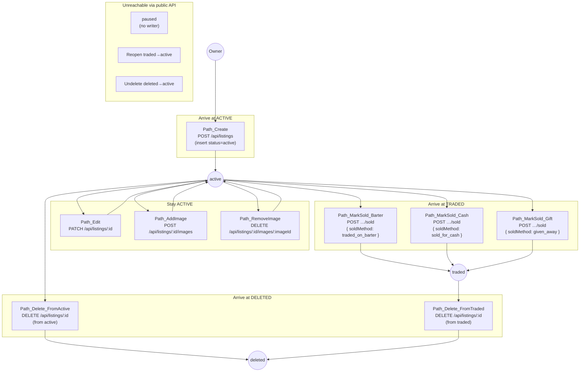
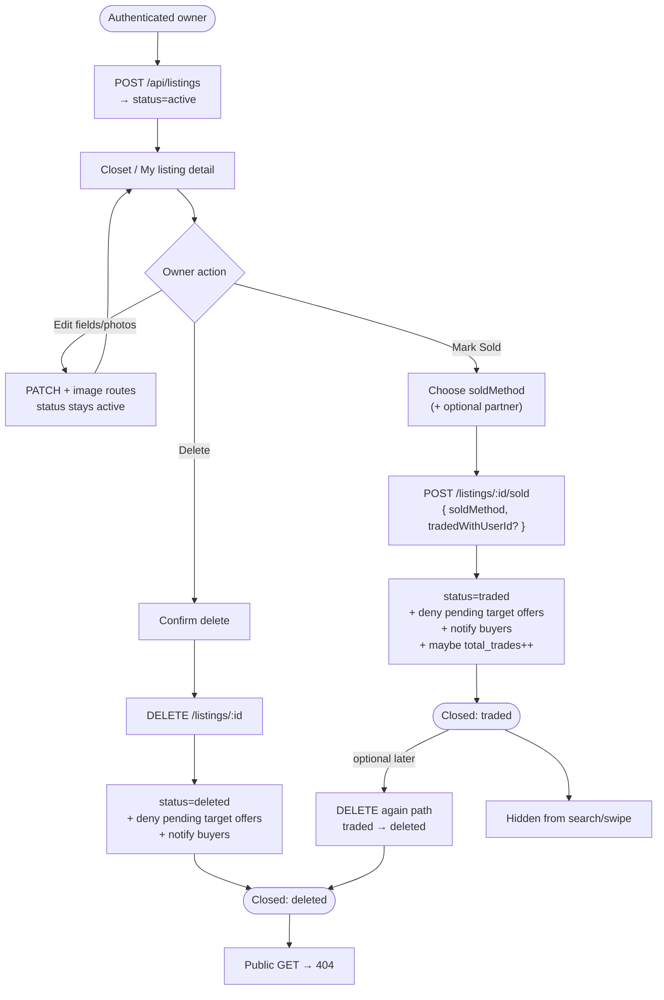
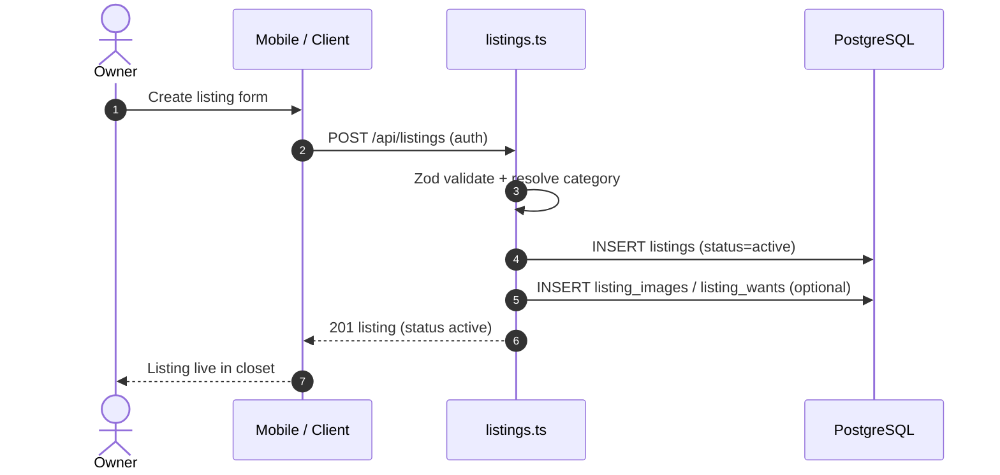
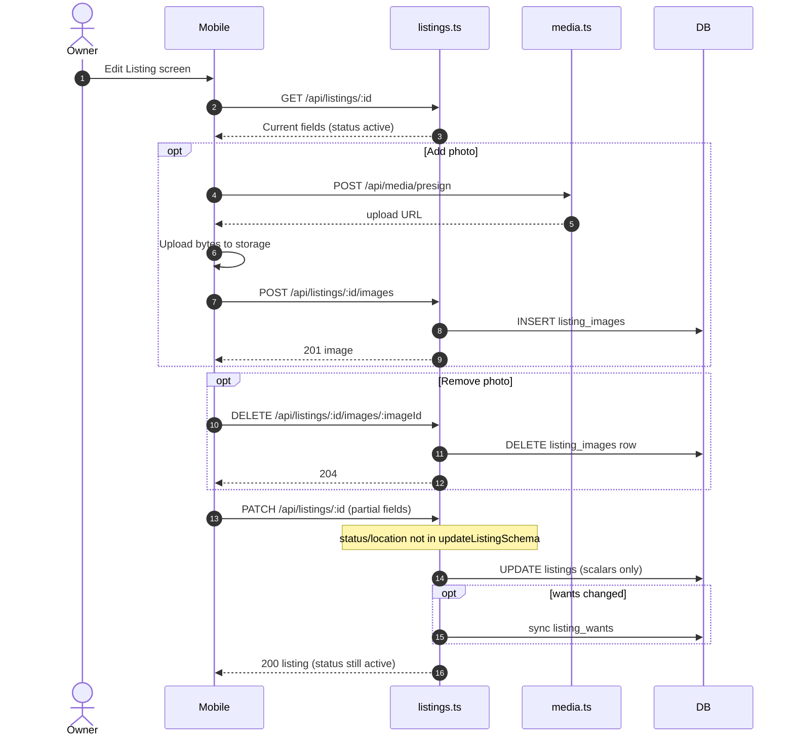
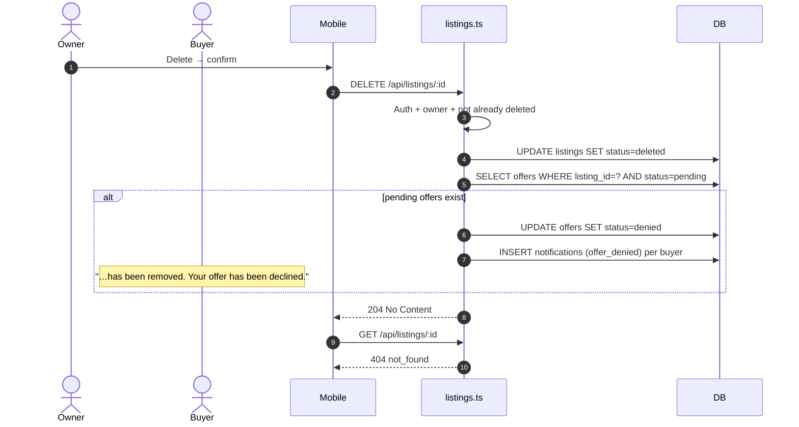
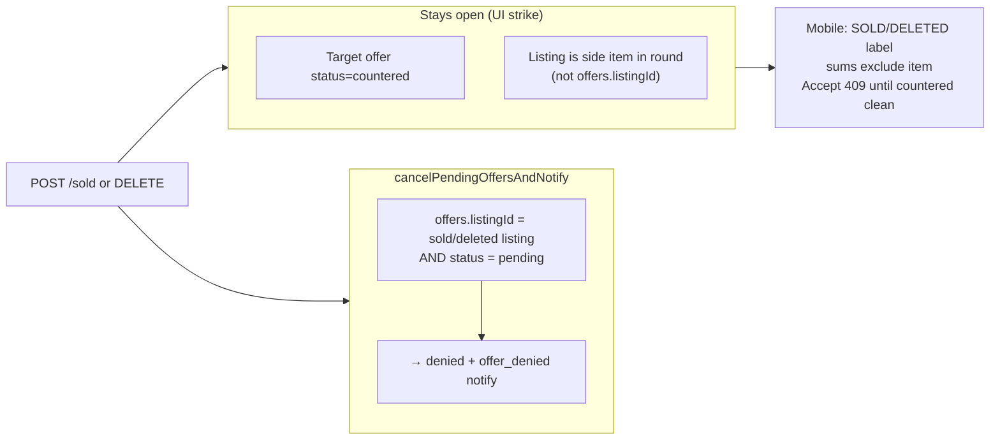

# Listing status & owner flows — backend reference

Detailed backend documentation for the **product (listing) status lifecycle** and the owner flows that change it: **create**, **edit**, **mark as sold**, and **delete**. Includes status diagrams (with labeled transition paths), flowcharts, and sequence diagrams.

**Validated against code (2026-07-22):** `src/routes/listings.ts`, `src/routes/offers.ts`, `src/db/schema/listings.ts`; mobile `mark_as_sold_screen.dart`, `profile_repository_impl.dart`, inbox offer/counter/buyer_counter screens.

**Per-flow deep dives**

| Flow | Doc |
|------|-----|
| Mark as Sold | [MARK_AS_SOLD_FLOW.md](./MARK_AS_SOLD_FLOW.md) |
| Soft delete | [DELETE_LISTING_FLOW.md](./DELETE_LISTING_FLOW.md) |
| Edit (no status change) | [EDIT_LISTING_FLOW.md](./EDIT_LISTING_FLOW.md) |
| Overview / mobile map | [LISTING_MANAGEMENT_FEATURE.md](./LISTING_MANAGEMENT_FEATURE.md) |

**Primary code:** `src/routes/listings.ts`, `src/db/schema/listings.ts`, offer side effects in `cancelPendingOffersAndNotify`, offer accept/counter guards in `src/routes/offers.ts`.

---

## Table of contents

1. [Listing status enum](#1-listing-status-enum)
2. [Status diagram (states + transition paths)](#2-status-diagram-states--transition-paths)
3. [Transition matrix](#3-transition-matrix)
4. [What each status means in the system](#4-what-each-status-means-in-the-system)
5. [End-to-end owner journey flowchart](#5-end-to-end-owner-journey-flowchart)
6. [Sequence: create listing](#6-sequence-create-listing)
7. [Sequence: edit listing](#7-sequence-edit-listing)
8. [Sequence: mark as sold](#8-sequence-mark-as-sold)
9. [Sequence: delete listing](#9-sequence-delete-listing)
10. [Offer interactions when status changes](#10-offer-interactions-when-status-changes)
11. [Handler map](#11-handler-map)
12. [Errors by transition](#12-errors-by-transition)

---

## 1. Listing status enum

PostgreSQL / Drizzle enum `listing_status`:

| Value | Meaning |
|-------|---------|
| `active` | Live on marketplace (search, swipe, public GET) |
| `traded` | Closed via Mark as Sold (`POST /sold`) |
| `paused` | Reserved in schema — **no public write API today** |
| `deleted` | Soft-deleted via `DELETE /listings/:id` |

Default on insert: **`active`**.

---

## 2. Status diagram (states + transition paths)

Boxes are statuses. Labeled arrows are the **flows / APIs** that cause the change.

```mermaid
stateDiagram-v2
  direction LR

  [*] --> active: Path_Create\nPOST /api/listings

  active --> active: Path_Edit\nPATCH /api/listings/:id\n(+ images POST/DELETE)\nstatus UNCHANGED

  active --> traded: Path_MarkSold\nPOST /api/listings/:id/sold\nsoldMethod = traded_on_barter\n| sold_for_cash | given_away

  active --> deleted: Path_Delete\nDELETE /api/listings/:id\n(from active)

  traded --> deleted: Path_Delete_AfterSold\nDELETE /api/listings/:id\n(allowed — only blocks if already deleted)

  note right of paused
    Path_Pause: NOT IMPLEMENTED
    Enum value exists only.
    No route sets status=paused.
  end note

  traded --> traded: Path_MarkSold_Again\nPOST /sold → 409
  deleted --> deleted: Path_Delete_Again\nDELETE → 409

  traded --> [*]: Row retained\n(soft close)
  deleted --> [*]: Row retained\n(soft delete)

  %% Illegal / blocked (documented, not drawn as success edges):
  %% traded → active   (no reopen API)
  %% deleted → active  (no undelete API)
  %% deleted → traded  (POST /sold → 409 if deleted)
  %% PATCH never changes status
```

### Path catalog (how you arrive at each status)



---

## 3. Transition matrix

| From ↓ / To → | `active` | `traded` | `deleted` | `paused` |
|---------------|----------|----------|-----------|----------|
| *(new)* | **Create** `POST /listings` | — | — | — |
| `active` | **Edit** / images (no status write) | **Mark sold** `POST /sold` | **Delete** `DELETE` | ❌ no API |
| `traded` | ❌ no reopen | 409 on second `/sold` | **Delete** `DELETE` (allowed) | ❌ |
| `deleted` | ❌ no undelete | 409 if `/sold` after delete | 409 on second `DELETE` | ❌ |
| `paused` | ❌ | ❌ | ❌ | ❌ |

**PATCH never changes status** — `status` / `locationCity` are not in `updateListingSchema`, so they cannot be applied via edit.

---

## 4. What each status means in the system

| Status | Public `GET /listings/:id` | Search / swipe | Owner closet (`GET /users/:id/listings`) | Can receive new offers | Mark sold | Delete |
|--------|----------------------------|----------------|------------------------------------------|------------------------|-----------|--------|
| `active` | 200 | Included | Included | Yes | Yes | Yes |
| `traded` | 200 (`status != deleted`) | Excluded | Included | No (`409` create offer) | 409 | Yes → `deleted` |
| `deleted` | 404 | Excluded | Excluded (`status != deleted`) | No | 409 | 409 |
| `paused` | 200 if fetched by id | Excluded from active feeds | Included | Non-active (`!== active`) | Yes if not traded/deleted gates | Yes if not already deleted |

Accept / counter treat **any** non-`active` listing in the pending round as blocking (`paused`, `traded`, or `deleted` → `409`).

Side-effect metadata on `traded` only:

- `sold_method`: `traded_on_barter` | `sold_for_cash` | `given_away`
- `traded_with_user_id`: optional partner UUID
- `user_profiles.total_trades++` only when `sold_method = traded_on_barter`

---

## 5. End-to-end owner journey flowchart


---

## 6. Sequence: create listing



---

## 7. Sequence: edit listing

Edit **does not** change status and **does not** cancel offers.



---

## 8. Sequence: mark as sold

```mermaid
sequenceDiagram
  autonumber
  actor Owner
  actor Buyer
  participant Mobile
  participant API as listings.ts
  participant DB

  Owner->>Mobile: Mark as Sold
  Mobile->>API: GET /listings/:id/trade-partners
  API-->>Mobile: Distinct offer buyers

  Owner->>Mobile: Confirm soldMethod (+ optional partner)
  Note over Mobile: Current mobile body:\n{ soldMethod, tradedWithUserId? }\n(does not send shareWin)
  Mobile->>API: POST /listings/:id/sold

  API->>API: Auth + owner + not deleted/traded
  API->>API: Zod markSoldSchema
  API->>DB: UPDATE listings<br/>status=traded, sold_method, traded_with_user_id

  API->>DB: SELECT offers WHERE listing_id=? AND status=pending
  alt pending offers exist
    API->>DB: UPDATE offers SET status=denied
    API->>DB: INSERT notifications (offer_denied) per buyer
    Note over Buyer: In-app notification only<br/>(no push from this helper)
  end

  alt soldMethod = traded_on_barter
    API->>DB: UPDATE user_profiles total_trades = total_trades + 1
  end

  API-->>Mobile: 200 { listing, status, soldMethod, shareWin }
  Note over API: shareWin defaults false when omitted
  Note over Mobile: Countered / multi-item side offers may remain open;<br/>those surfaces show SOLD strike-through.
```

---

## 9. Sequence: delete listing



---

## 10. Offer interactions when status changes



| Event | Pending offer on **target** | Countered offer on **target** | Listing as **bundle side item** |
|-------|----------------------------|-------------------------------|----------------------------------|
| Mark sold | Denied + notify | Unchanged (`countered`) | Unchanged; item `status=traded` in payload |
| Delete | Denied + notify | Unchanged | Unchanged; item `status=deleted` in payload |
| Edit | Unchanged | Unchanged | Unchanged |

Accept / counter require every listing in the pending round to be `active` (`409` otherwise).

---

## 11. Handler map

| Path | Method | File | Status effect |
|------|--------|------|---------------|
| `/api/listings` | `POST` | `listings.ts` | → `active` |
| `/api/listings/:id` | `PATCH` | `listings.ts` | none |
| `/api/listings/:id/images` | `POST` | `listings.ts` | none |
| `/api/listings/:id/images/:imageId` | `DELETE` | `listings.ts` | none |
| `/api/listings/:id/sold` | `POST` | `listings.ts` | → `traded` |
| `/api/listings/:id` | `DELETE` | `listings.ts` | → `deleted` |
| `/api/listings/:id/trade-partners` | `GET` | `listings.ts` | none (read) |

Helper: `cancelPendingOffersAndNotify` in `listings.ts` (shared by sold + delete).

---

## 12. Errors by transition

| Attempt | Result |
|---------|--------|
| `POST /sold` without auth | 401 |
| `POST /sold` as non-owner | 403 |
| `POST /sold` missing/invalid `soldMethod` | 400 |
| `POST /sold` when already `traded` | 409 |
| `POST /sold` when `deleted` | 409 |
| `DELETE` when already `deleted` | 409 |
| `DELETE` / `PATCH` / `/sold` as non-owner | 403 |
| `PATCH` with unknown `categoryId` | 400 |
| Create offer on non-`active` listing | 409 |
| Accept offer with sold/deleted round item | 409 |
| Counter including non-`active` listing id | 409 |

---

## Tests

| Suite | Covers |
|-------|--------|
| `tests/listing-owner-actions.test.ts` | Sold methods, trade count, pending cancel, countered/side-item gaps, delete, edit, accept 409 |
| `tests/listings.test.ts` | PATCH basics, DELETE soft-delete, images |
| `tests/offers.test.ts` | Accept/counter inactive listing |

---

## Manual QA (status paths)

1. **Create** → listing `active`; appears in search/swipe.
2. **Edit** title/value → still `active`; open offers unchanged.
3. **Mark sold (cash)** → `traded`, `sold_method=sold_for_cash`, `total_trades` unchanged; pending target offers denied.
4. **Mark sold (barter)** → `total_trades` +1.
5. **Delete** active listing → `deleted`; public GET 404; pending target offers denied.
6. Second sold / second delete → 409.
7. Countered offer after target sold → offer remains; UI shows **SOLD**; Accept blocked until counter removes inactive items.
