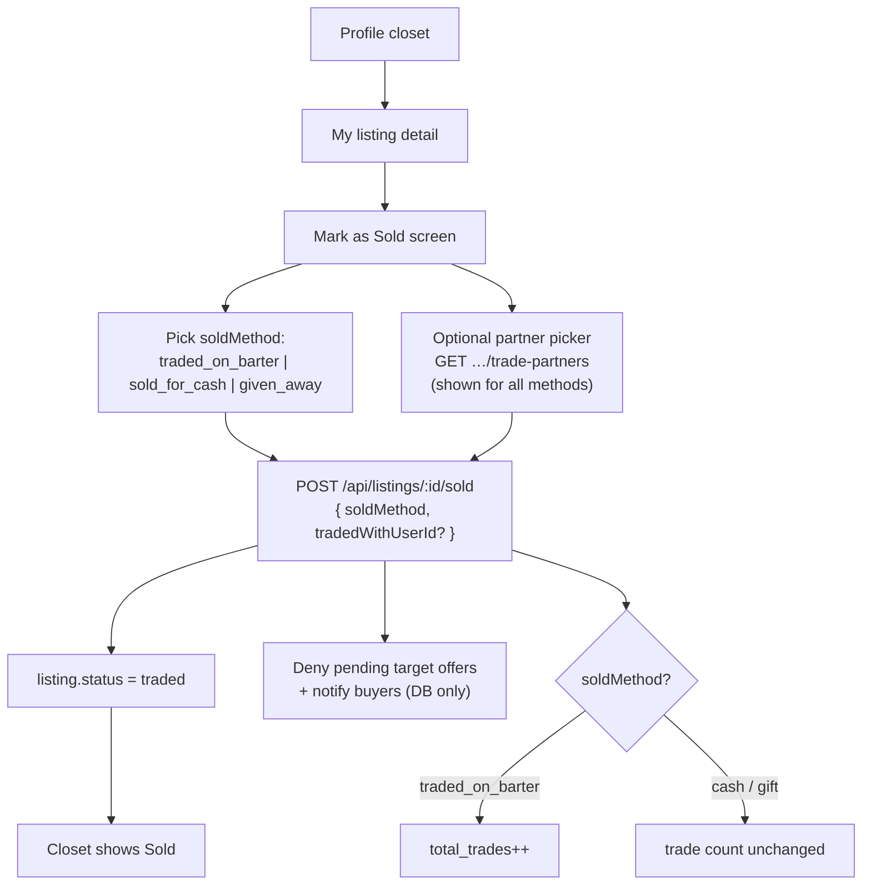
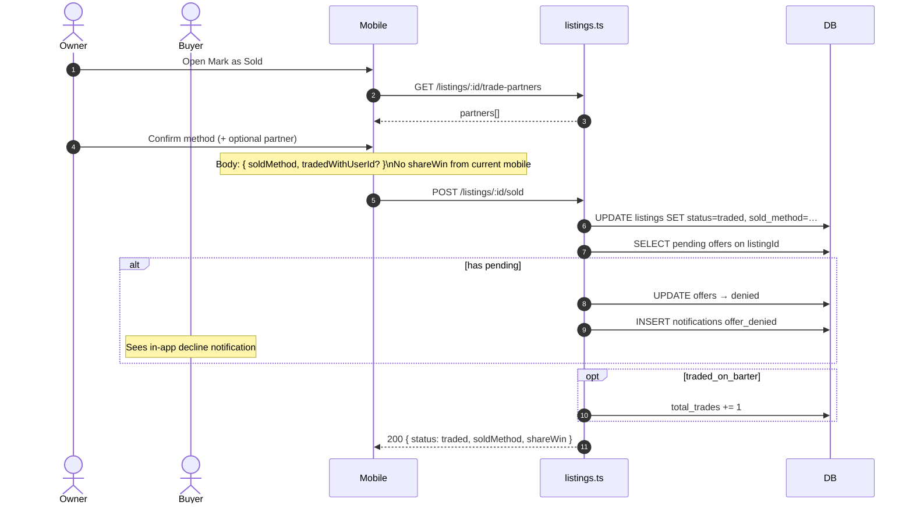

# Mark as Sold flow

Thorough reference for closing a listing via **Mark as Sold** (`POST /api/listings/:listingId/sold`), including mobile UI, API contract, offer side effects, and open-offer UX when a listing (or a bundle item) becomes `traded`.

**Related docs:** [LISTING_STATUS_AND_OWNER_FLOWS.md](./LISTING_STATUS_AND_OWNER_FLOWS.md) (status diagram + all sequences) · [DELETE_LISTING_FLOW.md](./DELETE_LISTING_FLOW.md) · [EDIT_LISTING_FLOW.md](./EDIT_LISTING_FLOW.md) · [LISTING_MANAGEMENT_FEATURE.md](./LISTING_MANAGEMENT_FEATURE.md)

---

## 1. Goal

Let the listing owner record that an item left their hands (barter, cash, or gift), set listing `status` to `traded`, optionally attribute a trade partner, and clean up **pending** offers that targeted this listing.

**Status path:** `active` --Path_MarkSold--> `traded` (via `POST /sold` with one of three `soldMethod` values).

---

## 2. Flow diagram



## 2b. Sequence diagram



### Mobile entry points

| Step | Location |
|------|----------|
| Owner listing detail | `mobile/lib/features/profile/presentation/my_listing_detail/` |
| Mark as Sold UI | `mobile/lib/features/profile/presentation/mark_as_sold/mark_as_sold_screen.dart` |
| Use case | `MarkListingSoldUseCase` → `ProfileRepository.markListingSold` |
| HTTP | `BarterApiService.markListingSold` → `POST /api/listings/{id}/sold` |

### Partner picker (mobile)

- Screen always loads `GET /api/listings/:listingId/trade-partners` (distinct buyers who offered).
- Optional selection is sent as `tradedWithUserId` when non-empty.
- **Current mobile does not send `shareWin`.** API still accepts it (default `false`) and echoes it in the response for future clients.

---

## 3. API contract

### `POST /api/listings/{listingId}/sold`

**Auth:** required (`requireAuth`). **Owner only.**

**Body**

| Field | Type | Required | Notes |
|-------|------|----------|--------|
| `soldMethod` | `"traded_on_barter"` \| `"sold_for_cash"` \| `"given_away"` | yes | How the item left |
| `tradedWithUserId` | UUID | no | Partner attribution (mobile optional) |
| `shareWin` | boolean | no (default `false`) | Echoed to client; **not sent by current mobile** |

**Success `200`**

```json
{
  "listing": { "...barter listing..." },
  "id": "<uuid>",
  "status": "traded",
  "soldMethod": "traded_on_barter",
  "shareWin": false
}
```

**Errors**

| Status | When |
|--------|------|
| `400` | Invalid body (`soldMethod` missing / wrong enum) |
| `401` | No auth |
| `403` | Not the listing owner |
| `404` | Listing not found |
| `409` | Already `deleted` or already `traded` |

---

## 4. Server behavior (ordered)

1. Load listing; enforce ownership and not already closed (`deleted` / `traded`).
2. Validate body with Zod (`markSoldSchema`).
3. Update listing: `status = traded`, set `soldMethod`, `tradedWithUserId`, `updatedAt`.
4. Call `cancelPendingOffersAndNotify(listingId, title, "listing_sold")`:
   - Finds offers where **`offers.listingId === listingId`** and **`status === "pending"`** only.
   - Sets those offers to `denied`.
   - Inserts `offer_denied` notifications for each buyer (DB / in-app feed only — **no FCM push**; see [deeplink-push-notifications.md](./deeplink-push-notifications.md)).
   - Body: `"<title>" has been marked as sold. Your offer has been declined.`
5. If `soldMethod === "traded_on_barter"`, increment `user_profiles.total_trades` by 1.
6. Return serialized listing + echo fields (`shareWin` defaults to `false` when omitted).

Implementation: `src/routes/listings.ts` (`POST /:listingId/sold`).

---

## 5. Offer side effects — what clears vs what stays

| Offer situation | Cleared on mark-sold? | Result |
|-----------------|----------------------|--------|
| Offer **targets** this listing, status `pending` | Yes | `denied` + buyer notified |
| Offer **targets** this listing, status `countered` | **No** | Offer stays open |
| This listing is a **buyer/seller side item** in a multi-item round (not `offers.listingId`) | **No** | Offer stays open; item shows as sold in UI |

### Open-offer UX (mobile inbox)

When an offer stays open but includes a listing with `status = traded`:

- Trade Offer / View Counter / Counter: item is **struck through**, red **SOLD** label.
- Trade-value sums **exclude** unavailable item cents.
- Counter does **not** pre-select or submit sold items.
- Accept is disabled client-side and rejected server-side (`409`) until the pending round only has `active` listings.

Listing `status` is included on nested listing summaries in offer payloads (`serializeListingSummary`).

---

## 6. Discovery / search impact

- Listing leaves the active pool (`status !== active`).
- Search and swipe decks exclude `traded` listings (see search / swipe docs).

---

## 7. Test coverage

| Area | File / suite |
|------|----------------|
| Mark-sold happy paths, conflicts, offer cancel, trade count | `tests/listing-owner-actions.test.ts` |
| Accept/counter 409 when round item sold | `tests/offers.test.ts` |
| Mobile unavailable helpers | `mobile/test/features/inbox/inbox_entities_test.dart` |

---

## 8. Manual QA checklist

1. Owner marks listing sold as cash → status `traded`, `soldMethod = sold_for_cash`, `total_trades` unchanged.
2. Owner marks sold as barter → `total_trades` increments by 1.
3. Buyer with **pending** offer on that listing → offer `denied`, notification received.
4. Buyer with **countered** offer on that listing → offer still open; Trade Offer shows **SOLD** on the item; Accept disabled.
5. Multi-item offer where a **side** listing is marked sold → offer stays; that item struck; sums drop; Counter excludes it.
6. Second mark-sold on same listing → `409`.
7. Non-owner → `403`.
