# Sealed peer reviews (trade reviews)

Technical reference for the **7-day sealed review window** on completed trades across **swaphaven-api** and **barter-stack mobile**. After a trade is marked complete, each party may submit one review. Reviews stay **sealed** until both parties submit **or** the window closes — whichever comes first. Only **revealed** reviews appear on public profiles.

Related assets:

- Interactive sequence diagrams (HTML): [`review-flow-sequence.html`](./review-flow-sequence.html)
- OpenAPI: `src/openapi/spec.ts` → `Trades`, `ReviewStatus`, `TradeReview`, `PublicTradeReview`
- Window helper: `src/lib/review-window.ts`

---

## Table of contents

1. [Goals and business rules](#1-goals-and-business-rules)
2. [System architecture](#2-system-architecture)
3. [End-to-end user flow](#3-end-to-end-user-flow)
4. [Sequence diagrams](#4-sequence-diagrams)
5. [Decision flow diagrams](#5-decision-flow-diagrams)
6. [API reference](#6-api-reference)
7. [Database model](#7-database-model)
8. [Review window resolution](#8-review-window-resolution)
9. [Reveal logic](#9-reveal-logic)
10. [Side effects](#10-side-effects)
11. [Mobile integration](#11-mobile-integration)
12. [Testing and verification](#12-testing-and-verification)
13. [Source file map](#13-source-file-map)

---

## 1. Goals and business rules

### Goals

| Goal | Implementation |
|------|----------------|
| Post-trade accountability | Each party submits at most one review per trade |
| Fair, honest feedback | **Sealed** until both submit or 7 days pass |
| Time-bounded window | Reviews only accepted while window is open |
| Profile trust signals | Revealed reviews + aggregate `ratingSum` / `ratingCount` on `user_profiles` |
| Push awareness | `trade_completed`, `review_received`, `reviews_revealed` notifications |

### Sealed-review policy

Reviews are **never exposed to the other party** (or on public profile) until **revealed**:

```
revealed = (both parties submitted) OR (review window closed)
```

Before reveal:

- `GET /review-status` exposes only `{ submitted: true/false }` for the partner — **not** rating, comment, or tags
- `GET /users/:userId/reviews` omits the review entirely
- The author can always read their own submission via `GET /reviews/mine`

### Review window

| Field | Set when | Meaning |
|-------|----------|---------|
| `completed_at` | `POST /trades/:id/complete` | Trade marked done |
| `review_window_closes_at` | Same request (normally) | `completed_at + 7 days` |

Window is **open** when `resolveReviewWindowClosesAt(trade) > now`.

Both parties (buyer and seller from the linked offer) may submit while the window is open.

### Constraints

- Trade must be `status = completed` before any review action
- One review per `(trade_id, reviewer_id)` — duplicate → **409**
- Rating: integer **1–5**; comment optional (max 1000 chars); tags optional (max 10, each max 50 chars)
- Only trade participants may read/write review endpoints (except public profile list)

---

## 2. System architecture

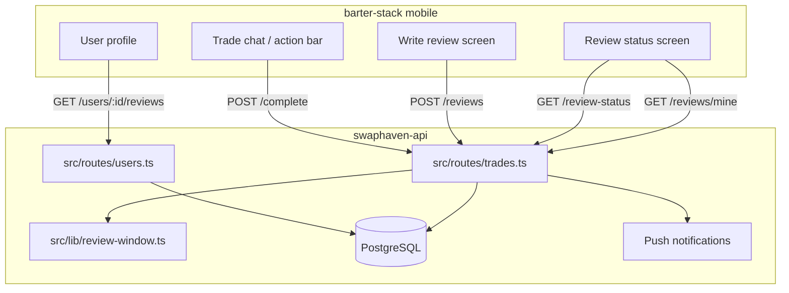

### Trade lifecycle (review-relevant states)

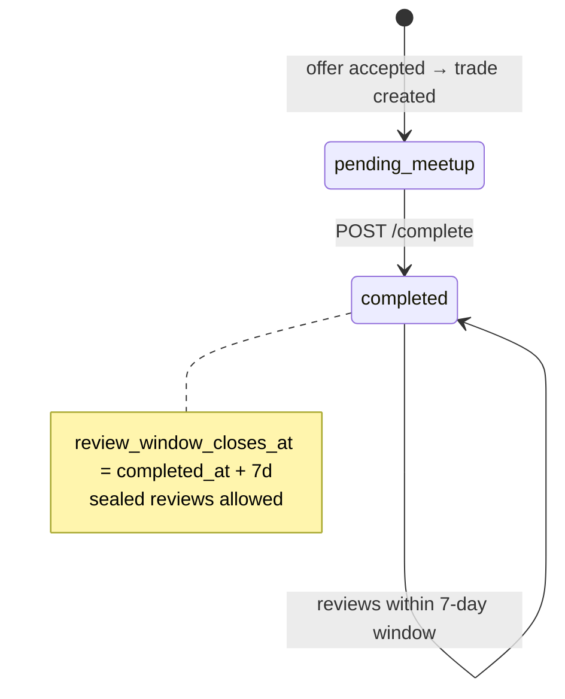

---

## 3. End-to-end user flow

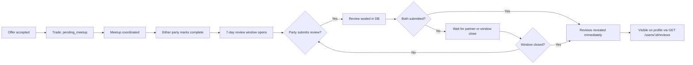

---

## 4. Sequence diagrams

### 4.1 Mark trade complete (opens review window)

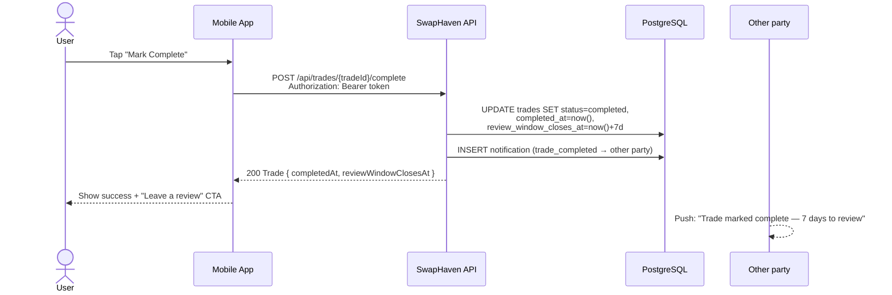

**Server code:** `src/routes/trades.ts` → `POST /:tradeId/complete`

---

### 4.2 Submit a review

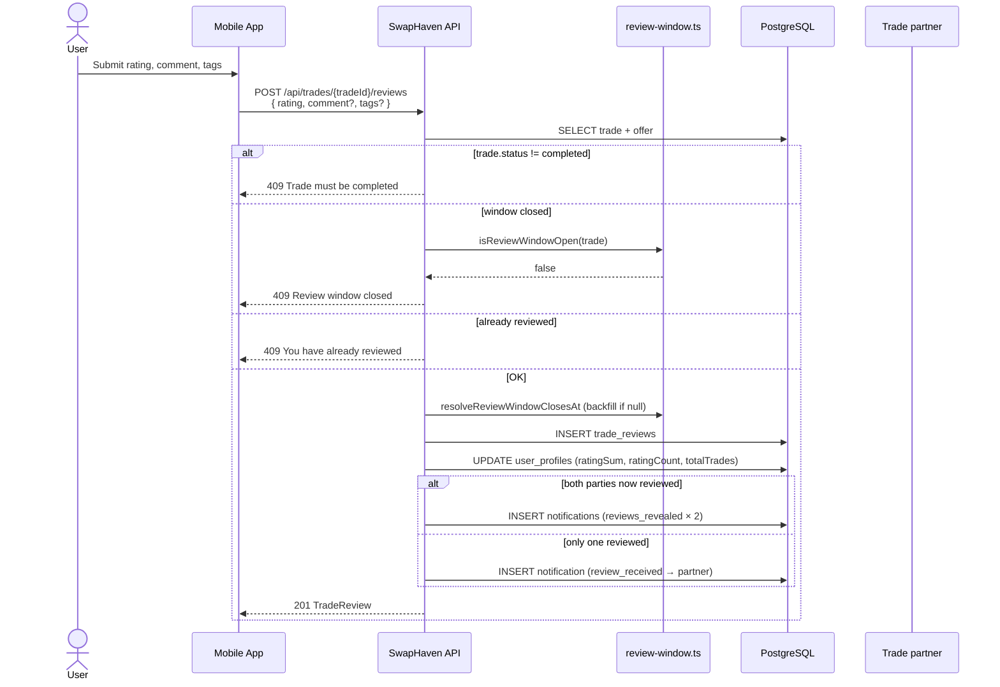

**Server code:** `src/routes/trades.ts` → `POST /:tradeId/reviews`

---

### 4.3 Poll review status (sealed → revealed)

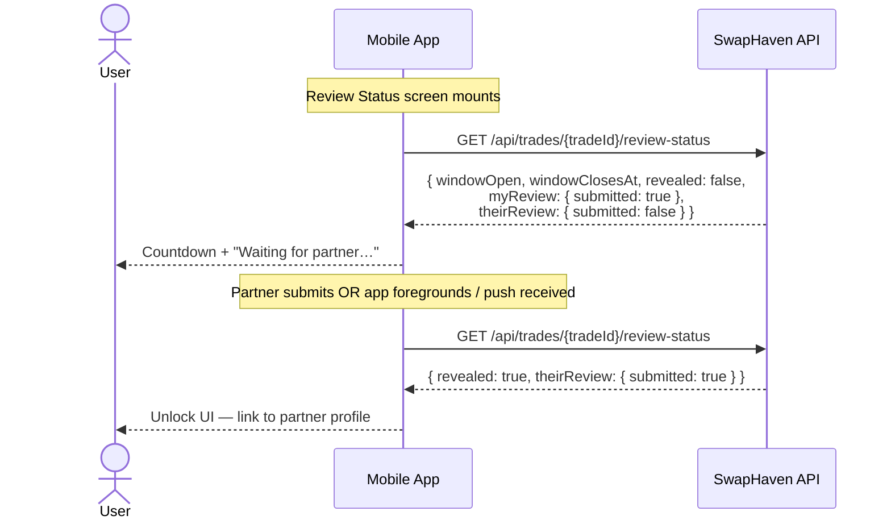

**Server code:** `src/routes/trades.ts` → `GET /:tradeId/review-status`

---

### 4.4 View own review (always allowed for author)

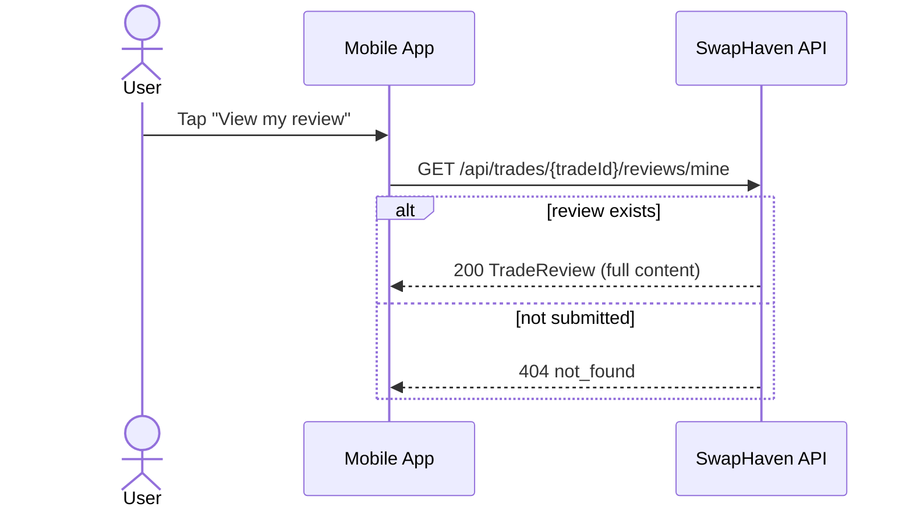

---

### 4.5 Public profile — revealed reviews only

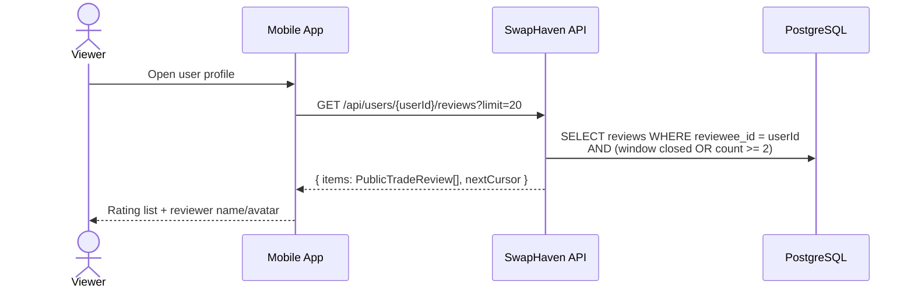

**Server code:** `src/routes/users.ts` → `GET /:userId/reviews`

---

## 5. Decision flow diagrams

### 5.1 POST /reviews — acceptance gate

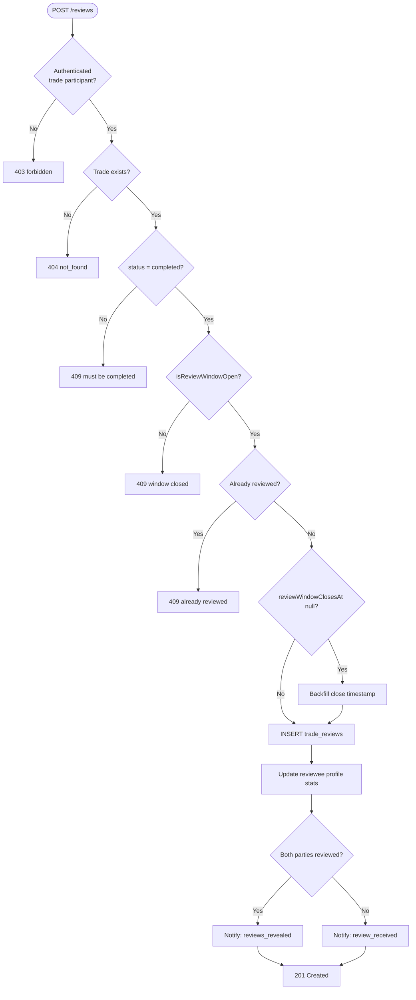

### 5.2 Review reveal (profile + status)

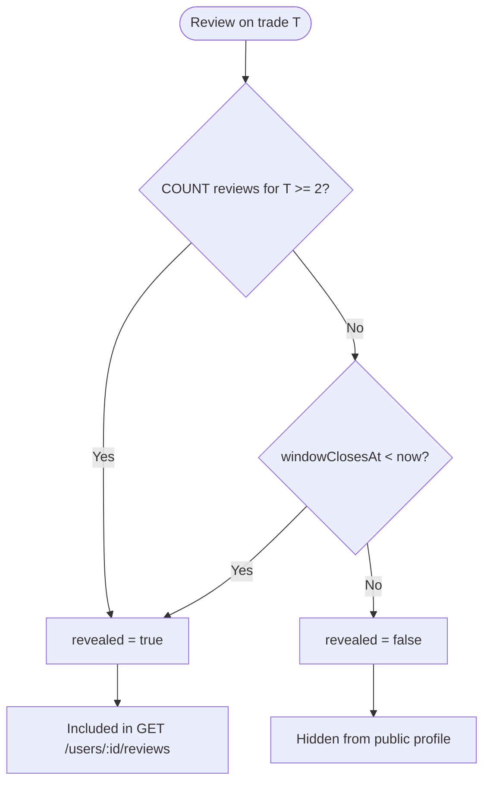

### 5.3 Resolve window close time

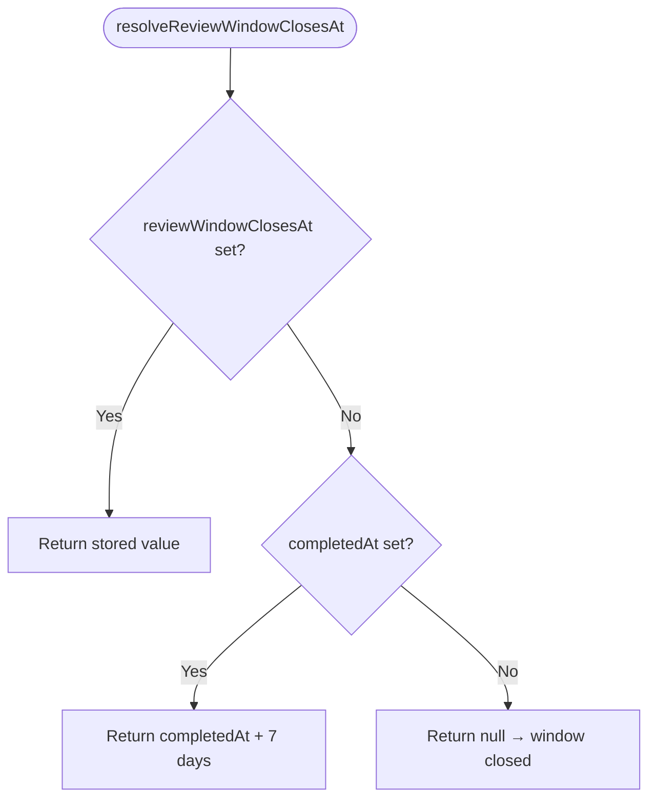

This derivation fixes completed trades that have `completed_at` but a missing `review_window_closes_at` (e.g. migration backfill gaps).

---

## 6. API reference

### Endpoint map

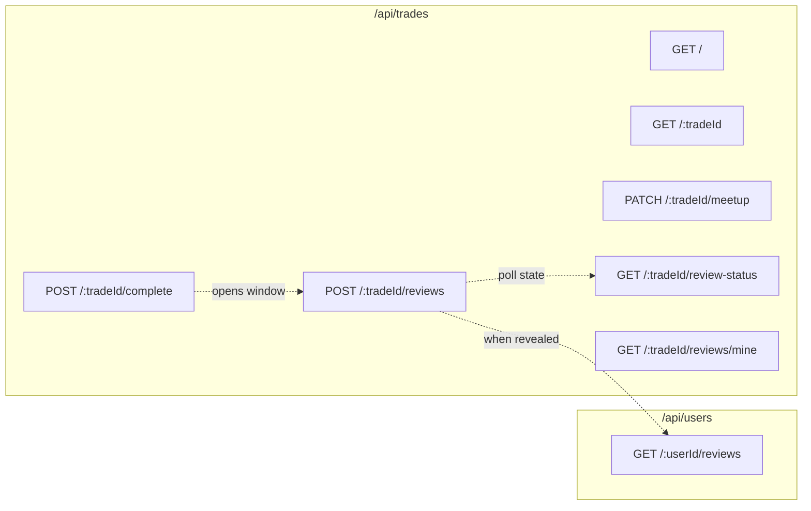

### Endpoints summary

| Method | Path | Auth | Purpose |
|--------|------|------|---------|
| `POST` | `/api/trades/:tradeId/complete` | Participant | Mark done; set `completedAt` + `reviewWindowClosesAt` |
| `POST` | `/api/trades/:tradeId/reviews` | Participant | Submit sealed review |
| `GET` | `/api/trades/:tradeId/review-status` | Participant | Window + submission flags + `revealed` |
| `GET` | `/api/trades/:tradeId/reviews/mine` | Participant | Author's own review (always visible to author) |
| `GET` | `/api/trades/:tradeId` | Participant | Full trade incl. `reviews[]` (participant-only) |
| `GET` | `/api/users/:userId/reviews` | Public | **Revealed** reviews only; cursor-paginated |

Mount: `src/app.ts` → `/api/trades`, `/api/users`

### Request / response shapes

#### POST `/api/trades/:tradeId/reviews`

**Request body:**

```json
{
  "rating": 5,
  "comment": "Great swap!",
  "tags": ["Fast reply", "Great condition"]
}
```

| Field | Type | Required | Rules |
|-------|------|----------|-------|
| `rating` | integer | yes | 1–5 |
| `comment` | string | no | max 1000 |
| `tags` | string[] | no | max 10 items, each max 50 chars |

**Success:** `201` → `TradeReview`

**Errors:**

| Status | Condition |
|--------|-----------|
| `400` | Validation failed |
| `403` | Not a trade participant |
| `404` | Trade not found |
| `409` | Not completed / window closed / duplicate review |

#### GET `/api/trades/:tradeId/review-status`

**Success:** `200` → `ReviewStatus`

```json
{
  "tradeId": "uuid",
  "windowClosesAt": "2026-07-23T12:00:00.000Z",
  "windowOpen": true,
  "revealed": false,
  "myReview": { "submitted": true, "submittedAt": "2026-07-16T12:00:00.000Z" },
  "theirReview": { "submitted": false }
}
```

#### GET `/api/users/:userId/reviews`

**Success:** `200`

```json
{
  "items": [
    {
      "id": "uuid",
      "tradeId": "uuid",
      "reviewerId": "uuid",
      "revieweeId": "uuid",
      "rating": 5,
      "comment": "Great swap!",
      "tags": ["Fast reply"],
      "createdAt": "2026-07-16T12:00:00.000Z",
      "reviewerDisplayName": "Alex",
      "reviewerAvatarUrl": "https://..."
    }
  ],
  "nextCursor": null
}
```

---

## 7. Database model

### Entity-relationship diagram

```mermaid
erDiagram
  users ||--o| user_profiles : has
  users ||--o{ trade_reviews : "writes (reviewer)"
  users ||--o{ trade_reviews : "receives (reviewee)"
  offers ||--|| trades : creates
  trades ||--o{ trade_reviews : has
  trades ||--o{ notifications : triggers

  users {
    uuid id PK
    text email
    text name
  }

  user_profiles {
    uuid id PK FK
    text display_name
    int rating_sum
    int rating_count
    int total_trades
  }

  offers {
    uuid id PK
    uuid buyer_id FK
    uuid seller_id FK
  }

  trades {
    uuid id PK
    uuid offer_id FK UK
    trade_status status
    timestamp completed_at
    timestamp review_window_closes_at
    timestamp meetup_scheduled_at
    text meetup_location
  }

  trade_reviews {
    uuid id PK
    uuid trade_id FK
    uuid reviewer_id FK
    uuid reviewee_id FK
    int rating
    text comment
    text_array tags
    timestamp created_at
  }

  notifications {
    uuid id PK
    uuid user_id FK
    notification_type type
    uuid related_trade_id
  }
```

### Table: `trades` (review columns)

| Column | Type | Notes |
|--------|------|-------|
| `status` | `trade_status` enum | Must be `completed` for reviews |
| `completed_at` | `timestamp` | Set on `POST /complete` |
| `review_window_closes_at` | `timestamp` | Normally `completed_at + 7 days`; may be backfilled lazily |

### Table: `trade_reviews`

| Column | Type | Notes |
|--------|------|-------|
| `trade_id` | `uuid` FK → `trades.id` | CASCADE delete |
| `reviewer_id` | `uuid` FK → `users.id` | Who wrote the review |
| `reviewee_id` | `uuid` FK → `users.id` | Who was reviewed |
| `rating` | `integer` | 1–5 |
| `comment` | `text` | Optional |
| `tags` | `text[]` | Quick-select labels |
| `created_at` | `timestamp` | Submission time |

**Index:** `trade_reviews_reviewee_id_created_at_idx` on `(reviewee_id, created_at DESC)` for profile queries.

### Migrations

| Migration | Purpose |
|-----------|---------|
| `0011_review_window_tags.sql` | Adds `review_window_closes_at`, `tags`, `reviews_revealed` notification type; backfills close time |
| `0013_ensure_missing_columns.sql` | Idempotent repair if `0011` was skipped in production |

Backfill SQL (both migrations):

```sql
UPDATE trades
SET review_window_closes_at = completed_at + INTERVAL '7 days'
WHERE status = 'completed'
  AND completed_at IS NOT NULL
  AND review_window_closes_at IS NULL;
```

### Schema source

- `src/db/schema/trades.ts`
- `src/db/schema/users.ts` (`user_profiles.ratingSum`, `ratingCount`, `totalTrades`)

---

## 8. Review window resolution

Central logic lives in `src/lib/review-window.ts`:

```typescript
export const REVIEW_WINDOW_MS = 7 * 24 * 60 * 60 * 1000;

export function resolveReviewWindowClosesAt(trade): Date | null {
  if (trade.reviewWindowClosesAt != null) return asDate(trade.reviewWindowClosesAt);
  if (trade.completedAt != null) return new Date(asDate(trade.completedAt).getTime() + REVIEW_WINDOW_MS);
  return null;
}

export function isReviewWindowOpen(trade, now = new Date()): boolean {
  const closesAt = resolveReviewWindowClosesAt(trade);
  return closesAt != null && closesAt > now;
}
```

### Why derivation matters

**Before fix:** `POST /reviews` rejected when `reviewWindowClosesAt` was `null`:

```typescript
if (!trade.reviewWindowClosesAt || trade.reviewWindowClosesAt < now) {
  return 409; // "Review window closed"
}
```

Completed trades with only `completed_at` set (missing backfill) always got **409**, so reviews never saved.

**After fix:** Window is computed from `completedAt + 7d` when the close column is absent. On first successful review, the server **backfills** `review_window_closes_at` in the database.

---

## 9. Reveal logic

### On `GET /review-status` (application layer)

```typescript
const windowOpen = isReviewWindowOpen(trade);
const revealed   = !windowOpen || trade.reviews.length >= 2;
```

### On `GET /users/:userId/reviews` (SQL layer)

```sql
COALESCE(review_window_closes_at, completed_at + INTERVAL '7 days') < NOW()
OR (SELECT COUNT(*) FROM trade_reviews WHERE trade_id = ...) >= 2
```

Both paths use the same COALESCE / derivation rule so legacy rows behave consistently.

---

## 10. Side effects

### Profile rating aggregation

On each successful review insert, the **reviewee's** profile is updated:

```typescript
ratingSum   += rating
ratingCount += 1
totalTrades += 1
```

Displayed rating on profile: `round(ratingSum / ratingCount, 1)` (see OpenAPI `UserProfile.rating`).

> Note: Stats update on **submit**, not on reveal. Sealed reviews still affect aggregates server-side; public profile list only shows revealed rows.

### Notifications

| Type | Trigger | Recipient |
|------|---------|-----------|
| `trade_completed` | `POST /complete` | Other party |
| `review_received` | First party submits (partner hasn't yet) | Reviewee |
| `reviews_revealed` | Both parties submitted | Both parties |

Schema: `src/db/schema/notifications.ts`

---

## 11. Mobile integration

### Implemented today

| Area | Status | Location |
|------|--------|----------|
| Fetch revealed reviews for profile | Done | `GET /api/users/:userId/reviews` via `ProfileRemoteDataSource.fetchUserReviews` |
| Review model / entity | Done | `mobile/lib/features/profile/data/models/review_model.dart` |
| Trade history ratings | Done | `userReviewsProvider` maps `tradeId:reviewerId → rating` |
| Mark complete UI | Placeholder | `trade_action_bar.dart` shows snackbar only — **no API call yet** |
| Submit review UI | Not wired | No `POST /reviews` client yet |
| Review status screen | Not wired | No `GET /review-status` client yet |
| ApiEndpoints trade review paths | Missing | `api_endpoints.dart` has `userReviews` but no trade review routes |

### Recommended mobile endpoints to add

```dart
static String tradeComplete(String tradeId) => '/api/trades/$tradeId/complete';
static String tradeReviewStatus(String tradeId) => '/api/trades/$tradeId/review-status';
static String tradeReviewMine(String tradeId) => '/api/trades/$tradeId/reviews/mine';
static String tradeReviews(String tradeId) => '/api/trades/$tradeId/reviews';
```

### Client rules

1. Drive countdown UI from `reviewWindowClosesAt` on complete response, or `windowClosesAt` from review-status
2. Never show partner review content until `revealed === true`
3. Re-poll `GET /review-status` on app foreground and after push (`review_received`, `reviews_revealed`)
4. Use `GET /reviews/mine` for author read-back while sealed

---

## 12. Testing and verification

### Automated tests

`tests/trades.test.ts` covers:

- Complete trade sets `completedAt` and `reviewWindowClosesAt` (7-day delta)
- Submit review after completion → `201`
- Reject review before completion → `409`
- Reject duplicate review → `409`
- Both parties can review independently
- **Derive window when `reviewWindowClosesAt` is null** → `201`
- **Reject when derived window expired** (completed 8+ days ago) → `409`

Run:

```bash
npm run typecheck
npm test -- tests/trades.test.ts
```

### Manual smoke checklist

1. Accept offer → trade in `pending_meetup`
2. `POST /api/trades/{id}/complete` → check `reviewWindowClosesAt`
3. `POST /api/trades/{id}/reviews` with `{ "rating": 5 }` → `201`
4. `GET /api/trades/{id}/review-status` → `myReview.submitted: true`, `revealed: false`
5. Partner submits → `revealed: true`
6. `GET /api/users/{revieweeId}/reviews` → review appears with reviewer name

---

## 13. Source file map

| Layer | Path | Role |
|-------|------|------|
| Routes | `src/routes/trades.ts` | Complete, review CRUD, review-status |
| Routes | `src/routes/users.ts` | Public revealed reviews list |
| Domain | `src/lib/review-window.ts` | Window duration + resolve/open helpers |
| Schema | `src/db/schema/trades.ts` | `trades`, `trade_reviews` tables |
| Schema | `src/db/schema/users.ts` | Profile rating aggregates |
| Schema | `src/db/schema/notifications.ts` | Review-related push types |
| OpenAPI | `src/openapi/spec.ts` | HTTP contract documentation |
| Tests | `tests/trades.test.ts` | Review + window regression tests |
| Migrations | `drizzle/0011_review_window_tags.sql` | Initial review window + tags |
| Migrations | `drizzle/0013_ensure_missing_columns.sql` | Production column repair |
| Docs | `docs/review-flow-sequence.html` | UI→API sequence (visual) |
| Mobile | `mobile/lib/features/profile/` | Profile review display |
| Mobile | `mobile/lib/features/tradechat/` | Trade complete action (placeholder) |
