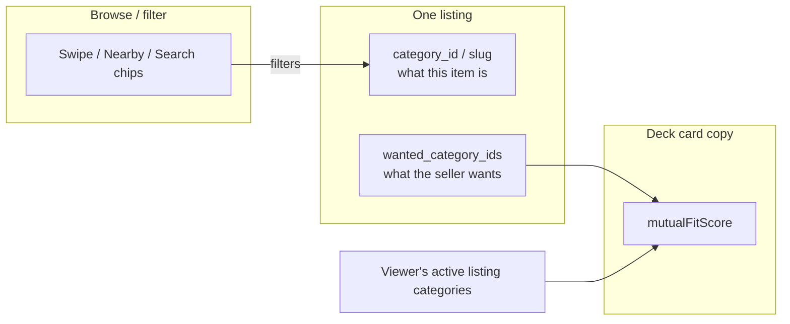
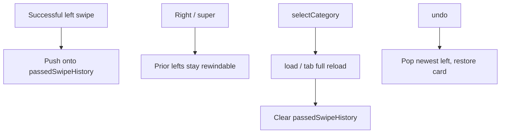
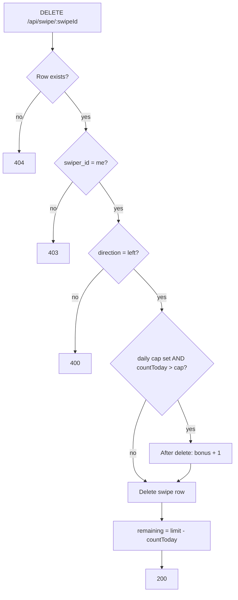
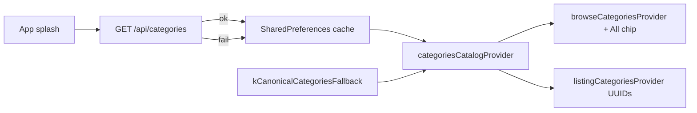
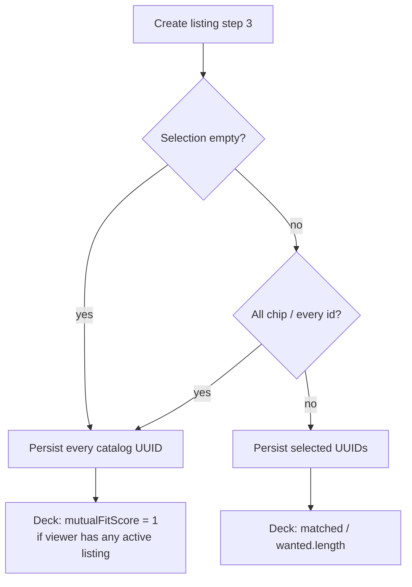
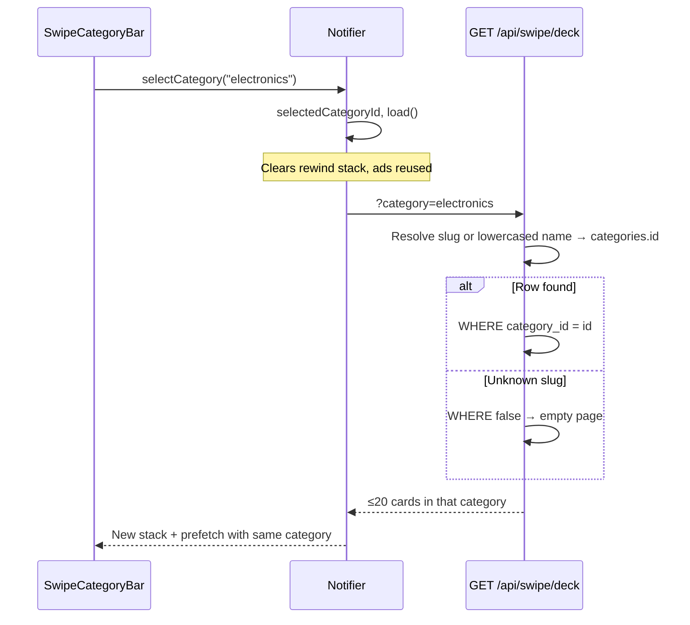

# Rewind & category logic

End-to-end reference for two discovery behaviors that share a deck: **rewind** (undo a left pass) and **category** (taxonomy, listing wants, and browse filters). Backend lives in `swaphaven-api`; the session stack and browse bar live in `barter-stack/mobile`.

Swipe quota, prefetch, ads, and streaks stay in [SWIPE_FEATURE.md](./SWIPE_FEATURE.md). This doc is the source of truth for rewind and categories.

---

## Table of contents

1. [Product overview](#1-product-overview)
2. [How rewind and category interact](#2-how-rewind-and-category-interact)
3. [Rewind](#3-rewind)
4. [Category catalog](#4-category-catalog)
5. [Listing category vs wanted](#5-listing-category-vs-wanted)
6. [Discovery browse filter](#6-discovery-browse-filter)
7. [Other surfaces](#7-other-surfaces)
8. [Mutual-fit scoring](#8-mutual-fit-scoring)
9. [Identifiers cheat sheet](#9-identifiers-cheat-sheet)
10. [Testing](#10-testing)
11. [Related docs](#11-related-docs)
12. [File index](#12-file-index)

---

## 1. Product overview

### Rewind

A Tinder-style **undo** for **left (pass)** swipes only. The listing returns to the top of the deck and the pass is deleted on the server so it can show up again.

| Can rewind | Cannot rewind |
|------------|----------------|
| Left pass, this session, still in the local stack | Right swipe (opens Make Offer) |
| | Super like |
| | Another user’s swipe |
| | Passes older than the remote cap |
| | Passes from a previous deck load / category switch |

### Category

Every listing has **one** catalog category (what it *is*) and **zero or more** wanted categories (what the seller will trade *for*). Browse bars on Discovery, Nearby, and Search filter by the listing’s category — not by wants.



---

## 2. How rewind and category interact

Changing browse category **throws away** the rewind stack. A full deck reload does the same.



| Event | Rewind stack |
|-------|----------------|
| Left swipe with a `swipeId` | Prepend, trim to `rewind_limit` |
| Right or super | Unchanged |
| `load()` | Cleared |
| `selectCategory()` | Cleared (it calls `load()`) |
| Account switch | Cleared (notifier rebuilds) |
| Failed undo API | Unchanged; card stays gone from the UI until retry |

The daily-limit screen is skipped while `canUndo` is true, so a user who just hit quota can still rewind the last pass.

---

## 3. Rewind

### 3.1 Product rules

1. Only **left** passes are undoable. Right and super are permanent for this user/listing pair (`UNIQUE (swiper_id, listing_id)`).
2. Undo is **LIFO**: newest eligible pass first.
3. The stack is **session memory**. It is not persisted across process death, `load()`, or category change.
4. The server is the source of truth: the client must `DELETE /api/swipe/:swipeId` before putting the card back. A client-only pop would leave the row in `swipes` and the listing would stay hidden from future decks.
5. Quota is restored. Streak counters are **not** rolled back.

### 3.2 Remote config

| Key | Default | App clamp | Meaning |
|-----|---------|-----------|---------|
| `rewind_limit` | `1` | `0…50` | Max left passes kept in `passedSwipeHistory` |

- `0` disables rewind (lefts are not stacked; `undo()` is a no-op).
- Values above `50` are clamped so a console typo cannot grow session RAM without bound.
- If remote config lowers the cap mid-session, `undo()` re-trims before popping.
- Offline fallback matches the historical single-slot undo (`RemoteConfigDefaults.rewindLimit = 1`).

Firebase / template: `mobile/remoteconfig.template.json` → `rewind_limit`.

### 3.3 Session stack (mobile)

`LastPassedSwipe` stores `{ swipeId, card }` **newest first**.

```
rewind_limit = 3
left A, left B, left C, left D

passedSwipeHistory = [D, C, B]   // A dropped
undo → restore D, then C, then B
```

```mermaid
sequenceDiagram
  participant User
  participant Screen as SwipeDiscoveryScreen
  participant N as SwipeDiscoveryNotifier
  participant API as DELETE /api/swipe/:id

  User->>Screen: Tap rewind
  alt History empty
    Screen-->>User: SnackBar "Nothing to rewind"
  else canUndo
    Screen->>N: undo()
    N->>API: delete swipeId
    alt 200
      API-->>N: remainingSwipesToday, bonusSwipesAvailable
      N->>N: Prepend card, pop history, apply quota
      N-->>User: Listing is top of deck
    else 4xx / network
      API-->>N: error
      N-->>User: Card stays off deck; stack unchanged
    end
  end
```

After a successful undo the notifier:

- Puts the saved `SwipeDeckCard` at index `0` of `allCards` / `visibleCards`.
- Rebuilds `deckItems` with that listing on top (ads already in the stack stay, minus a duplicate of this listing if prefetch had re-added it).
- Writes server quota onto state (not a local `++`).
- Sets `deckExhausted = false` so prefetch can run again.
- Does **not** decrement or restore superlike quota (super cannot be undone).

### 3.4 API — `DELETE /api/swipe/:swipeId`

Requires `Authorization: Bearer <access_token>`.

**Success — 200**

```json
{
  "swipeId": "<uuid>",
  "listingId": "<uuid>",
  "remainingSwipesToday": 19,
  "bonusSwipesAvailable": 2
}
```

| Status | When |
|--------|------|
| **200** | Left swipe deleted; quota fields returned |
| **400** | Invalid UUID, or swipe is not `left` |
| **403** | Swipe belongs to another user |
| **404** | Unknown `swipeId` |

**Server steps**

1. Load swipe by id.
2. Reject if missing, not owned, or `direction !== "left"`.
3. Count today’s swipes **before** delete.
4. If `DAILY_SWIPE_LIMIT` is set **and** `swipesTodayBefore > limit`, this pass consumed **bonus** → restore `bonus_swipes_remaining + 1` after delete.
5. `DELETE FROM swipes WHERE id = swipeId`.
6. Recalculate `remainingSwipesToday` from the post-delete count.
7. Return ids + quota. **Do not** decrement `listings.right_swipe_count` (lefts never incremented it). **Do not** rewrite streak dates.



Because `(swiper_id, listing_id)` is unique, deleting the row is what makes `GET /api/swipe/deck` eligible to return that listing again.

### 3.5 Quota restore details

| Situation | After undo |
|-----------|------------|
| Unlimited (`DAILY_SWIPE_LIMIT` unset) | `remainingSwipesToday` stays `MAX_SAFE_INTEGER`; bonus unchanged |
| Daily remaining was used | Recount: `max(0, limit - swipesTodayAfter)` |
| Bonus was used (`swipesTodayBefore > limit`) | `bonusSwipesAvailable + 1` |
| Streak / longest streak | Unchanged |
| Superlike remaining | Unchanged (not a left) |

The client **trusts the DELETE response** for remaining/bonus instead of incrementing locally, so it stays aligned with midnight boundaries and bonus restores.

### 3.6 Edge cases

| Case | Behavior |
|------|----------|
| Tap rewind with empty stack | SnackBar; no API call |
| `rewind_limit = 0` | Left swipe does not push; `canUndo` stays false |
| Eighth left when limit is 7 | Oldest stacked pass is dropped client-side; **that swipe row stays on the server** and cannot be rewound later |
| Undo while `isSwiping` | Ignored |
| Undo after daily limit UI would otherwise show | Allowed (`!canSwipe && canUndo` still shows the deck) |
| Top card is an ad | Rewind button is hidden; ads are not stacked |
| Prefetch raced and re-fetched the listing | Restore path de-dupes by listing id |
| Right swipe after a left | The left remains rewindable; undo brings that older listing back on top |

---

## 4. Category catalog

Canonical rows are seeded in Postgres and duplicated as a mobile fallback. Slugs must stay in sync across API seed, `CANONICAL_CATEGORIES`, and `kCanonicalCategoriesFallback`.

| UUID (fixed seed) | Slug | Name |
|-------------------|------|------|
| `…0001` | `clothing` | Clothing |
| `…0002` | `electronics` | Electronics |
| `…0003` | `home_kitchen` | Home & Kitchen |
| `…0004` | `furniture` | Furniture |
| `…0005` | `books` | Books |
| `…0006` | `sneakers` | Sneakers |
| `…0007` | `cameras` | Cameras |
| `…0008` | `sports_fitness` | Sports & Fitness |
| `…0009` | `toys_games` | Toys & Games |
| `…000a` | `tools` | Tools |
| `…000b` | `garden_outdoor` | Garden & Outdoor |
| `…000c` | `art_collectibles` | Art & Collectibles |
| `…000d` | `instruments` | Instruments |
| `…000e` | `baby_kids` | Baby & Kids |
| `…000f` | `vehicles_parts` | Vehicles & Parts |
| `…0010` | `other_toys` | Other Toys |
| `…0011` | `board_games` | Board Games |
| `…0012` | `jewelry` | Jewelry |
| `…0013` | `others` | Others |

Seeds: `drizzle/0015_seed_categories.sql`, `0016_seed_jewelry_category.sql`, `0025_seed_others_category.sql`.

`categories.parent_id` exists for a future tree; **today every row is a root**. Browse UI is a flat chip list plus a “All” sentinel (`id/slug = all`).

### 4.1 Loading the catalog on mobile



- Cold start: seed fallback → hydrate prefs → refresh from API.
- Failed refresh **never clears** a good cache.
- Create/edit listing sends **`categoryId` = UUID**.
- Discovery / Nearby / Search chips send **`slug`**.

### 4.2 Legacy onboarding slugs

Onboarding copy still uses older ids. They are migrated before persist/read:

| Stored / UI id | Canonical slug |
|----------------|----------------|
| `home` | `home_kitchen` |
| `sports` | `sports_fitness` |
| `games` | `toys_games` |
| `outdoor` | `garden_outdoor` |
| `art_prints` | `art_collectibles` |

Interest `categoryIds` from onboarding live **only on device** (`UserPreferencesNotifier`). They do **not** auto-filter the swipe deck. The deck filter is the browse bar (`selectedCategoryId`).

---

## 5. Listing category vs wanted

### 5.1 What the listing *is*

On `POST /api/listings` / `PATCH`:

| Field | Role |
|-------|------|
| `categoryId` | **Required** UUID → `categories.id` |
| `category` | Optional display label; defaults to `categories.name` |

Stored as both `listings.category_id` (FK) and denormalized `listings.category` (text). Discovery filters on the **FK**. Search still matches the **text** column with slug/label heuristics.

Unknown `categoryId` → **400** `Unknown categoryId`.

### 5.2 What the seller wants

| Storage | Content |
|---------|---------|
| `listings.wanted_category_ids` | JSONB UUID array |
| `listings.wanted_categories` | JSONB display-name array |
| `listing_wants` | One row per wanted UUID, plus optional `free_text` |

Create-listing “Looking For”:

- Suggested chips come from `kSuggestedWantedByListingSlug` (e.g. clothing → sneakers, jewelry, …).
- **Open to any** = every catalog UUID selected (or the user skipped the step). That persists the **full catalog**, not an empty list.
- Empty wanted list on the server means “no signal” for match score (score `0`), which is different from open-to-any.

UI collapse: if wanted labels cover every canonical **name**, item detail shows `Open to any category` instead of listing all 19.



---

## 6. Discovery browse filter

**Server-scoped**, not a client filter of a mixed deck. `selectCategory(id)` writes `selectedCategoryId` and calls `load()`, which requests a fresh page.



### 6.1 Query param

`GET /api/swipe/deck?category=<slug>`

| Input | Effect |
|-------|--------|
| omitted, `""`, `all` | Unfiltered (still excludes own / swiped / negotiations / blocks) |
| Known slug (`electronics`) | `listings.category_id = that row’s id` |
| Known **name**, case-insensitive (`Electronics`) | Same resolution |
| Unknown value | Empty deck (`sql false`), not a 400 |

Prefetch (`loadMore`) forwards the same `category` and `excludeIds` from the in-memory deck.

### 6.2 What is *not* filtered

- Ads: fetched once per session; category change **reuses** `adSlots` (no ad refetch).
- Mutual-fit: still computed from the viewer’s closet vs the **card’s wants**, independent of the browse chip.
- Onboarding interest ids: unused here.

`swipeListingMatchesCategory` remains as a helper/tests leftover. The live deck no longer hides cards client-side; the API never returned other categories for that request.

---

## 7. Other surfaces

Same catalog, different filter strategy:

| Surface | Where the filter runs | Match key |
|---------|----------------------|-----------|
| **Discovery swipe** | API `GET /swipe/deck?category=` | `listings.category_id` via slug/name |
| **Nearby / Trending feed** | Client, after `GET /listings/trending` | `categorySlug == selectedCategoryId` |
| **Search** | API `GET /api/search?category=` | Denormalized `listings.category` text, with aliases (`sports_fitness` ↔ “Sports & Fitness”, `toys_games` ↔ “Gaming”, …) |
| **Listing index** | API `GET /api/listings` | UUID `categoryId` **or** text `category` |
| **Create / edit listing** | Write path | UUID `categoryId` required |
| **Item detail “Looking for”** | Display | Collapse full-catalog wants to “Open to any” |

Nearby does **not** refetch when the chip changes; it slices the already-loaded trending/others lists. Discovery **does** refetch, because the server page is random and category-scoped.

---

## 8. Mutual-fit scoring

Computed on the server for each deck card (`computeMatchScore`). **One-directional:** “how much of *their* wants do *my listing categories* cover?”

1. Collect the viewer’s **active** listing `category` labels, lowercased.
2. Card `wantedCategories` (names, not UUIDs):
   - Empty wants **or** empty closet → score `0`, no reason.
   - Names cover **every canonical category name** → score `1`, reason *“They're open to any category, and you have items to trade.”*
   - Else `score = matched.length / wanted.length`, reason *“You have items in: …”* when there is overlap.

Browse category does not change this formula. A Cameras-only deck can still say “You have items in: electronics” when that is the want-match.

---

## 9. Identifiers cheat sheet

| Use this | When |
|----------|------|
| Category **UUID** | `POST/PATCH /listings` `categoryId`, `wantedCategoryIds`, `GET /listings?categoryId=` |
| Category **slug** | Browse chips, `GET /swipe/deck?category=`, `GET /search?category=`, onboarding prefs after migrate |
| Category **display name** | `listings.category`, `wanted_categories`, match-score strings, search text match |
| Sentinel `all` | Mobile browse only — never a real `categories` row |

Do not send slugs as `categoryId`. Do not send UUIDs as the swipe `category` query (resolution is slug or name, not id).

---

## 10. Testing

### API — `tests/swipe.test.ts`

- Deck `?category=electronics` includes electronics, excludes clothing.
- `DELETE /api/swipe/:id` restores a left-passed listing to the next deck.
- 403 other user’s swipe; 400 on right swipe; 404 unknown id.
- Bonus restore when the undone pass was over the daily cap.

### Mobile — `mobile/test/features/discovery/swipe_discovery_notifier_test.dart`

| Case | Expectation |
|------|-------------|
| `rewind_limit = 1` | Second left drops the first; undo restores the second only |
| `rewind_limit = 7` | Eighth left drops oldest; seven undos LIFO |
| `rewind_limit = 0` | `canUndo` false; no DELETE |
| Right after left | Left stays rewindable |
| `load()` / `selectCategory()` | Stack cleared |
| `selectCategory` | `loadDeck` called with that slug (server refetch) |

Helpers: `swipe_data_models_test.dart` (`swipeListingMatchesCategory`), `suggested_wanted_categories_test.dart` (open-to-any / suggestions).

---

## 11. Related docs

| Doc | Relevance |
|-----|-----------|
| [SWIPE_FEATURE.md](./SWIPE_FEATURE.md) | Deck, quota, prefetch, ads, make-offer |
| [API_GUIDE.md](./API_GUIDE.md) | Curl samples |
| [DB_SCHEMA.md](./DB_SCHEMA.md) | `categories`, `listings.category_*`, `listing_wants`, `swipes` |
| [SEARCH_FEATURE.md](./SEARCH_FEATURE.md) | Search `category` query and label aliases |
| [SEED_LISTINGS.md](./SEED_LISTINGS.md) | Fixture `categoryId` / wanted ids |

---

## 12. File index

**API**

- `src/routes/swipe.ts` — deck `category` query, `DELETE /:swipeId`
- `src/routes/listings.ts` — `GET /api/categories`, listing category writes, `listing_wants`
- `src/lib/categories.ts` — `CANONICAL_CATEGORIES`, `categoryIdBySlug`
- `src/lib/match-score.ts` — mutual-fit + open-to-any
- `src/lib/barter-listing.ts` — create body: UUID `categoryId`, wanted arrays
- `src/db/schema/listings.ts` — `categories`, `listings`, `listing_wants`
- `tests/swipe.test.ts`

**Mobile**

- `lib/features/discovery/di/discovery_providers.dart` — stack, `undo()`, `selectCategory()`
- `lib/features/discovery/application/undo_swipe_use_case.dart`
- `lib/features/discovery/domain/swipe_category_filter.dart` — helper / tests
- `lib/features/listings/di/category_providers.dart` — catalog + browse chips
- `lib/features/listings/domain/suggested_wanted_categories.dart`
- `lib/core/categories/catalog_category.dart` — parse, fallback UUIDs, slug migrate
- `packages/barter_remote_config` — `rewind_limit`
- `remoteconfig.template.json`
