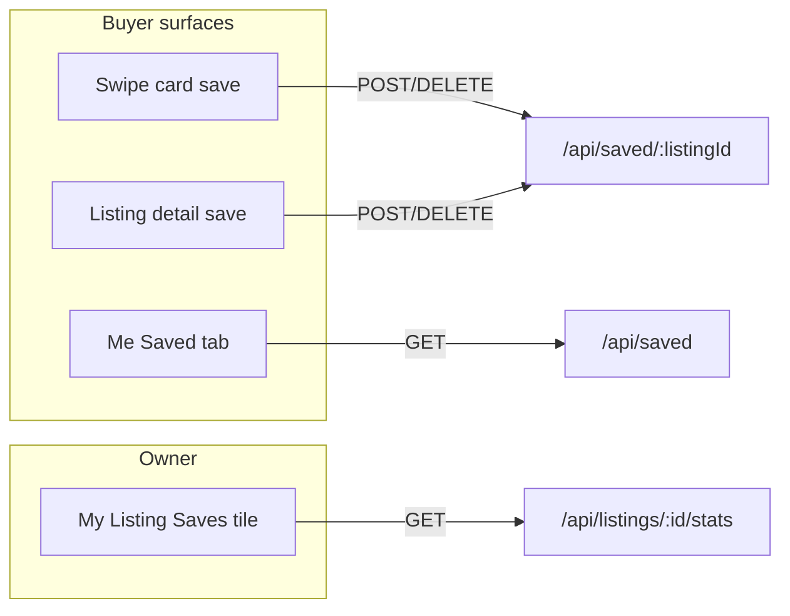
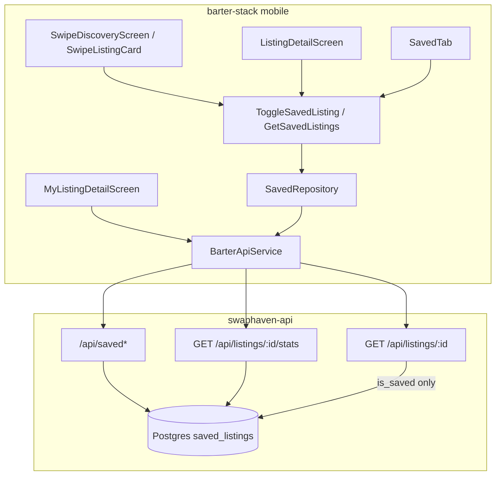
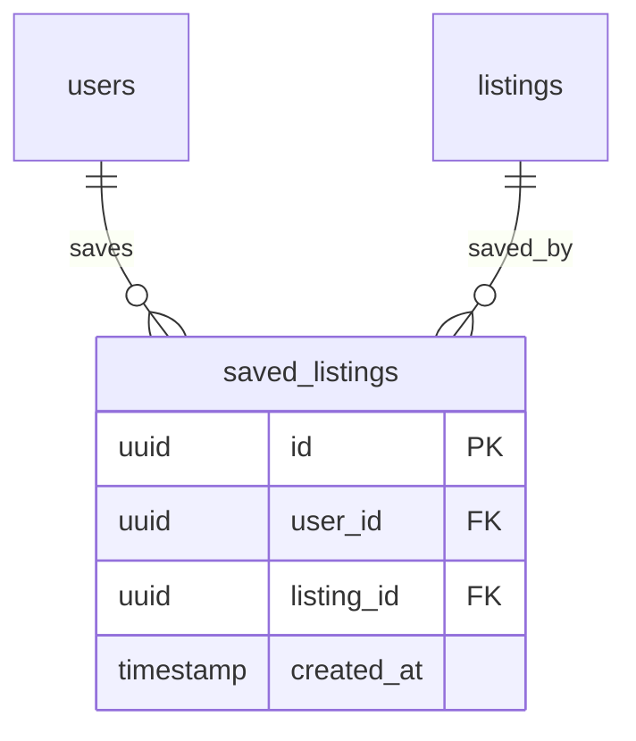
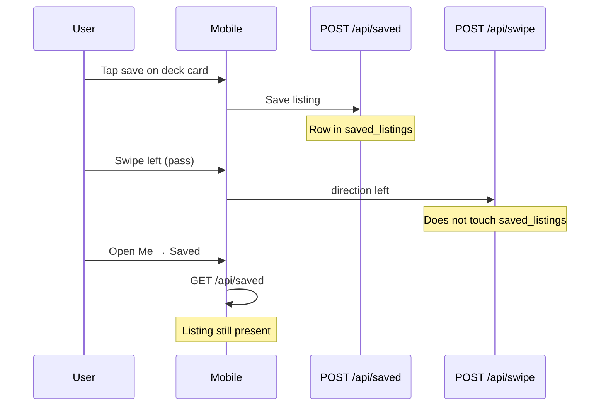

# Saved (Save-for-Later) Feature

End-to-end reference for **save-for-later**: backend (`swaphaven-api`) and mobile (`barter-stack/mobile`). Covers schema, APIs, owner stats, mobile UI surfaces, independence from swipes, and edge cases.

**Naming:** product and code use **saved / save / unsave**. The mobile toggle uses a Material **bookmark-shaped icon** for visual distinction from hearts / likes — that is iconography only, not a separate “bookmark” product name.

---

## 1. Product overview

Users can **save** another person’s active listing to revisit later, without committing to a swipe or offer.

| Surface | Behavior |
|---------|----------|
| **Swipe deck card** | Save icon (top-right); tap does **not** consume a swipe |
| **Listing detail** | Save icon next to share; optimistic toggle |
| **Me → Saved tab** | Grid of the signed-in user’s saved listings (Me-only; not on other profiles) |
| **My Listing Detail → Saves** | Owner analytics: how many users saved this listing |



### What Saved is **not**

| Concept | Source | Notes |
|---------|--------|-------|
| Right-swipe / heat | `listings.right_swipe_count` | Interest signal; shown as 🔥 heat badge |
| Offers | `offers` table | Open + accepted counts on owner stats |
| Heart / favorite (legacy naming) | — | Save UI uses bookmark **icon**; engagement hearts elsewhere are unrelated |

Saves **survive a left swipe (pass)**. Passing a listing does not remove it from Saved.

---

## 2. System architecture



| Layer | Location |
|-------|----------|
| HTTP routes | `swaphaven-api/src/routes/saved.ts` (mounted at `/api/saved`) |
| Schema | `swaphaven-api/src/db/schema/saved_listings.ts` |
| Migration | `drizzle/0019_saved_listings.sql` |
| Listing `is_saved` | `swaphaven-api/src/routes/listings.ts` (`GET /:listingId`), `swipe.ts` (deck cards) |
| Owner stats | `GET /api/listings/:listingId/stats` in `listings.ts` |
| OpenAPI | tag **Saved** in `src/openapi/spec.ts` |
| Mobile feature | `barter-stack/mobile/lib/features/saved/` |
| Shared providers | `barter-stack/mobile/lib/service_providers.dart` |
| Me tab | `profile/presentation/tabs/saved_tab.dart` |
| UI icons | `Icons.bookmark_rounded` / `bookmark_border_rounded` in `barter_ui` + listing detail |

---

## 3. Data model

### Table `saved_listings`

| Column | Type | Notes |
|--------|------|-------|
| `id` | uuid PK | Default `gen_random_uuid()` |
| `user_id` | uuid FK → `users` | Cascade delete |
| `listing_id` | uuid FK → `listings` | Cascade delete |
| `created_at` | timestamp | Default now; list order newest first |

**Constraints / indexes**

- Unique `(user_id, listing_id)` — one save row per user per listing
- Index `(user_id, created_at)` — pagination for `GET /api/saved`



Saves are **not** denormalized onto `listings` (no `save_count` column). Owner `save_count` is a live `COUNT(*)` on this table via the stats endpoint.

---

## 4. API reference

All `/api/saved*` routes require Bearer auth.

### 4.1 `GET /api/saved`

List the caller’s saved listings (active only), newest first.

**Query:** standard `limit` + `cursor` pagination.

**Response**

```json
{
  "items": [
    {
      "saved_id": "<uuid>",
      "saved_at": "2026-07-28T00:00:00.000Z",
      "listing": {
        "...": "BarterListing fields",
        "is_saved": true
      }
    }
  ],
  "nextCursor": null
}
```

Inactive / deleted listings are excluded via join on `listings.status = 'active'`.

### 4.2 `POST /api/saved/:listingId`

Save a listing for later. **Idempotent.**

| Status | Meaning |
|--------|---------|
| `201` | Newly saved — `{ id, listingId, saved: true }` |
| `200` | Already saved — same shape |
| `400` | Own listing, or listing not `active` |
| `404` | Listing not found / deleted |

### 4.3 `DELETE /api/saved/:listingId`

Unsave. **Idempotent** — always `204`, even if nothing was saved.

### 4.4 `is_saved` on shared listing surfaces

| Endpoint | Behavior |
|----------|----------|
| `GET /api/listings/:listingId` | Optional auth. When authenticated, includes `is_saved` (and nested `listing.is_saved`). Does **not** run save/offer COUNT queries. |
| `GET /api/swipe/deck` | Each card / nested listing includes `is_saved` for the caller. |

### 4.5 Owner stats (not on public listing detail)

`GET /api/listings/:listingId/stats` — **owner only** (`403` for non-owners).

```json
{
  "view_count": 12,
  "save_count": 3,
  "offer_count": 2
}
```

| Field | Meaning |
|-------|---------|
| `view_count` | Denormalized `listings.view_count` |
| `save_count` | `COUNT(*)` of `saved_listings` for this listing |
| `offer_count` | Offers with status `pending`, `countered`, or `accepted` |

Public/buyer `GET /api/listings/:id` intentionally omits these COUNTs for performance. My Listing Detail on mobile fetches listing + stats in parallel and merges them.

```bash
# Save
curl -s -X POST http://localhost:3001/api/saved/<listingId> \
  -H "Authorization: Bearer $TOKEN"

# List
curl -s "http://localhost:3001/api/saved?limit=20" \
  -H "Authorization: Bearer $TOKEN"

# Unsave
curl -s -X DELETE http://localhost:3001/api/saved/<listingId> \
  -H "Authorization: Bearer $TOKEN"

# Owner stats
curl -s http://localhost:3001/api/listings/<listingId>/stats \
  -H "Authorization: Bearer $OWNER_TOKEN"
```

---

## 5. Independence from swipes



- Save does **not** record a swipe or bump `right_swipe_count`.
- Pass / like does **not** create or delete a save.
- Saving does **not** create an offer.

---

## 6. Mobile implementation

### Feature layout

```
mobile/lib/features/saved/
  domain/       saved_listing.dart, saved_repository.dart
  application/  get_saved_listings_use_case.dart, toggle_saved_listing_use_case.dart
  data/         models, datasources, repository_impl
  di/           saved_providers.dart  (mySavedListingsProvider)
```

Repository / use-case providers live in `service_providers.dart` (shared wiring). Feature-only UI provider: `mySavedListingsProvider`.

### Client API

| Method | Endpoint |
|--------|----------|
| `getSavedListings` | `GET /api/saved` |
| `saveListing` | `POST /api/saved/:id` |
| `unsaveListing` | `DELETE /api/saved/:id` |
| `getListingStats` | `GET /api/listings/:id/stats` (My Listing merge) |

### UI wiring

| Screen / widget | Behavior |
|-----------------|----------|
| `SwipeListingCard` | `_SaveButton` with bookmark icon; `onToggleSaved` |
| Discovery notifier | Optimistic `isSaved` flip + rollback on failure |
| `ListingDetailScreen` | Gallery save control; uses toggle use case / `isFavorited` mapped from `is_saved` |
| `SavedTab` | Me-only tab next to Closet; empty state copy |
| `MyListingDetailScreen` | Views / **Saves** / Offers tiles; Saves from `save_count` via stats |
| Feed / closet heat | `FireCountBadge` for `right_swipe_count` (not save count) |

### Profile tabs (Me)

`Closet` · `Saved` · `History` · `Reviews`

Other users’ profiles do **not** show the Saved tab.

---

## 7. Edge cases & rules

| Case | Behavior |
|------|----------|
| Save own listing | `400` |
| Save inactive listing | `400` |
| Save missing / deleted | `404` |
| Double save | `200`, same row |
| Unsave when not saved | `204` |
| Listing soft-deleted | Cascade removes save rows; excluded from list |
| User deleted | Cascade removes save rows |
| Left-swipe after save | Save remains |
| Unauthenticated listing detail | `is_saved: false` |

---

## 8. Tests

| Suite | Coverage |
|-------|----------|
| `tests/saved.test.ts` | POST idempotent, own listing blocked, DELETE, GET list order, survives left swipe, `is_saved` on detail/deck, `save_count` on stats |
| `tests/listings.test.ts` | Owner stats `offer_count` / `save_count`, non-owner `403` on stats |
| Mobile | `my_listing_detail_test.dart` (`save_count` parse), `swipe_listing_card_test.dart` (save icon callback) |

```bash
# API
cd swaphaven-api && npm test -- tests/saved.test.ts

# Mobile
cd barter-stack/mobile && flutter test \
  test/features/profile/my_listing_detail_test.dart \
  packages/barter_ui/test/widgets/swipe_listing_card_test.dart
```

---

## 9. Related docs

| Doc | Relevance |
|-----|-----------|
| [API_GUIDE.md](./API_GUIDE.md) | Endpoint catalog / curl samples |
| [DB_SCHEMA.md](./DB_SCHEMA.md) | Schema overview + migrations |
| [SWIPE_FEATURE.md](./SWIPE_FEATURE.md) | Deck / right-swipe heat (orthogonal) |
| [LISTING_MANAGEMENT_FEATURE.md](./LISTING_MANAGEMENT_FEATURE.md) | My Listing owner surfaces |
| OpenAPI / Swagger | Tag **Saved**; `GET .../stats` under Listings |
