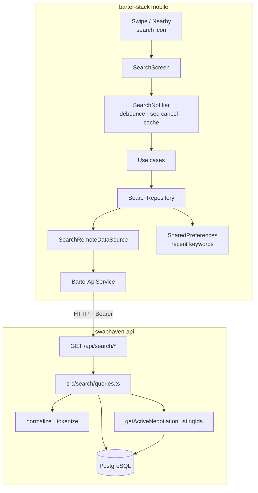
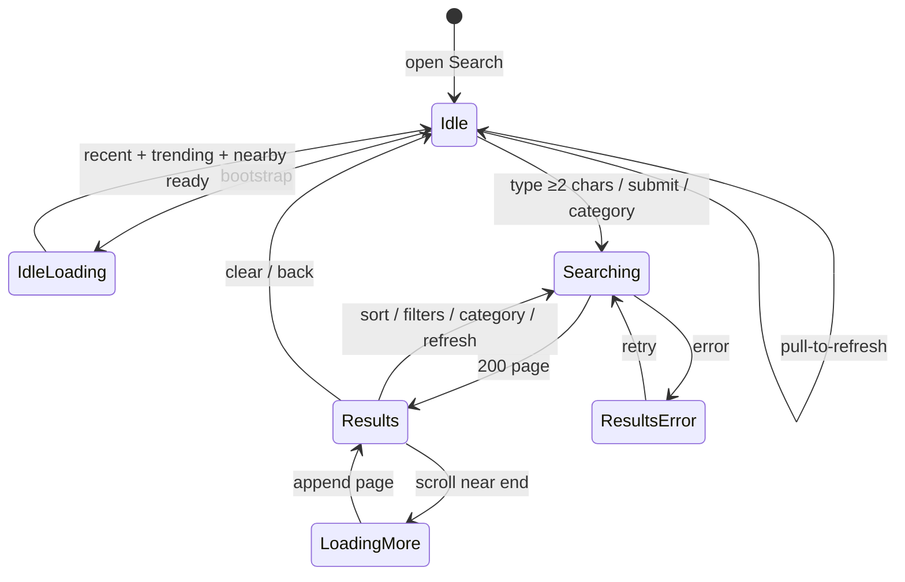
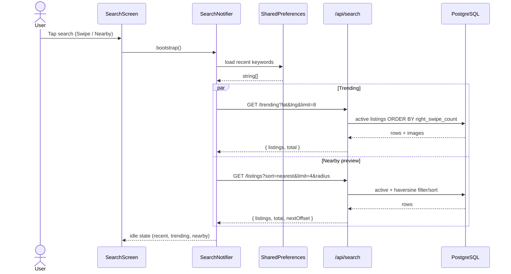
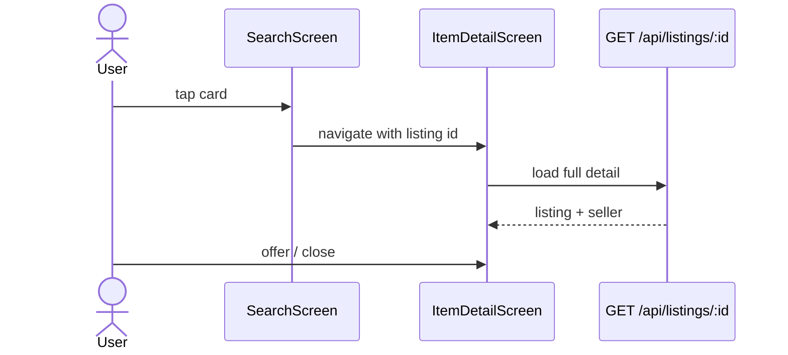
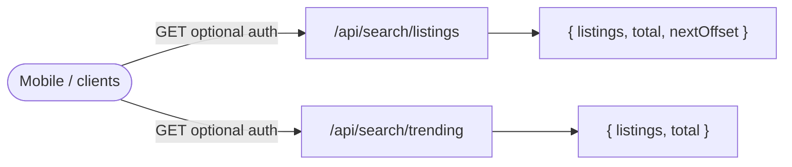
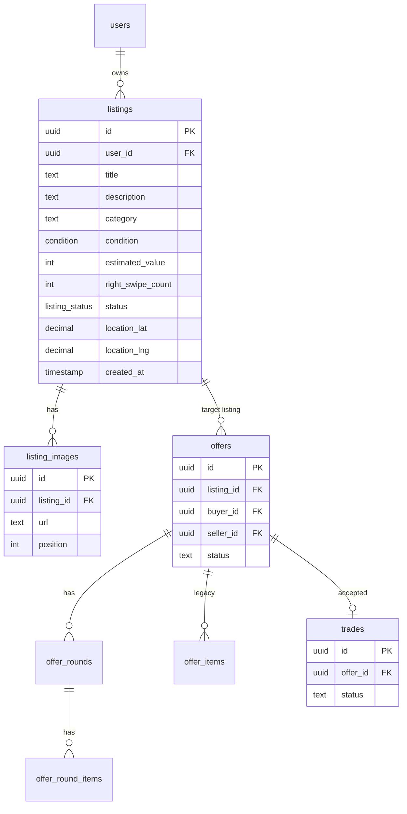
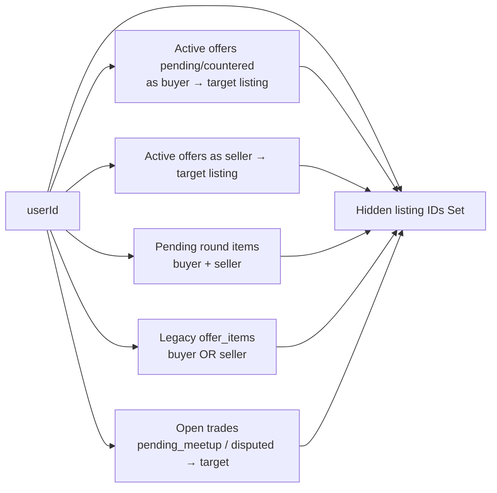

# Listing search (Phase 1)

Dedicated listing search across **swaphaven-api** and **barter-stack mobile**. Search is a separate HTTP module (`/api/search`) so it can later move to its own service without rewriting swipe or nearby feeds. Mobile owns presentation, debounce, recent keywords, and pagination; the API owns ranking, filters, and negotiation exclusion.

---

## Table of contents

1. [Goals and non-goals](#1-goals-and-non-goals)
2. [System architecture](#2-system-architecture)
3. [User flows](#3-user-flows)
4. [Sequence diagrams](#4-sequence-diagrams)
5. [API contracts](#5-api-contracts)
6. [Backend module map](#6-backend-module-map)
7. [Query pipeline](#7-query-pipeline)
8. [Database model](#8-database-model)
9. [Negotiation exclusion](#9-negotiation-exclusion)
10. [Mobile architecture](#10-mobile-architecture)
11. [Phase 2 hooks](#11-phase-2-hooks)
12. [Testing and verification](#12-testing-and-verification)
13. [Operational notes](#13-operational-notes)

---

## 1. Goals and non-goals

### Goals (Phase 1)

| Goal | Implementation |
|------|----------------|
| Find **active** listings only | `status = 'active'` hard filter |
| Entry from Swipe + Nearby | Search icon → `AppRoute.search` |
| Keyword + filters + sort | `q`, `condition`, `category`, `radius`, `sort` |
| Geo-aware results | Haversine miles; optional hard radius |
| Infinite scroll | Offset pagination (`limit` / `offset` / `nextOffset`) |
| Idle discovery | Recent keywords (local), categories, Close to you, Trending items |
| Hide in-flight negotiations | Shared `getActiveNegotiationListingIds` |
| Microservice-ready API | Isolated `src/search/*` + `src/routes/search.ts` |

### Non-goals (Phase 1)

- Elasticsearch / Meilisearch / embeddings
- Server-side search keyword history or trending keywords
- Affinity ranking from swipe/detail signals (`seed_ids` accepted, **ignored**)
- Searching sold/traded/paused/deleted listings
- Favorites/hearts on search cards (UI shows fire / right-swipe count)

---

## 2. System architecture



### Design split

| Concern | Owner |
|---------|--------|
| Ranking, filters, COUNT, serialization | API search module |
| Debounce (300ms), request-seq cancel, nearby TTL cache | Mobile `SearchNotifier` |
| Recent keywords | Mobile SharedPreferences (`barter_search_recent_keywords`) |
| Hide offers/trades from discovery | Shared lib used by search, swipe, listings |

---

## 3. User flows

### High-level UI state machine



### Idle screen contents

1. **Recent keywords** — local chips (add on submit, remove / clear)
2. **Categories** — browse slugs → `category=` on search
3. **Close to you** — `GET /api/search/listings` with `sort=nearest`, `limit=4`, radius from prefs (2‑minute in-memory cache)
4. **Trending** — `GET /api/search/trending` → product grid (not keywords)

### Results screen contents

- Sort chips: best match / nearest / newest / value asc / most saved
- Filters sheet: conditions + max distance miles
- Grid or list (`barter_ui` cards)
- Infinite scroll when `nextOffset != null`
- Tap card → existing `ItemDetailScreen` (offer / close)

---

## 4. Sequence diagrams

### 4.1 Open search (idle bootstrap)



### 4.2 Typed / submitted search

```mermaid
sequenceDiagram
  actor User
  participant UI as SearchScreen
  participant N as SearchNotifier
  participant Prefs as SharedPreferences
  participant API as GET /api/search/listings
  participant Hide as active-offer-listings
  participant DB as PostgreSQL

  User->>UI: type "nike shoes" (or submit)
  UI->>N: setQueryText / submitQuery
  Note over N: debounce 300ms; bump requestSeq
  opt submit (not debounce-only)
    N->>Prefs: add recent keyword
  end
  N->>API: q, lat, lng, radius, condition, category, sort, limit=20, offset=0<br/>Authorization: Bearer (optionalAuth)
  API->>Hide: getActiveNegotiationListingIds(userId)
  Hide->>DB: offers / rounds / offer_items / open trades
  DB-->>Hide: listing UUID[]
  Hide-->>API: exclude IDs
  API->>DB: COUNT(*) WHERE filters
  API->>DB: SELECT … ORDER BY sort LIMIT/OFFSET
  API->>DB: listing_images for page IDs
  DB-->>API: rows
  API-->>N: { listings, total, nextOffset }
  alt seq still current
    N-->>UI: Results
  else newer request won
    N--xUI: drop stale response
  end
```

### 4.3 Infinite scroll

```mermaid
sequenceDiagram
  actor User
  participant UI as SearchScreen
  participant N as SearchNotifier
  participant API as GET /api/search/listings

  User->>UI: scroll near bottom
  UI->>N: loadMore()
  alt canLoadMore == false
    N-->>UI: no-op
  else
    N->>API: same filters, offset=nextOffset
    API-->>N: next page
    N-->>UI: append listings; update nextOffset
  end
```

### 4.4 Tap result → detail



---

## 5. API contracts

### Endpoints overview



Mounted in `src/app.ts`:

```text
app.use("/api/search", searchRouter);
```

Auth: **`optionalAuth`**. When a Bearer token is present, the user’s own listings and active-negotiation listings are excluded. Anonymous callers still get active listings (no personal exclusions).

### `GET /api/search/listings`

| Query | Type | Notes |
|-------|------|--------|
| `q` | string | Normalized; tokens &lt; 2 chars dropped; max 8 tokens; AND across tokens |
| `lat` / `lng` | number | Optional geo |
| `radius` | 1–25 | Miles; **hard** filter when set with lat/lng |
| `condition` | CSV | `new,like_new,great,good,fair` |
| `category` | string | Slug; matched against label/slug variants |
| `sort` | enum | See table below; default depends on `q` / geo |
| `limit` | 1–100 | Default 20 |
| `offset` | ≥0 | Default 0 |
| `seed_ids` | CSV UUIDs | Phase 2; **ignored** |

**Default sort**

| Context | Default |
|---------|---------|
| `q` present (≥2 after normalize) | `best_match` |
| else geo present | `nearest` |
| else | `newest` |

**Sort modes**

| `sort` | Primary order |
|--------|----------------|
| `best_match` | title hit → nearby boost → `right_swipe_count` → `created_at` |
| `nearest` | haversine ASC → `created_at` |
| `newest` | `created_at` DESC |
| `value_asc` | `estimated_value` ASC → `created_at` |
| `most_saved` | `right_swipe_count` DESC → `created_at` |

**Response**

```json
{
  "listings": [
    {
      "id": "…",
      "title": "…",
      "condition": "good",
      "estimated_value": 25,
      "images": ["https://…"],
      "category": "…",
      "right_swipe_count": 3,
      "distance_miles": 1.2
    }
  ],
  "total": 42,
  "nextOffset": 20
}
```

`listings[]` uses the shared **BarterListing** shape plus nullable `distance_miles`. `nextOffset` is `null` when there is no further page.

### `GET /api/search/trending`

Thin wrapper around the same query engine:

- `sort=most_saved`
- `offset=0`
- `radius` **not** applied as a hard filter (keeps carousel populated)
- Response: `{ listings, total }` (no `nextOffset`)

### Error shapes

| Status | When |
|--------|------|
| `400` | Zod validation failure (`validation_error`) |
| `500` | Unexpected DB / server error |

OpenAPI: tag **Search** in `src/openapi/spec.ts` (`SearchListingsResponse`, `TrendingSearchListingsResponse`).

---

## 6. Backend module map

```text
swaphaven-api/
├── src/routes/search.ts          # HTTP: Zod, optionalAuth, defaults
├── src/search/
│   ├── types.ts                  # SearchSort, SearchListingParams
│   ├── normalize.ts              # normalizeQuery, tokenizeQuery
│   └── queries.ts                # filters, sort, COUNT, SELECT, images
├── src/lib/active-offer-listings.ts  # shared hide list
├── src/lib/barter-listing.ts     # serializeListingBarter
├── tests/search.test.ts
└── drizzle/0013_search_trgm_indexes.sql
```

Search **does not** reuse `GET /api/listings` handlers. It shares only:

- schema / Drizzle client
- barter serializer
- negotiation hide helper (also used by swipe + listings feed)

---

## 7. Query pipeline

```mermaid
flowchart TD
  A[Request params] --> B{Auth user?}
  B -->|yes| C[Load hidden listing IDs]
  B -->|no| D[Skip exclusions]
  C --> E[Build WHERE]
  D --> E

  E --> E1[status = active]
  E --> E2[exclude own userId]
  E --> E3[NOT IN hidden IDs]
  E --> E4[token AND: title OR description ILIKE]
  E --> E5[condition IN]
  E --> E6[category slug/label match]
  E --> E7{lat+lng+radius?}
  E7 -->|yes| E8[haversine ≤ radius]

  E --> F[COUNT *]
  E --> G[SELECT lean columns]
  G --> H[ORDER BY sort]
  H --> I[LIMIT / OFFSET]
  I --> J[Load images by listing ids]
  J --> K[serializeListingBarter + distance_miles]
  F --> L[{ listings, total, nextOffset }]
  K --> L
```

### Text matching

1. `normalizeQuery` — trim, collapse spaces, lowercase  
2. `tokenizeQuery` — split on space; drop tokens length &lt; 2; cap **8** tokens  
3. Each token becomes `(title ILIKE %token% OR description ILIKE %token%)`  
4. Tokens are **AND**ed (all must match)

### Category matching

Mobile sends browse slugs (e.g. `books`). DB may store labels (`Books`, `Home & Kitchen`). The filter matches:

- lower(category) = slug  
- slugified label (` & ` / spaces → `_`)  
- a few explicit aliases (`sports_fitness`, `toys_games`, `garden_outdoor`)

### Lean SELECT

Search selects only columns needed for list cards and ranking. Newer columns such as `sold_method` are **not** required in the SELECT so a slightly lagging migration does not break search listing responses.

---

## 8. Database model

### Tables touched by search



### Indexes for search

Migration `drizzle/0013_search_trgm_indexes.sql`:

```sql
CREATE EXTENSION IF NOT EXISTS pg_trgm;
CREATE INDEX IF NOT EXISTS listings_title_trgm_idx
  ON listings USING gin (title gin_trgm_ops);
CREATE INDEX IF NOT EXISTS listings_description_trgm_idx
  ON listings USING gin (description gin_trgm_ops);
```

Existing indexes also help:

- `listings_status_created_at_idx` — active + newest sorts  
- `listings_user_id_idx` — owner exclusion paths  
- `listing_images_listing_id_idx` — image batch load  

Geo distance is computed in SQL (haversine); there is no PostGIS requirement in Phase 1.

### Status filter (product rule)

Only `listing_status = 'active'` appears in search/trending. Sold / traded / paused / deleted never surface here.

---

## 9. Negotiation exclusion

When the request is authenticated, search calls:

```ts
getActiveNegotiationListingIds(userId)
```

from `src/lib/active-offer-listings.ts`. The same helper hides cards in **swipe deck** and **listings/nearby** feeds so discovery surfaces stay consistent.

### What gets hidden



Constants:

- `ACTIVE_OFFER_STATUSES` = `pending`, `countered`
- `OPEN_TRADE_STATUSES` = `pending_meetup`, `disputed`

**Blast radius:** this helper is shared. Changes affect search, swipe, and feed together. Prefer dedicated unit/integration coverage before expanding rules.

---

## 10. Mobile architecture

### Feature layout (`mobile/lib/features/search/`)

```text
search/
├── domain/
│   ├── entities/search_entities.dart
│   └── repositories/search_repository.dart
├── application/
│   ├── search_listings_use_case.dart
│   ├── load_trending_searches_use_case.dart
│   └── recent_search_keywords_use_case.dart
├── data/
│   ├── datasources/search_remote_data_source.dart
│   ├── datasources/search_local_data_source.dart
│   ├── models/search_data_models.dart
│   └── repositories/search_repository_impl.dart
├── presentation/
│   ├── search_screen.dart
│   ├── search_filters_sheet.dart
│   └── search_ui_mapper.dart
└── di/search_providers.dart      # SearchNotifier + SearchUiState
```

Wiring:

| Piece | Location |
|-------|----------|
| Endpoints | `ApiEndpoints.searchListings` / `searchTrending` |
| HTTP | `BarterApiService.searchListings` / `getSearchTrending` |
| Providers | `service_providers.dart` + `search_providers.dart` |
| Route | `AppRoute.search` (GoRouter overlay) |
| Entry | Swipe header + Nearby `_FeedHeader` search icons |
| Cards | `barter_ui` `SearchResultGridCard` / `SearchResultListTile` |

### Client behaviors worth knowing

| Behavior | Detail |
|----------|--------|
| Debounce | 300ms on text changes |
| Min query | &lt; 2 chars does not search |
| Request cancel | monotonic `_requestSeq`; ignore stale responses |
| Page size | 20 |
| Nearby cache | 2 minutes in notifier memory |
| Recent keywords | max 12, case-insensitive dedupe |
| Sort nudge | submitting text while on `nearest` switches to `bestMatch` |

### Mobile → API parameter mapping

| UI | Query param |
|----|-------------|
| Search box | `q` |
| User prefs lat/lng | `lat`, `lng` |
| Filter max distance | `radius` |
| Condition chips | `condition` CSV |
| Category chip | `category` slug |
| Sort chip | `sort` |
| Scroll page | `offset`, `limit` |

---

## 11. Phase 2 hooks

| Hook | Status |
|------|--------|
| `seed_ids` query param | Parsed (max 50), **ignored** in `searchListings` |
| Local affinity (right-swipe + detail opens) | Not built |
| Similar-item merge / embeddings | Deferred |
| External search engine | Deferred |

Phase 2 intent: mobile builds a small local affinity store and passes `seed_ids`; API merges similar active listings into ranking without changing the public response envelope.

---

## 12. Testing and verification

### API

```bash
cd swaphaven-api
npm run typecheck
npm test -- tests/search.test.ts
```

Cover at least: validation, active-only, token AND, geo radius, sorts, pagination, auth exclusions.

### Mobile

```bash
cd barter-stack/mobile
flutter analyze
flutter test   # include barter_ui search card tests if present
```

### Manual smoke

1. Open search from Swipe and Nearby  
2. Idle: recent / trending / nearby populate  
3. Type a known title → results; clear → idle  
4. Filters + sort change refresh page 0  
5. Scroll loads more until `nextOffset` null  
6. Listing in an active offer with you should not appear  
7. Tap result opens detail  

---

## 13. Operational notes

- **Deploy:** Railway `start:prod` runs migrations before boot; ensure `0013_search_trgm_indexes` (and prior listing/trade migrations) are applied.
- **Perf:** Each authenticated search may run several exclusion queries plus COUNT + page SELECT + images. Watch latency if offer tables grow; consider collapsing exclusions into one SQL later.
- **Consistency:** Changing hide rules in `active-offer-listings.ts` changes swipe and nearby too — treat as a cross-feature change.
- **Isolation:** Prefer extending `src/search/*` rather than folding search into `routes/listings.ts`.

### Related docs

- [API_GUIDE.md](./API_GUIDE.md) — full endpoint catalog  
- [DB_SCHEMA.md](./DB_SCHEMA.md) — broader schema  
- [SWAGGER.md](./SWAGGER.md) — OpenAPI UI  

### Key source files

| Area | Path |
|------|------|
| Route | `src/routes/search.ts` |
| Queries | `src/search/queries.ts` |
| Hide helper | `src/lib/active-offer-listings.ts` |
| Migration | `drizzle/0013_search_trgm_indexes.sql` |
| Mobile screen | `barter-stack/mobile/lib/features/search/presentation/search_screen.dart` |
| Mobile state | `barter-stack/mobile/lib/features/search/di/search_providers.dart` |
