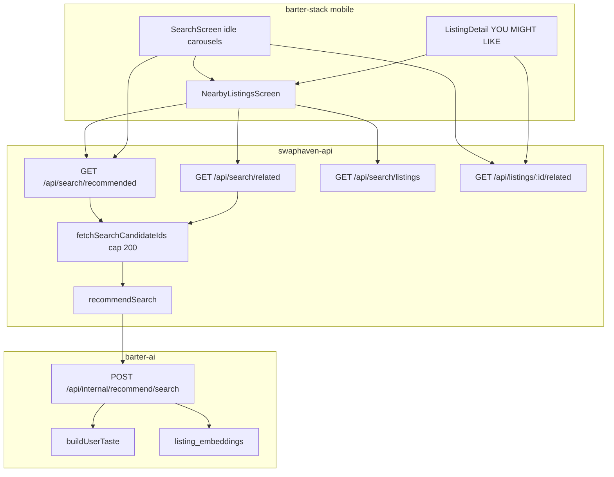
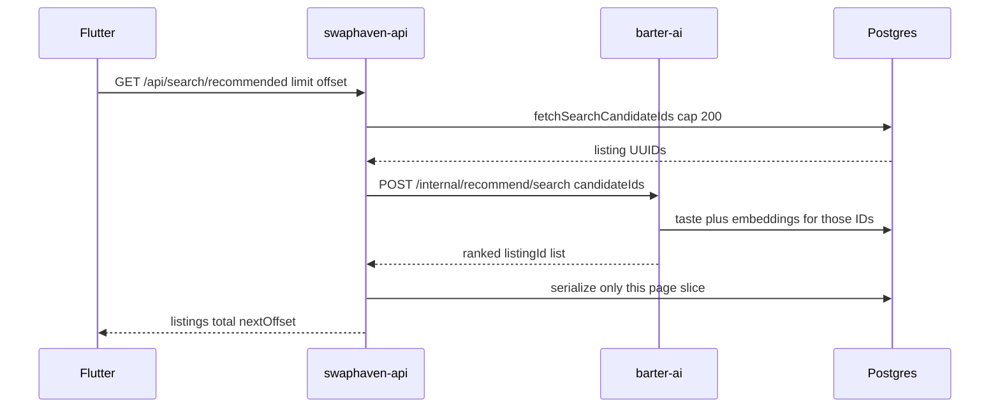

# Search recommendations and shared See all grid

Personalized listing collections for **search idle**, **typed Recommended sort**, and **item-detail YOU MIGHT LIKE**. Ranking lives in **barter-ai**. Public HTTP lives in **swaphaven-api** as **new** search routes. Mobile reuses the existing Nearby Listings grid for every **See all**.

Existing `GET /api/search/listings`, `GET /api/search/trending`, and `GET /api/listings/:listingId/related` are **unchanged**.

Related: [SEARCH_FEATURE.md](./SEARCH_FEATURE.md) (keyword search), [SWIPE_FEATURE.md](./SWIPE_FEATURE.md) (deck also uses taste).

---

## Table of contents

1. [Product](#1-product)
2. [What the ranker learns](#2-what-the-ranker-learns)
3. [System architecture](#3-system-architecture)
4. [User flows](#4-user-flows)
5. [Sequence diagrams](#5-sequence-diagrams)
6. [Why new APIs (not `sort=recommended`)](#6-why-new-apis-not-sortrecommended)
7. [barter-ai ranking](#7-barter-ai-ranking)
8. [Public API contracts](#8-public-api-contracts)
9. [Pagination and performance](#9-pagination-and-performance)
10. [Fallback behavior](#10-fallback-behavior)
11. [Mobile architecture](#11-mobile-architecture)
12. [What is not personalized](#12-what-is-not-personalized)
13. [Testing](#13-testing)
14. [Operational notes](#14-operational-notes)

---

## 1. Product

The ML stack is a **hybrid content + behavior ranker**, not collaborative filtering. Listing text is embedded with OpenAI `text-embedding-3-small`. Each signed-in viewer gets a **taste vector** from recent swipes, saves, and detail views. Candidates are scored at request time (cosine similarity + category / value / popularity heuristics).

| Surface | UI | Who sees it | Data |
|---------|----|-------------|------|
| Search idle **Recommended for you** | Horizontal carousel (~10 tiles) + See all | Signed-in only | `GET /api/search/recommended?limit=10` |
| Search idle **Trending** | Same carousel + See all | Everyone | Existing `GET /api/search/trending` (preview); See all uses `GET /api/search/listings?sort=most_saved` |
| Search idle **Close to you** | Small preview grid + See all | Everyone | Preview: existing search nearest; See all: paged `GET /api/search/listings?sort=nearest` |
| Typed search **Recommended** sort | Pushes the shared grid (does **not** call listings `sort=recommended`) | Signed-in only | `GET /api/search/recommended?q=…` |
| Item detail **YOU MIGHT LIKE** | Carousel + See all | Signed-in (related preview already required auth) | Preview: existing `GET /api/listings/:id/related?limit=10`; See all: `GET /api/search/related?listingId=` |
| Map tab nearby count tap | Existing grid, **in-memory feed** | Everyone | `feedProvider` — no extra search request |

**See all destination:** one screen, [`NearbyListingsScreen`](../../barter-stack/mobile/lib/features/listings/presentation/nearby_listing_screen.dart) at `/listings/nearby`, parameterized with `ListingCollectionArgs`. Infinite-scroll grid of `SearchResultGridCard`.

Guests never see Recommended (rail or sort). Trending and nearby still work.

---

## 2. What the ranker learns

Taste is rebuilt **on every recommend call** from Postgres. There is no offline training job.

| Signal | Table | Weight | Window |
|--------|-------|--------|--------|
| Super-swipe | `swipes` (`super`) | +3.0 | 90 days |
| Save for later | `saved_listings` | +2.5 | 90 days |
| Right-swipe | `swipes` (`right`) | +2.0 | 90 days |
| Listing detail view | `listing_views` | +1.0 | 30 days |
| Left-swipe (pass) | `swipes` (`left`) | −0.5 | 90 days |
| Onboarding interests | `user_profiles.interest_category_ids` | category match only | static |
| Viewer’s closet categories | active `listings` they own | category match only | static |

Recency decay: `exp(-days / 14)` so recent actions count more.

**Not used:** completed trades, offer accept/reject, search clicks, `seed_ids` from the client.

Listing **embeddings** refresh on create/edit (`scheduleListingEmbed` → `POST /api/internal/embed/listing`). Unchanged content hash skips the OpenAI call.

---

## 3. System architecture



| Layer | Path |
|-------|------|
| barter-ai search rank | `barter-ai/src/recommend/rank.ts` → `rankSearch` |
| barter-ai candidates by ID | `barter-ai/src/recommend/candidates.ts` → `fetchCandidatesByIds` |
| Internal route | `barter-ai/src/routes/internal.ts` → `POST /api/internal/recommend/search` |
| Public collections | `swaphaven-api/src/search/collections.ts` |
| Public routes | `swaphaven-api/src/routes/search.ts` |
| Candidate ID query | `swaphaven-api/src/search/queries.ts` → `fetchSearchCandidateIds` |
| HTTP client | `swaphaven-api/src/lib/barter-ai.ts` → `recommendSearch` (800ms timeout) |
| Shared grid | `barter-stack/mobile/lib/features/listings/presentation/nearby_listing_screen.dart` |
| Collection args | `barter-stack/mobile/lib/features/listings/domain/listing_collection_args.dart` |
| Carousel widget | `barter-stack/mobile/packages/barter_ui/lib/widgets/listing_preview_carousel.dart` |

---

## 4. User flows

### Idle search

1. Open search (Swipe or Nearby search icon).
2. Signed-in: Recommended carousel loads in parallel with Trending (failure cannot block idle).
3. Tap a tile → listing detail.
4. Tap **See all** → `/listings/nearby` with `ListingCollectionArgs` (`paged: true`).
5. Scroll the grid → `offset` += 20 until `nextOffset` is null.

### Typed Recommended sort

1. Run a keyword search (results stay on `SearchScreen`).
2. Open sort sheet → **Recommended** (hidden for guests).
3. App **pushes** the nearby grid with `source=recommended` and `query=<committed q>`.
4. It does **not** send `sort=recommended` to `GET /api/search/listings`.

### Item detail See all

1. Open a listing (signed in).
2. **YOU MIGHT LIKE** uses the existing related preview (`limit=10`).
3. **See all** opens the same grid with `source=related` and `listingId`.

### Map nearby tap (unchanged performance path)

Tapping the nearby count on the listings/map tab still opens `/listings/nearby` **without** extras. The screen reads `feedProvider.mapListings` already in memory. No extra search HTTP.

---

## 5. Sequence diagrams

### Recommended page (See all or idle)



### Related See all

Same as above, plus `listingId` on both public and internal calls. Ranker uses **related weights** (taste + seed cosine) instead of deck weights. Excludes the seed, its owner, the viewer’s swipes, active negotiations, and blocked owners.

### barter-ai skip / timeout

If `BARTER_AI_URL` is unset, the secret is missing, or the 800ms recommend call fails, `recommendSearch` returns `{ skipped: true }`. The API keeps the candidate IDs in newest order and still paginates. The client always gets `{ listings, total, nextOffset }`.

---

## 6. Why new APIs (not `sort=recommended`)

Phase 1 search reserved `seed_ids` on listings and ignored it. This feature does **not** implement that client-side affinity store.

Reusing `rankDeck` would ignore the search query (it pulls its own country pool). Search must **filter first, then rerank**.

Reusing `GET /api/listings/:id/related` for See all would dump up to 30 rows with no `offset`. Carousels keep that preview route; See all uses a paged sibling.

| Keep unchanged | Add |
|----------------|-----|
| `GET /api/search/listings` sort enum | `GET /api/search/recommended` |
| `GET /api/search/trending` | `GET /api/search/related?listingId=` |
| `GET /api/listings/:id/related` | `POST /api/internal/recommend/search` |
| `POST /api/internal/recommend/deck` | |
| `POST /api/internal/recommend/related` | |

---

## 7. barter-ai ranking

### `POST /api/internal/recommend/search`

Auth: `X-Internal-Key: <INTERNAL_API_SECRET>` (same as other internal routes).

Request body (own Zod schema — does **not** change `recommendBody` for deck/related):

| Field | Type | Notes |
|-------|------|-------|
| `candidateIds` | UUID[] | Required, 1–200 |
| `userId` | UUID | Optional; enables taste |
| `listingId` | UUID | Optional seed; switches to related weights |
| `country` | ISO-2 | Required |
| `excludeIds` | UUID[] | Optional |
| `excludeOwnerIds` | UUID[] | Optional |
| `limit` | int | 1–200, default 200 |

Response: `{ items: [{ listingId, score, reason }] }` (same shape as deck/related).

`rankSearch`:

1. Dedupes and caps IDs at 200.
2. Loads embeddings **only for those IDs** (`fetchCandidatesByIds`).
3. Builds taste if `userId` is set.
4. Loads seed embedding if `listingId` is set.
5. Scores with `DECK_WEIGHTS` (no seed) or `RELATED_WEIGHTS` (seed present).

### Score blend

| Component | Deck / search (no seed) | Related / search (seed) |
|-----------|-------------------------|-------------------------|
| Taste cosine | 0.75 | 0.50 |
| Seed cosine | 0 | 0.25 |
| Category match | 0.10 | 0.10 |
| Value band | 0.10 | 0.10 |
| Popularity | 0.05 | 0.05 |

Cosine is mapped to `[0, 1]` as `(cos + 1) / 2` before blending.

Missing embeddings still participate (cosine 0) so keyword matches are not dropped.

---

## 8. Public API contracts

Both routes require a bearer token. Envelope matches listings search:

```json
{
  "listings": [ { "id": "…", "title": "…", "images": [], "status": "active" } ],
  "total": 47,
  "nextOffset": 20
}
```

`total` is the **ranked pool size** (≤ 200), not the unfiltered catalog count. `nextOffset` is `null` on the last page.

### `GET /api/search/recommended`

| Query | Notes |
|-------|-------|
| `q` | Optional keyword (same tokenization as listings) |
| `lat`, `lng`, `radius` | Optional hard geo filter (miles, 1–32) |
| `condition` | CSV of `new,like_new,great,good,fair` |
| `category` | Browse slug |
| `limit` | 1–100, default 20 |
| `offset` | Default 0 |

401 without auth.

```bash
curl -s 'http://localhost:3001/api/search/recommended?limit=20&offset=0' \
  -H "Authorization: Bearer $TOKEN"
```

Idle rail: `limit=10&offset=0`. See all / sort: `limit=20`, then increment `offset`.

### `GET /api/search/related`

Same paging/filter fields plus required `listingId` (UUID). 400 if missing.

```bash
curl -s "http://localhost:3001/api/search/related?listingId=$SEED&limit=20&offset=0" \
  -H "Authorization: Bearer $TOKEN"
```

Unknown / deleted seed → `{ listings: [], total: 0, nextOffset: null }` (not 404), so See all can show empty without crashing.

### Who calls what

| Grid `source` | HTTP |
|---------------|------|
| `recommended` | `GET /api/search/recommended` |
| `related` | `GET /api/search/related` |
| `trending` | `GET /api/search/listings?sort=most_saved` |
| `nearby` (paged See all) | `GET /api/search/listings?sort=nearest` + lat/lng/radius |
| `nearby` (map tap, default) | no extra HTTP — `feedProvider` |

---

## 9. Pagination and performance

The API never returns every matching row.

1. Filter active listings (query, category, geo, blocks, own listings) and take **at most 200 IDs** (`order by created_at desc`).
2. Rank that pool in barter-ai (embeddings already in DB — **no OpenAI call** on the recommend path).
3. Slice `offset` / `limit`.
4. Serialize **only the page** (images for ~20 listings).

Page 2 re-ranks the same 200 IDs and slices again (no ranked-id cache). Cosine over 200 vectors is cheap; the 800ms timeout protects the search path if barter-ai or taste queries stall.

Other guards:

| Path | Guard |
|------|--------|
| Map nearby grid | Uses already-loaded feed — zero extra round trip |
| Idle recommended | Best-effort; `.then(onError: [])` cannot fail search bootstrap |
| Idle recommended | Only requested when signed in |
| Recommend HTTP | 800ms abort → skip → newest of the same pool |
| Embeddings | Fire-and-forget on listing write; ranking works without `OPENAI_API_KEY` (category/popularity fallback) |

`POOL_CAP` / `SEARCH_CANDIDATE_CAP` = **200** in both API candidate fetch and barter-ai `rankSearch`.

---

## 10. Fallback behavior

| Situation | Behavior |
|-----------|----------|
| Guest | Recommended UI hidden; APIs 401 |
| `BARTER_AI_URL` unset | `{ skipped: true }`; newest order of the filtered pool, still paged |
| Recommend timeout / 5xx | Same skip |
| Empty candidate pool | `{ listings: [], total: 0, nextOffset: null }` |
| Related seed missing | Empty page (not 404) |
| Item-detail related preview down | Existing listings related fallback (category + similar value) — **unchanged** |

---

## 11. Mobile architecture

Feature-first search stays under `lib/features/search/`. The shared grid lives under `lib/features/listings/` because `/listings/nearby` already existed.

```
search/
  application/load_recommended_listings_use_case.dart   # idle rail only
  data/… searchRecommended / searchRelated
  presentation/search_screen.dart                       # carousels + See all
listings/
  domain/listing_collection_args.dart
  application/load_listing_collection_page_use_case.dart
  di/listing_collection_providers.dart
  presentation/nearby_listing_screen.dart
barter_ui/
  widgets/listing_preview_carousel.dart                 # tile + See all header
```

### `ListingCollectionArgs` (GoRouter `extra`)

| Field | Meaning |
|-------|---------|
| `source` | `nearby` \| `recommended` \| `trending` \| `related` |
| `title` | App bar override (`Close to you`, `You might like`, …) |
| `listingId` | Required for `related` |
| `query` | Keyword when opening from Recommended sort |
| `paged` | `true` → search APIs + infinite scroll; map tap leaves this false |

`usesMapFeed` is true only for default nearby (`!paged && source == nearby && listingId == null`).

### Carousel

`ListingPreviewCarousel` matches item-detail closet tiles: 112×112 image + two-line title + optional **See all**. Used by search idle Recommended/Trending and listing-detail YOU MIGHT LIKE (seller closet still uses the same tile widget).

---

## 12. What is not personalized

| Surface | Ranking |
|---------|---------|
| Keyword search default sorts | `best_match`, `nearest`, `newest`, `value_asc`, `most_saved` — unchanged |
| Trending idle / See all | `right_swipe_count` (most saved), not taste |
| Close to you / map nearby | Geo + existing feed |
| Swipe deck | Already taste-ranked via `recommendDeck` (separate path) |
| Item-detail related **preview** | Existing `recommendRelated` (10 items) |

`seed_ids` on `GET /api/search/listings` remains parsed and ignored.

---

## 13. Testing

### barter-ai

```bash
cd barter-ai
npm run typecheck
npm test -- tests/internal-recommend.test.ts tests/recommend-score.test.ts
```

Covers: search route requires `candidateIds`; deck/related contracts unchanged.

### swaphaven-api

```bash
cd swaphaven-api
npm run typecheck
npm test -- tests/search.test.ts
```

Covers: recommended 401; paged `nextOffset` and non-overlapping pages; related 401/400; related omits the seed id. Listings/trending tests still pass on the same file.

### Mobile

```bash
cd barter-stack/mobile
flutter test test/features/listings/listing_collection_args_test.dart
cd packages/barter_ui && flutter test test/widgets/listing_preview_carousel_test.dart
```

### Manual smoke

1. Signed-in search idle: Recommended carousel + See all → paginated grid.
2. Guest search idle: no Recommended; Trending See all still works.
3. Typed search → sort Recommended → grid filtered by `q`.
4. Listing detail YOU MIGHT LIKE → See all → grid, seed listing absent.
5. Map nearby tap still instant (feed data); title **Nearby Listings**.
6. Stop barter-ai: recommended/related still return newest pages (no spinner forever).

---

## 14. Operational notes

- **Env (API):** `BARTER_AI_URL`, `BARTER_AI_SECRET` (must equal barter-ai `INTERNAL_API_SECRET`).
- **Env (barter-ai):** `OPENAI_API_KEY` for new embeddings; ranking still runs without it.
- **Deploy order:** ship barter-ai `recommend/search` before (or with) the API collections routes. If the internal path 404s, the client skips and falls back to newest.
- **OpenAPI:** `/api/search/recommended` and `/api/search/related` added in `src/openapi/spec.ts` only (listings/trending enums untouched).
- **Isolation:** extend `src/search/collections.ts`; do not add `recommended` to listings `sortEnum`.
- **Watch:** authenticated recommended/related run exclusions + 200-ID select + taste queries + page serialize. If swipe/view tables grow, taste SQL in `barter-ai/src/recommend/taste.ts` is the first place to index/limit.

### Related docs

- [SEARCH_FEATURE.md](./SEARCH_FEATURE.md) — keyword search Phase 1
- [API_GUIDE.md](./API_GUIDE.md) — endpoint catalog
- [SWIPE_FEATURE.md](./SWIPE_FEATURE.md) — deck `recommendDeck`
- [SAVED_FEATURE.md](./SAVED_FEATURE.md) — save signal
- barter-ai [README](../../barter-ai/README.md) — companion service

### Key source files

| Area | Path |
|------|------|
| Internal search rank | `barter-ai/src/recommend/rank.ts` |
| Taste | `barter-ai/src/recommend/taste.ts` |
| Collections | `swaphaven-api/src/search/collections.ts` |
| Routes | `swaphaven-api/src/routes/search.ts` |
| Tests | `swaphaven-api/tests/search.test.ts`, `barter-ai/tests/internal-recommend.test.ts` |
| Shared grid | `barter-stack/mobile/lib/features/listings/presentation/nearby_listing_screen.dart` |
| Idle UI | `barter-stack/mobile/lib/features/search/presentation/search_screen.dart` |
| Detail rail | `barter-stack/mobile/lib/features/listings/presentation/listing_detail_screen.dart` |
