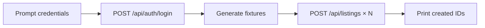

# Seed listings script

Bulk-create realistic sample listings for an existing SwapHaven user — useful for local development, swipe/discovery testing, and staging demos on Railway.

The script logs in over HTTP, then posts **10 unique listings** (by default) to `POST /api/listings`. Every run generates fresh titles, descriptions, prices, locations, and image seeds.

---

## Quick start

### Local

1. Start Postgres and the API (see [LOCAL_DEVELOPMENT.md](./LOCAL_DEVELOPMENT.md)).
2. Register a user in the app, or via the [seed user script](./SEED_USER.md):

```bash
npm run seed:user
# or: npm run seed:user -- --random
```

3. Run the seed script (from the repo root):

```bash
npm run seed:listings
```

4. Enter the account **email** and **password** when prompted.

### Railway / production API

```bash
npm run seed:listings -- --base-url https://swaphaven-backend-production.up.railway.app
```

Use a **non-production test account** on shared environments.

---

## What it does



| Step | Endpoint | Purpose |
|------|----------|---------|
| 1 | `POST /api/auth/login` | Obtain `accessToken` |
| 2 | — | Build random listing payloads |
| 3 | `POST /api/listings` | Create each listing as the logged-in user |

Listings are created under **your account** — they appear in My Listings and in swipe discovery (when eligible).

---

## Example output

```text
API: http://127.0.0.1:3001
Creating 10 listing(s)...

Email: demo@example.com
Password:

Logged in as Demo User (demo@example.com)

[1/10] Sony Mirrorless Body (low shutter count) ... ok (5a3a89d9-15e2-46b8-9b46-14758dc78fe0)
[2/10] KitchenAid Espresso Machine (matte black) ... ok (590622ca-524a-4af3-b64f-97107206fe0e)
...
[10/10] Fender Electric Guitar (with gig bag) ... ok (d5e1c989-eecb-4c65-978d-14eb3706c296)

Done. Created 10 listing(s) for demo@example.com.
```

Run it again — titles and details will be different each time.

---

## CLI reference

```bash
npm run seed:listings [-- --base-url <url>] [--count <n>] [--help]
```

| Option | Default | Description |
|--------|---------|-------------|
| `--base-url <url>` | See [API target](#api-target) | API origin (no trailing slash) |
| `--count <n>` | `10` | Listings to create (max **14**, one per product template) |
| `--help` | — | Print usage |

### API target

Resolved in order:

1. `--base-url` flag
2. `API_BASE` environment variable
3. `PUBLIC_API_URL` environment variable
4. `http://127.0.0.1:3001`

```bash
# Local (explicit)
API_BASE=http://127.0.0.1:3001 npm run seed:listings

# Railway
API_BASE=https://swaphaven-backend-production.up.railway.app npm run seed:listings
```

### Non-interactive mode

Skip prompts when both variables are set. Plain usernames (without `@`) are normalized to `username@example.com`, same as [SEED_USER.md](./SEED_USER.md):

```bash
SEED_EMAIL=demo SEED_PASSWORD='your-password' npm run seed:listings
```

Useful for scripts and CI-style automation. **Do not commit real passwords.**

### Fewer listings

```bash
npm run seed:listings -- --count 5
```

---

## Generated listing data

Fixtures are built in `scripts/listing-fixtures.ts` by `generateListingFixtures()`.

Each listing randomizes:

| Field | Examples |
|-------|----------|
| **Title** | `Patagonia Hiking Shell (men's L)` |
| **Description** | Condition note + wanted snippet + date + ref serial |
| **Category** | One of 14 templates (cameras, electronics, sneakers, …) |
| **Condition** | `new`, `like_new`, `great`, `good`, `fair` |
| **Estimated value** | Random within a category-specific range |
| **Flags** | `acceptCashTopUps`, `isSwipeOnly` |
| **Wanted** | Two random category slugs + free-text line |
| **Details** | `brand`, `ageRange` |
| **Location** | Bay Area city, jittered coordinates, random street |
| **Image** | `https://picsum.photos/seed/<unique>/800/600` |

Product templates cover: cameras, electronics, home & kitchen, furniture, books, sneakers, tools, gaming, clothing, instruments, sports, garden, art & collectibles, board games.

---

## Files

| File | Role |
|------|------|
| `scripts/seed-listings.ts` | CLI: login, create listings, progress output |
| `scripts/listing-fixtures.ts` | Random fixture generator |
| `package.json` | `"seed:listings": "tsx scripts/seed-listings.ts"` |

---

## Verify listings

**API**

```bash
curl -s "http://127.0.0.1:3001/api/listings?limit=5" | jq '.listings[:3] | .[].title'
```

**Database (Drizzle Studio)**

```bash
npm run db:studio
```

**Mobile app**

Point `barter-stack/mobile/lib/config/env/dev.env` at local API:

```env
API_BASE=http://127.0.0.1:3001
```

Then open swipe discovery — seeded listings from other users will appear; your own are excluded from your feed.

---

## Troubleshooting

| Problem | Fix |
|---------|-----|
| `Login failed` / `Invalid email or password` | Use the account email (not display name). Register first if needed. |
| `fetch failed` / connection refused | Start API: `npm run dev`. Check `--base-url`. |
| `Create failed (401)` | Token expired — re-run script to log in again. |
| Port 5433 / DB errors on API | Start Postgres; see [LOCAL_DEVELOPMENT.md](./LOCAL_DEVELOPMENT.md). |
| Listings created but not in swipe feed | Discovery excludes your own listings — use a second test user to browse, or check `/api/listings`. |
| Images missing | Only HTTPS URLs are stored; picsum links are valid. |

---

## Safety notes

- Creates **real rows** in the target database (local or Railway).
- Always use a **dedicated test account** on shared/production APIs.
- Non-local targets (`--base-url`, `API_BASE`) require typing `yes` at the prompt, or pass `--force` to skip confirmation.
- Never pass production credentials in shell history — prefer interactive prompts or short-lived env vars.
- The script does not delete listings; remove test data manually or via API if needed.

---

## Related docs

- [LOCAL_DEVELOPMENT.md](./LOCAL_DEVELOPMENT.md) — Postgres, migrations, run API
- [API_GUIDE.md](./API_GUIDE.md) — `POST /api/auth/login`, `POST /api/listings`
- [TESTING.md](./TESTING.md) — automated test fixtures (separate from this CLI)
