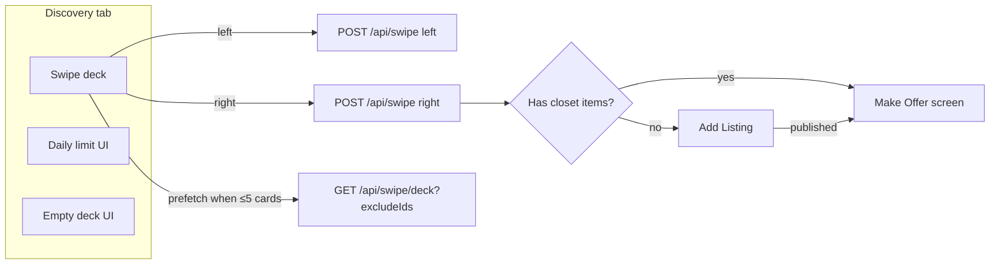
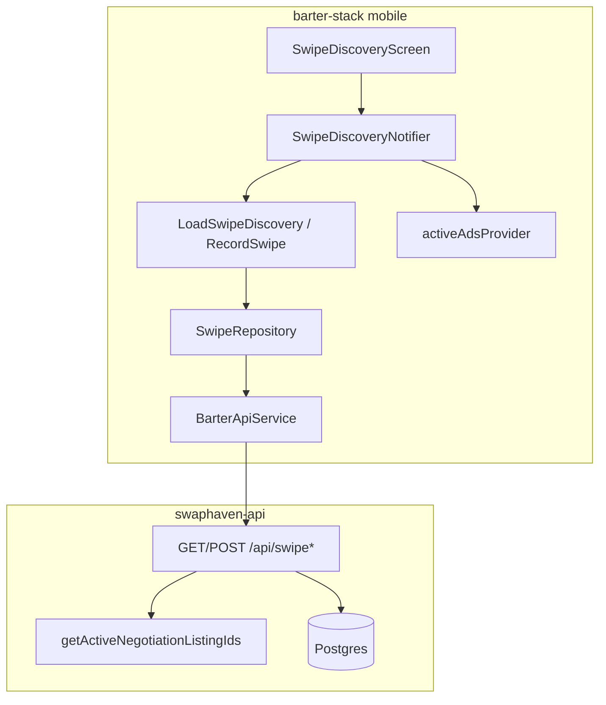
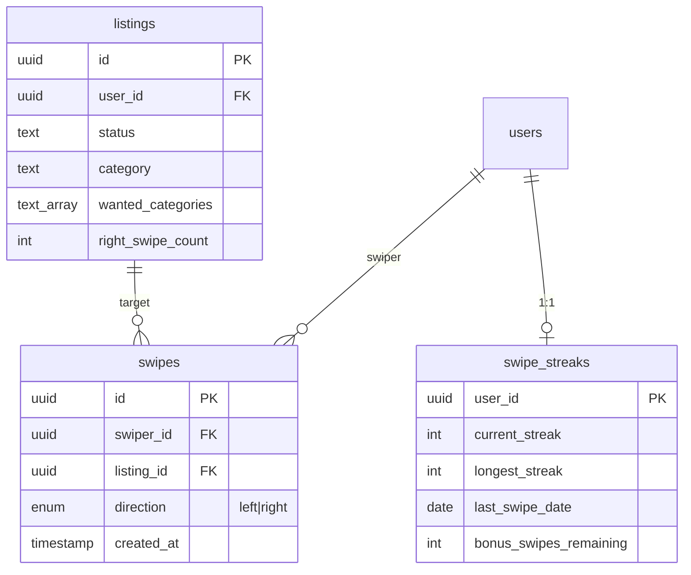
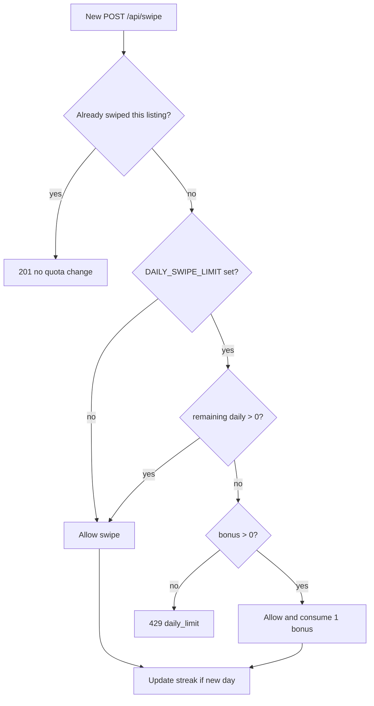
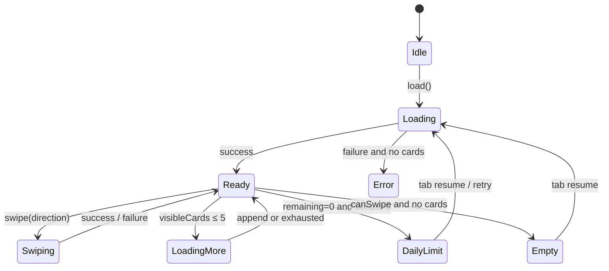
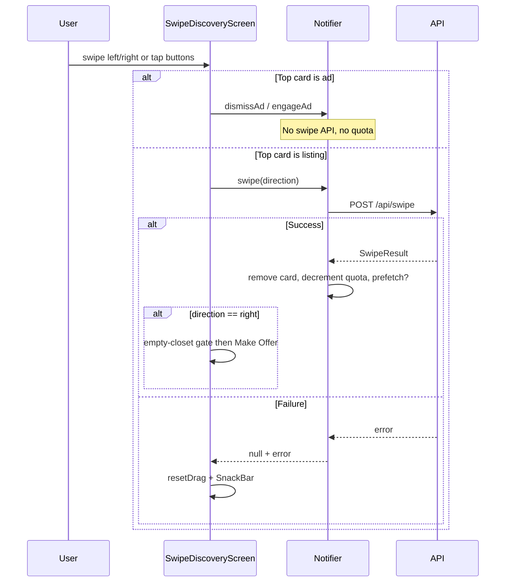
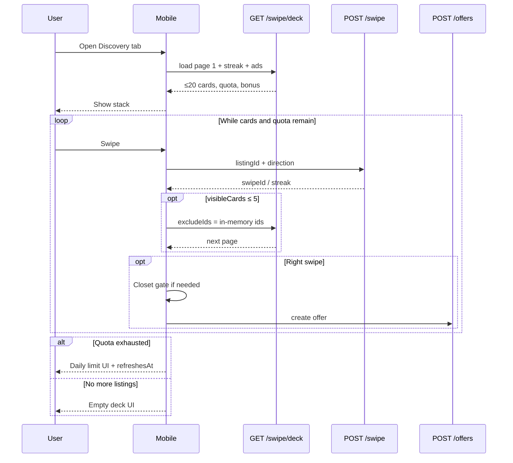

# Swipe / Discovery Feature

End-to-end reference for the discovery swipe deck: backend (`swaphaven-api`) and mobile (`barter-stack/mobile`). Covers APIs, quota, prefetch paging, mutual-fit scoring, streaks, ads interleaving, make-offer handoff, and edge cases.

---

## 1. Product overview

Users browse other people’s **active** listings in a Tinder-style card stack.

| Action | Meaning |
|--------|---------|
| **Left swipe** | Pass — recorded; listing won’t appear again for this user |
| **Right swipe** | Interested — recorded; opens **Make an Offer** (after optional empty-closet gate) |
| **Ad card** | Sponsored slot interleaved client-side; dismiss/engage does **not** use swipe quota |



---

## 2. System architecture



| Layer | Location |
|-------|----------|
| HTTP routes | `swaphaven-api/src/routes/swipe.ts` (mounted at `/api/swipe`) |
| Negotiation exclusion | `swaphaven-api/src/lib/active-offer-listings.ts` |
| Env quota | `swaphaven-api/src/config/env.ts` → `DAILY_SWIPE_LIMIT` |
| Mobile feature | `barter-stack/mobile/lib/features/discovery/` |
| Shared providers | `barter-stack/mobile/lib/service_providers.dart` |
| Ads (separate API) | `GET /api/ads/active` — see [ADS.md](./ADS.md) |

---

## 3. Constants & configuration

### Backend

| Name | Value / source | Role |
|------|----------------|------|
| `DECK_PAGE_SIZE` | `20` (code constant) | Cards per `GET /deck` response |
| `DAILY_SWIPE_LIMIT` | Env; default **unlimited** (`null`) | Max new swipes per user per **local** calendar day |
| `UNLIMITED_REMAINING` | `Number.MAX_SAFE_INTEGER` | Returned as `remainingSwipesToday` when unlimited |

**Env usage** (`.env` / Railway):

```bash
# Unlimited (default) — leave unset or empty
# DAILY_SWIPE_LIMIT=

# Cap at 20 swipes/day
DAILY_SWIPE_LIMIT=20
```

Vitest sets `DAILY_SWIPE_LIMIT=20` if unset so quota/429 tests still run (`vitest.config.ts`).

### Mobile

| Name | Value | Role |
|------|-------|------|
| `_kPrefetchThreshold` | `5` | When `visibleCards.length ≤ 5`, fetch next page |
| `_kAdEvery` | `5` | Insert one ad after every 5 listing cards |

**Important:** page size and daily quota are independent. Prefetch can load more than 20 cards into the client over a session; the daily quota (if set) still caps how many **swipes** are allowed.

---

## 4. Data model



- Unique constraint: `(swiper_id, listing_id)` — one swipe per user per listing forever.
- `right_swipe_count` is denormalized; incremented only on a **new** right swipe.

Schema details: [DB_SCHEMA.md](./DB_SCHEMA.md).

---

## 5. API reference

All swipe routes require `Authorization: Bearer <access_token>`.

### 5.1 `GET /api/swipe/deck`

Returns one page of candidate cards plus quota metadata.

**Query**

| Param | Type | Description |
|-------|------|-------------|
| `excludeIds` | string or string[] | Optional. Comma-separated and/or repeated UUIDs already held in the client deck (for prefetch). Invalid UUIDs → **400**. |

**Success — 200**

```json
{
  "cards": [
    {
      "listing": {
        "id": "…",
        "userId": "…",
        "title": "…",
        "status": "active",
        "category": "…",
        "wantedCategories": ["…"],
        "rightSwipeCount": 3,
        "ownerName": "Display Name",
        "images": [{ "url": "…" }],
        "categoryRow": { "slug": "…", "name": "…" },
        "wants": [{ "freeText": "…" }]
      },
      "matchReason": "You have items in: cameras",
      "mutualFitScore": 0.5,
      "matchedWantedLabels": ["cameras"],
      "hotCount": 3
    }
  ],
  "remainingSwipesToday": 20,
  "bonusSwipesAvailable": 0,
  "refreshesAt": "2026-07-20T00:00:00.000Z"
}
```

Notes:

- Nested `user` is stripped; `ownerName` = `profile.displayName` ∥ `user.name`.
- `hotCount` mirrors `listing.rightSwipeCount`.
- When unlimited, `remainingSwipesToday` is `Number.MAX_SAFE_INTEGER`.
- `refreshesAt` is next **server-local** midnight.

**Deck selection algorithm**

1. Load all listing IDs this user has ever swiped.
2. Load active-negotiation listing IDs (`getActiveNegotiationListingIds`).
3. Merge with client `excludeIds`.
4. Query listings where:
   - `status = 'active'`
   - `userId ≠ viewer`
   - `id NOT IN` exclusion set
5. `ORDER BY RANDOM()`, `LIMIT 20`.
6. Eager-load `images`, `categoryRow`, `wants`, `user` + `profile`.
7. Compute mutual-fit per card (see §7).
8. Attach quota + streak bonus.

`is_swipe_only` is **not** used as a deck filter today.

---

### 5.2 `POST /api/swipe`

Records a swipe (or returns the existing one idempotently).

**Body**

```json
{ "listingId": "<uuid>", "direction": "left" | "right" }
```

**Responses**

| Status | When |
|--------|------|
| **201** | New swipe recorded, or idempotent replay of existing pair |
| **400** | Validation error, or swiping own listing |
| **404** | Listing not found |
| **409** | Listing already in an active offer negotiation for this user |
| **429** | Daily limit exhausted and no bonus swipes left (only if `DAILY_SWIPE_LIMIT` is set) |

**Success body**

```json
{
  "swipeId": "<uuid>",
  "direction": "right",
  "streakUpdated": true,
  "newStreakCount": 1
}
```

**Idempotency:** If `(swiperId, listingId)` already exists → **201** with stored swipe; **does not** consume quota again; `streakUpdated: false`. Returned `direction` is the **stored** one.

**Side effects on a new swipe**

1. Insert `swipes` row.
2. If `right` → `listings.right_swipe_count += 1`.
3. Update streak / possibly consume or award bonus (see §6).

---

### 5.3 `GET /api/swipe/streak`

Returns streak row, or zeros if none:

```json
{
  "currentStreak": 0,
  "longestStreak": 0,
  "lastSwipeDate": null,
  "bonusSwipesRemaining": 0
}
```

---

## 6. Daily quota, bonus, and streaks



### Remaining count

```
swipesToday = COUNT(*) WHERE swiper_id = me AND created_at >= startOfLocalDay()
remaining   = unlimited ? MAX_SAFE_INTEGER : max(0, DAILY_SWIPE_LIMIT - swipesToday)
```

- Swipe counting uses **server local midnight**.
- Streak dates use **UTC** `YYYY-MM-DD` (`toISOString().slice(0, 10)`). These can diverge near timezone boundaries.

### Order of consumption

1. Daily allotment first.
2. Bonus only after daily remaining is `0`.
3. Every 7th streak day awards **+5** bonus swipes.

### Streak transitions (new swipe only)

| Case | Result |
|------|--------|
| No streak row | Insert streak = 1 |
| Last swipe was yesterday | `currentStreak + 1`; maybe +5 bonus on `% 7 === 0` |
| Last swipe older than yesterday | Reset streak to 1 |
| Same UTC day | No streak change (unless only consuming bonus) |

---

## 7. Mutual-fit scoring

Computed on the server for each deck card.

1. Load viewer’s **active** listings; build set of `category.trim().toLowerCase()` (“what I can offer”).
2. For each card, take `wantedCategories`:
   - If wants empty **or** viewer has no active listings → score `0`, no reason.
   - Else `matched = wants ∩ myCategories`.
   - `mutualFitScore = matched.length / wantedCategories.length`.
   - `matchReason = matched.length > 0 ? "You have items in: …" : null`.

This is **one-directional**: “how much of *their* wants do *my listing categories* cover?”, not a full two-sided market match.

---

## 8. Negotiation exclusion

Helper: `getActiveNegotiationListingIds(userId)`.

Listings in the following sets are hidden from the deck and blocked on `POST /api/swipe` (**409**):

- Offer `listingId` where user is buyer or seller and status ∈ `{pending, countered}`
- `offer_round_items` on pending rounds of those offers
- Legacy `offer_items` on active offers
- Target listing of open trades (`pending_meetup`, `disputed`) involving the user

Same helper is reused by search / nearby feeds for consistency ([SEARCH_FEATURE.md](./SEARCH_FEATURE.md)).

Withdrawing an offer restores visibility in the deck.

---

## 9. Prefetch paging (page 20 + load at ≤5)

Do **not** return the entire catalog uncapped. Each request stays cheap (~20 rich listing rows). The client tops up when the stack runs low.

```mermaid
sequenceDiagram
  participant App as Mobile
  participant API as GET /api/swipe/deck
  participant DB as Postgres

  App->>API: GET /deck (no excludeIds)
  API->>DB: exclude swiped + negotiations, RANDOM, limit 20
  DB-->>API: page1
  API-->>App: cards + remainingSwipesToday

  Note over App: User swipes; visibleCards length drops to ≤5

  App->>API: GET /deck?excludeIds=id1,id2,...
  API->>DB: also exclude client IDs, RANDOM, limit 20
  DB-->>API: page2
  API-->>App: next cards
  App->>App: append + dedupe by listing id
```

### Mobile rules

| Rule | Detail |
|------|--------|
| Trigger | After `load()`, after successful listing swipe, after category change — if `visibleCards.length ≤ 5` |
| Guards | Skip if `isLoading`, `isLoadingMore`, `deckExhausted`, or `!canSwipe` |
| `excludeIds` | All IDs in `allCards` (including category-hidden), not only visible |
| Dedupe | Drop any listing id already in memory |
| Quota on prefetch | Take **min(local, server)** for remaining/bonus — never inflate |
| Failure | Non-fatal; user keeps swiping remaining cards |
| Exhausted | Empty page → `deckExhausted = true`; stop further prefetch |

---

## 10. Mobile architecture

### Folder layout

```
mobile/lib/features/discovery/
├── application/
│   ├── load_swipe_discovery_use_case.dart   # deck + streak in parallel
│   ├── record_swipe_use_case.dart
│   ├── load_make_offer_data_use_case.dart
│   └── create_offer_use_case.dart
├── data/
│   ├── datasources/swipe_remote_data_source.dart
│   ├── models/swipe_data_models.dart
│   └── repositories/swipe_repository_impl.dart
├── domain/
│   ├── entities/swipe_entities.dart
│   ├── repositories/swipe_repository.dart
│   └── swipe_category_filter.dart
├── di/
│   └── discovery_providers.dart             # SwipeDiscoveryNotifier, MakeOfferController
└── presentation/
    ├── swipe_discovery_screen.dart
    ├── swipe_ui_mapper.dart
    └── make_offer/
        ├── make_offer_route_args.dart
        └── make_offer_screen.dart
```

### Domain entities (summary)

| Entity | Purpose |
|--------|---------|
| `SwipeListing` | Card listing fields + `ownerName`, images, category, wants |
| `SwipeDeckCard` | Listing + match metadata + `hotCount` |
| `SwipeDeck` | Cards + remaining/bonus + `refreshesAt` |
| `SwipeStreak` | Streak counters + bonus |
| `SwipeResult` | POST response (`swipeId`, streak flags) |
| `SwipeDiscoveryData` | Deck + streak aggregate for initial load |
| `MakeOfferData` | Target listing + buyer closet |

### Notifier state machine



**Quota decrement (client, matches server):** daily first, then bonus.

```dart
if (remaining > 0) remaining--;
else if (bonus > 0) bonus--;
```

`canSwipe` ⇒ `remainingSwipesToday > 0 || bonusSwipesAvailable > 0`.

---

## 11. Mobile UI states

`SwipeDiscoveryScreen` body priority:

1. **Loading** — initial `isLoading`
2. **Error** — `error != null` and no visible cards (+ Retry)
3. **Daily limit** — `!canSwipe` (shown even if cards remain in memory)
4. **Empty deck** — `canSwipe` but `visibleCards.isEmpty` (“No more listings right now”)
5. **Card stack** — `SwipeCardStack` on interleaved `deckItems`

Lifecycle: `onScreenResumed` → `notifier.load()`.

### Gesture / button flow



### Right-swipe → Make Offer

1. If closet has no active items → push Add Listing (`popOnSuccess=true&emptyCloset=true`). Cancel aborts.
2. Closet check **fails open** (network/auth glitch → proceed to offer rather than block).
3. Push Make Offer with `listingId`, `swipeId`, listing snapshot.
4. Make Offer UI: closet pick → cash top-up → note → `POST /api/offers`.

---

## 12. Category filtering

- Client-side only on `allCards`.
- `SwipeCategoryBar` + browse sheet + clear chip.
- Match via `swipeListingMatchesCategory` (browse slug / backend label helpers).
- Changing category rebuilds `visibleCards` / `deckItems` from cached cards and **reuses** ad slots (no ad refetch).
- May trigger prefetch if the filtered visible stack shrinks to ≤5.
- Prefetch `excludeIds` still come from full `allCards`.

---

## 13. Sponsored ads in the deck

Ads are **not** returned by `/api/swipe/deck`. Mobile fetches `GET /api/ads/active` once per session (`activeAdsProvider`) in parallel with the first deck load.

| Behavior | Detail |
|----------|--------|
| Interleave | One ad after every 5 listing cards (`_kAdEvery`) |
| Empty listings | No ads shown |
| Empty/failed ads API | Listings only |
| Quota | Dismiss / CTA / swipe-away ad → **no** quota change |
| Impression | When ad reaches top of stack (`recordAdImpression`) |
| Click | CTA tap or right-swipe ad → `recordAdClick` + open URL |

Full ads product docs: [ADS.md](./ADS.md).

---

## 14. End-to-end happy path



---

## 15. Edge cases checklist

| Case | Behavior |
|------|----------|
| Own listing | Never in deck; POST → 400 |
| Already swiped | Hidden from deck; POST → idempotent 201 |
| Active negotiation | Hidden; POST → 409 |
| Unlimited quota | No 429; huge `remainingSwipesToday` |
| Prefetch race vs swipe | Client keeps lower remaining/bonus |
| Failed swipe API | Card stays; drag resets; snackbar |
| Failed prefetch | Ignored; continue with remaining cards |
| Empty first page | `deckExhausted`; empty UI if still can swipe |
| Daily limit with cards left | Limit UI wins (cards not shown) |
| Duplicate right swipe | No second `right_swipe_count` increment |
| Offer withdrawn | Listing can reappear in deck |
| Counter excludes an offered item | That item can reappear for the seller |

---

## 16. Testing

### API — `tests/swipe.test.ts`

- Deck contents / ownership / auth
- Negotiation hide (buyer & seller) + restore after withdraw / counter
- `excludeIds` paging + page size ≤ 20
- Remaining decrements with `DAILY_SWIPE_LIMIT=20` in test env
- POST left/right, own listing, 409, idempotency, **429** after 20

### Mobile — `mobile/test/features/discovery/`

| File | Focus |
|------|-------|
| `swipe_discovery_notifier_test.dart` | load, swipe, quota order, prefetch append/dedupe, deckExhausted, ads |
| `swipe_repository_impl_test.dart` | mapping + `excludeIds` forward |
| `swipe_data_models_test.dart` | JSON parsing, category match |
| `load_swipe_discovery_use_case_test.dart` | parallel deck + streak |
| `make_offer_controller_test.dart` | offer load/submit wiring |

---

## 17. Operational notes

1. **Restart the API** after changing `DAILY_SWIPE_LIMIT`.
2. Deck uses `ORDER BY RANDOM()` — fine at small/medium scale; revisit if inventory is huge (seeded/cursor ranking).
3. Historical swipe exclusion list grows with power users (`NOT IN` all past swipes).
4. OpenAPI documents deck + swipe + streak; some runtime fields (`matchedWantedLabels`, unlimited remaining) are richer than the schema.
5. Deploy API + mobile together when changing deck response shape (`ownerName`, prefetch `excludeIds`).

---

## 18. Related docs

| Doc | Relevance |
|-----|-----------|
| [ADS.md](./ADS.md) | Sponsored cards in the stack |
| [API_GUIDE.md](./API_GUIDE.md) | Route table / curl samples |
| [DB_SCHEMA.md](./DB_SCHEMA.md) | `swipes`, `swipe_streaks` |
| [SEARCH_FEATURE.md](./SEARCH_FEATURE.md) | Shared negotiation exclusion; `right_swipe_count` ranking |
| [LISTING_MANAGEMENT_FEATURE.md](./LISTING_MANAGEMENT_FEATURE.md) | Sold/traded listings leave the deck |
| [SEED_LISTINGS.md](./SEED_LISTINGS.md) | Seeding discovery inventory |
| [TESTING.md](./TESTING.md) | How to run API tests |

---

## 19. Quick reference — files

**API**

- `src/routes/swipe.ts`
- `src/lib/active-offer-listings.ts`
- `src/config/env.ts` (`DAILY_SWIPE_LIMIT`)
- `src/openapi/spec.ts`
- `tests/swipe.test.ts`

**Mobile**

- `lib/features/discovery/**`
- `lib/core/services/api_endpoints.dart` (`swipe`, `swipeDeck`, `swipeStreak`)
- `lib/core/services/barter_api_service.dart` (`getSwipeDeck`, `recordSwipe`)
- `lib/service_providers.dart` (repository + use cases)
- `lib/features/ads/**` (session ads + impression/click)
