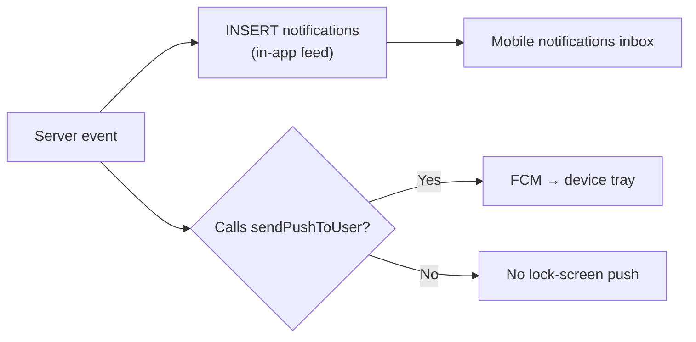
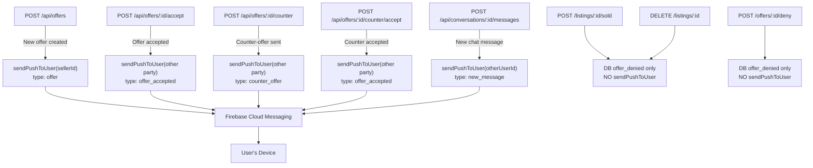
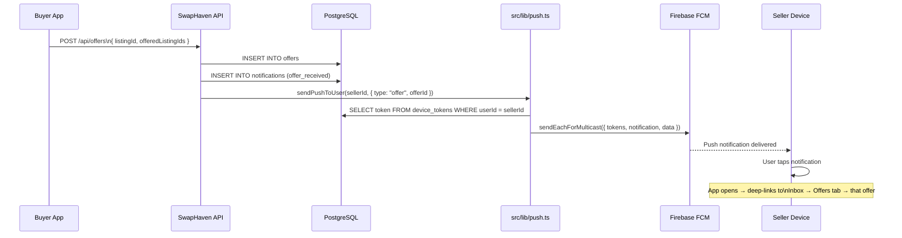
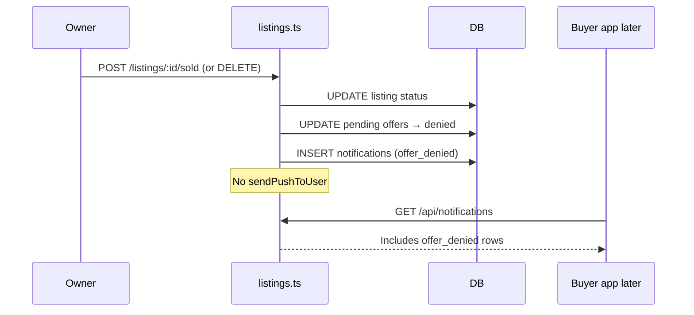
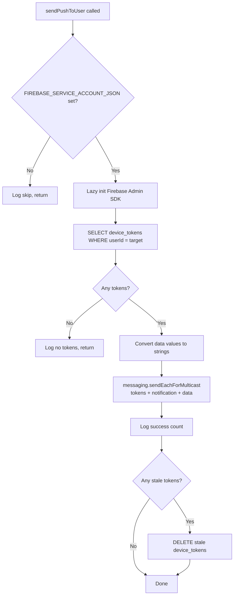
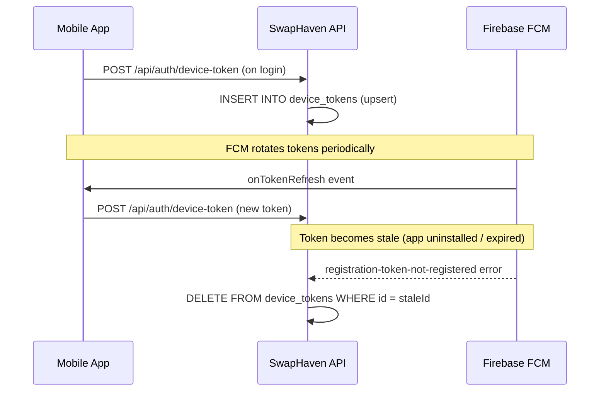

# Push Notification Deep Links — SwapHaven API

## Overview

The API can notify users in **two different channels**:

| Channel | Mechanism | What the user sees |
|---------|-----------|--------------------|
| **In-app (DB) notification** | `INSERT` into `notifications` | Appears in the app’s notifications list (`GET /api/notifications`) |
| **Push (FCM)** | `sendPushToUser` in `src/lib/push.ts` | Lock-screen / system tray; tap deep-links into Inbox |

These are **independent**. Many events do both. Some events write a DB notification **only** (no FCM push).

The API sends push via Firebase Cloud Messaging (FCM) when a handler calls `sendPushToUser`. Each FCM message carries a structured `data` payload that the mobile app parses to deep-link into the relevant Inbox item.

---

## In-app vs push — important distinction



### Events that send **both** DB notification + FCM push

| Event | Route / helper | DB `notifications.type` | FCM `data.type` |
|-------|----------------|-------------------------|-----------------|
| New offer | `POST /api/offers` | `offer_received` | `offer` |
| Offer accepted | `POST /api/offers/:id/accept` (and counter accept alias) | `offer_accepted` | `offer_accepted` |
| Counter sent | `POST /api/offers/:id/counter` | (counter notification) | `counter_offer` |
| New chat message | `POST /api/conversations/:id/messages` | (as implemented) | `new_message` |

### Events that write **DB notification only** (no FCM push)

| Event | Where | DB type | Why it matters |
|-------|--------|---------|----------------|
| **Listing marked sold** — pending target offers cancelled | `cancelPendingOffersAndNotify` in `src/routes/listings.ts` (from `POST …/sold`) | `offer_denied` | Buyer sees “Offer declined” **in-app**, but **no** push banner |
| **Listing deleted** — pending target offers cancelled | Same helper (from `DELETE /api/listings/:id`) | `offer_denied` | Same — in-app only |
| Offer denied by party | `handleDeny` in `offers.ts` | `offer_denied` | In-app only (no `sendPushToUser`) |
| Offer withdrawn | `POST /api/offers/:id/withdraw` | (withdraw notification if present) | Check handler — currently no push |

**Mark sold / delete detail**

When the owner marks a listing sold or deletes it, `cancelPendingOffersAndNotify`:

1. Finds offers with `listingId = that listing` and `status = pending`
2. Sets them to `denied`
3. Inserts `notifications` rows for each buyer (`type: offer_denied`, body like *“…has been marked as sold. Your offer has been declined.”*)
4. **Does not** call `sendPushToUser`

So buyers are notified in the app notification feed, but they will **not** get a phone lock-screen push for that automatic decline unless a future change adds FCM there.

Related listing docs: [MARK_AS_SOLD_FLOW.md](./MARK_AS_SOLD_FLOW.md), [DELETE_LISTING_FLOW.md](./DELETE_LISTING_FLOW.md), [LISTING_STATUS_AND_OWNER_FLOWS.md](./LISTING_STATUS_AND_OWNER_FLOWS.md).

---

## Architecture

### Key files

| File | Purpose |
|---|---|
| `src/lib/push.ts` | Core push helper — lazy Firebase init, `sendPushToUser`, stale-token cleanup |
| `src/db/schema/` | `deviceTokensTable` — stores FCM tokens per user/platform; `notifications` — in-app feed |
| `src/routes/auth.ts` | `POST /api/auth/device-token` — registers a device token |
| `src/routes/offers.ts` | Fires `offer`, `counter_offer`, `offer_accepted` **push**; deny/withdraw are DB-only |
| `src/routes/listings.ts` | `cancelPendingOffersAndNotify` — **DB `offer_denied` only, no push** |
| `src/routes/conversations.ts` | Fires `new_message` push |
| `src/config/env.ts` | `FIREBASE_SERVICE_ACCOUNT_JSON` env var |

---

## Environment Setup

Add the Firebase service account to `.env`:

```env
FIREBASE_SERVICE_ACCOUNT_JSON={"type":"service_account","project_id":"barter-stack",...}
```

To get the JSON:
1. Firebase Console → Project Settings → Service Accounts
2. Click **Generate new private key**
3. Paste the entire JSON as the value of `FIREBASE_SERVICE_ACCOUNT_JSON`

When this variable is absent (CI, dev without Firebase), all `sendPushToUser` calls are silently no-op'd with a log line — the API continues to work normally. **DB notifications are still inserted** regardless of Firebase.

---

## FCM Data Payload Contract

Every **push** notification includes both a `notification` block (shown in the system tray) and a `data` block (parsed by the mobile app for deep-link routing).

```typescript
export interface PushPayload {
  title: string;
  body: string;
  data: {
    type: "offer" | "counter_offer" | "offer_accepted" | "new_message";
    offerId?: string;        // present for offer / counter_offer
    conversationId?: string; // present for offer_accepted / new_message
  };
}
```

### `type` → mobile routing

| `type` | Payload key | Mobile destination |
|---|---|---|
| `offer` | `offerId` | Inbox → Offers tab, offer highlighted |
| `counter_offer` | `offerId` | Inbox → Offers tab, offer highlighted |
| `offer_accepted` | `conversationId` | Inbox → Chats tab, conversation auto-opened |
| `new_message` | `conversationId` | Inbox → Chats tab, conversation auto-opened |

There is **no** FCM `data.type` today for `offer_denied` / listing sold-or-deleted auto-decline, because those paths do not call `sendPushToUser`.

---

## Where **push** notifications are triggered



---

## End-to-End Flow



### Mark sold / delete — in-app only (no push)



## `sendPushToUser` Internals



**Stale token cleanup** — FCM returns `messaging/registration-token-not-registered` or `messaging/invalid-registration-token` for tokens that belong to uninstalled apps or expired sessions. These are automatically deleted from `device_tokens` so future sends stay fast.

---

## Device Token Registration

Mobile devices register their FCM token with the API after every login. The token is stored per user and platform.

### Endpoint

```
POST /api/auth/device-token
Authorization: Bearer <access_token>

{
  "token": "<fcm-registration-token>",
  "platform": "ios" | "android" | "web"
}
```

**Response:** `204 No Content`

The insert uses `ON CONFLICT DO NOTHING` so duplicate registrations are safe.

### Token lifecycle



---

## All Push Events by Route

### `POST /api/offers` — New offer

```typescript
sendPushToUser(listing.userId, {
  title: "New swap offer! 🔄",
  body: "Someone wants to trade for your item.",
  data: { type: "offer", offerId: offer.id },
});
```

### `POST /api/offers/:offerId/accept` — Offer accepted

```typescript
sendPushToUser(offer.buyerId, {
  title: "Offer accepted! 🎉",
  body: "Your trade offer was accepted. Start chatting now.",
  data: { type: "offer_accepted", conversationId: conv.id },
});
```

### `POST /api/offers/:offerId/counter` — Counter-offer sent

```typescript
sendPushToUser(offer.buyerId, {
  title: "Counter-offer received 🔁",
  body: "The seller proposed new terms. Review and respond.",
  data: { type: "counter_offer", offerId: offer.id },
});
```

### `POST /api/offers/:offerId/counter/accept` — Counter accepted

```typescript
sendPushToUser(offer.sellerId, {
  title: "Counter-offer accepted! 🎉",
  body: "The buyer accepted your counter. Time to arrange the swap.",
  data: { type: "offer_accepted", conversationId: conv.id },
});
```

### `POST /api/conversations/:convId/messages` — New chat message

```typescript
sendPushToUser(otherUserId, {
  title: senderName,
  body: parsed.data.body.slice(0, 100),
  data: { type: "new_message", conversationId: convId },
});
```

---

## Firebase Admin SDK Initialisation

The SDK initialises lazily on the first `sendPushToUser` call and reuses the instance on subsequent calls:

```mermaid
flowchart LR
    A[First sendPushToUser call] --> B{_messagingReady?}
    B -- Yes --> E[Return cached getMessaging]
    B -- No --> C{FIREBASE_SERVICE_ACCOUNT_JSON set?}
    C -- No --> D[Return null — no-op]
    C -- Yes --> F[import firebase-admin/app]
    F --> G{getApps().length === 0?}
    G -- Yes --> H[initializeApp with service account cert]
    G -- No --> I[Reuse existing app]
    H & I --> J[_messagingReady = true]
    J --> E
```

This pattern means:
- Zero startup cost — Firebase is not imported at module load time
- Works in environments without `FIREBASE_SERVICE_ACCOUNT_JSON` (CI, local dev)
- No duplicate initialisation when multiple modules import `push.ts`

---

## Testing Locally

### 1. Provide a real service account

```bash
# .env
FIREBASE_SERVICE_ACCOUNT_JSON=$(cat path/to/service-account.json)
```

### 2. Get a device FCM token

Run the Flutter app in debug mode — the token is printed to the console:

```
╔══════════════════════════════════════════════════════╗
║  FCM Registration Token                              ║
╠══════════════════════════════════════════════════════╣
  dAb3x9Qf...
╚══════════════════════════════════════════════════════╝
```

### 3. Register the token via the API

```bash
curl -X POST http://localhost:3000/api/auth/device-token \
  -H "Authorization: Bearer <your-jwt>" \
  -H "Content-Type: application/json" \
  -d '{ "token": "dAb3x9Qf...", "platform": "android" }'
```

### 4. Trigger an event

```bash
# Create an offer — seller receives a push
curl -X POST http://localhost:3000/api/offers \
  -H "Authorization: Bearer <buyer-jwt>" \
  -H "Content-Type: application/json" \
  -d '{ "listingId": "...", "offeredListingIds": ["..."] }'
```

### 5. Expected server log

```
[push] sending type=offer to userId=<sellerId> (1 device(s))
[push] delivered 1/1 (type=offer userId=<sellerId>)
```

---

## Adding a New Notification Type

1. Add the new `type` string to the `PushPayload.data.type` union in `src/lib/push.ts`
2. Call `sendPushToUser` in the appropriate route handler with the new type and relevant ID
3. Update `InboxDeepLinkType` in the mobile app's `notification_deep_link.dart`
4. Add the routing logic in `InboxDeepLink.fromPayload()` and `isOfferTab` if a new tab is involved
